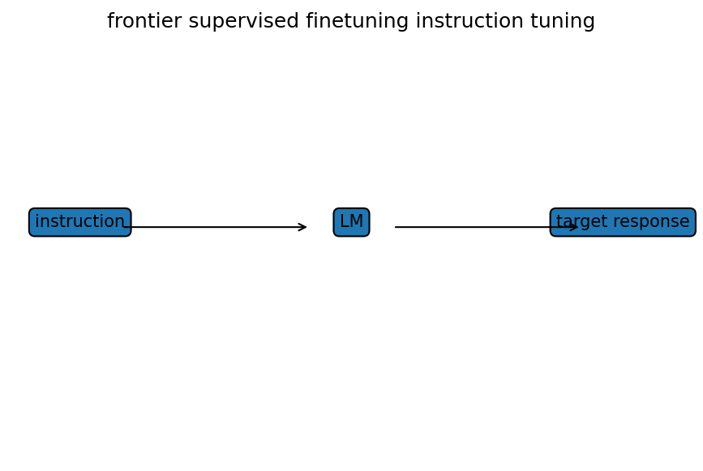

# SFT・instruction tuning

Course 10｜Frontier

---

## 今回の問い

pretrained LMを「指示に従うmodel」へ変える最初の段階は何を最適化しているか。

---

## 直感

SFTはinstruction-response pairに対するconditional language modeling。base modelの次token予測能力を、望ましい会話・指示応答分布へ寄せる。

---

## 図解

---

## 中心式

$$
\mathcal L_{SFT}=-\sum_t\log\pi_\theta(y_t\mid x,y_{<t})
$$

---

## 導出

1. response conditional probabilityをautoregressive factorizationする。
2. 負のlog likelihoodを取るとtoken cross entropyの和。
3. prompt tokenをloss maskする設計ではresponse tokenだけを直接教師信号にする。

---

## 小さい例

「次を要約せよ」というinstructionと良質なsummaryのpairを多数学習する。

---

## 条件を外すと

- SFT dataのstyle biasをmodel capabilityと混同しない。
- train/eval contaminationを避ける。

---

## 理解確認

- 式の各記号を定義できるか。
- 導出を1段ずつ再現できるか。
- 反例を1つ作れるか。

---

## 教科書と演習

[教科書](../../textbook/frontier-supervised-finetuning-instruction-tuning)

[10問の演習](../../exercises/frontier-supervised-finetuning-instruction-tuning)
