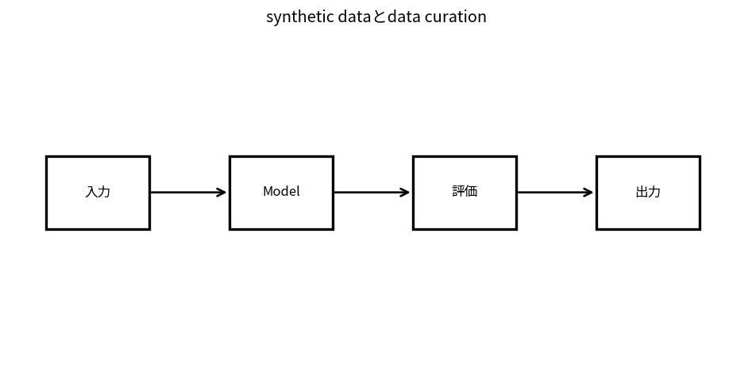

# synthetic dataとdata curation

Course 10｜Frontier｜Topic 18/20

---
layout: center
---

## 今回の問い

## 到達目標

- 定義と代表式を、自分の言葉と記号で説明できる。
- 成立条件を確認し、手計算と結果を検算できる。

## 理解確認

- 定義・条件・計算結果を自分の言葉で説明できるか確認する。

synthetic dataとdata curationの代表式は、どの定義・仮定から、なぜその形になるのか。

---

## なぜ今これを学ぶのか

前Topic `frontier-long-context-memory` で得た概念を使い、ここでは synthetic dataとdata curation へ進む。

---

## 直感

synthetic dataはmodelが生成したデータを学習へ混ぜる方法で、coverage拡張とbias増幅の両方が起こりうる。

---

## 図解

real/syntheticの混合比を変えたtraining distributionを描く。 modelが生成したdataが選別・検証を経て次のtraining dataへ戻るloopを描く。品質filterが弱いと誤りやmode collapseが自己増幅しうる。

---

## 記号と代表式

- $p_{real}$：real data distribution
- $p_{synthetic}$：generated data
- $\alpha$：mixture weight
- $p_{train}=\alpha p_{real}+(1-\alpha)p_{synthetic}$

$$
p_{train}=\alpha p_{real}+(1-\alpha)p_{synthetic}
$$

---

## 導出 1

real/synthetic sampling ratioがtraining expectationのweightを直接変える。

---

## 導出 2

filterはnoiseを減らす一方、filter modelのbiasでcoverageを狭める。

---

## 例題

math problemsをgeneratorで作りverifierでanswer check後trainingへ。generator qualityとverifier false acceptanceを別評価。

---

## 条件を変えるとどうなるか

「syntheticは無料で無限」ではない。generation compute、verification、diversity、distribution mismatchが制約。

---

## よくある誤解

synthetic dataとdata curationでは、式へ数値を代入するだけでは不十分である。「syntheticは無料で無限」ではない。generation compute、verification、diversity、distribution mismatchが制約。 という失敗例が示すように、式を使える条件と結論の範囲を区別する必要がある。

---

## 実装・計算上の注意

data lineage、license/provenance、real/synthetic tag、filter thresholds、contamination audit。

---

## 一段先へ

physics/biology等のdomain constraintsをloss/modelへ組み込むScientific MLへ。

---

## 自分で説明できるか

- 「mixture distribution」を式を見ずに説明できるか
- 「feedback loop」までの論理を一段ずつ再現できるか
- synthetic dataとdata curationの条件を1つ外した反例を説明できるか

---
layout: center
---

## 教科書と演習

- [教科書](../../textbook/frontier-synthetic-data-data-curation)
- [10問の演習](../../exercises/frontier-synthetic-data-data-curation)
