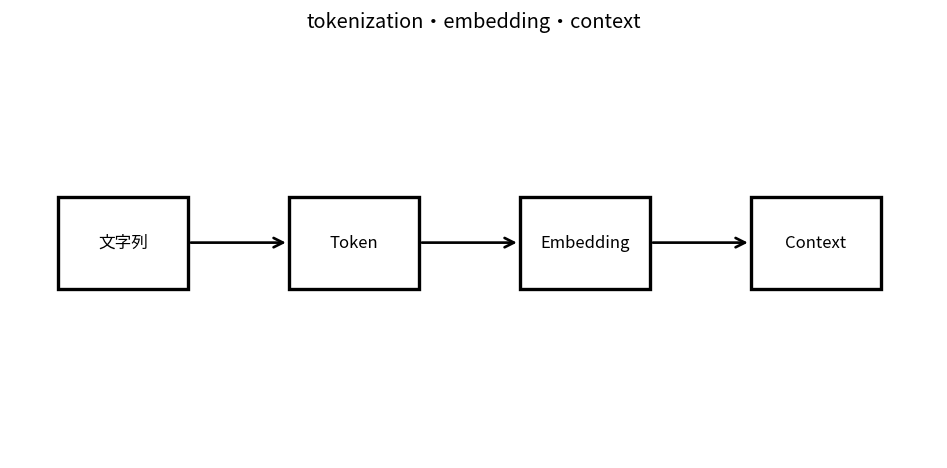

# tokenization・embedding・context

Course 10｜Frontier｜Topic 02/20

---
layout: center
---

## 今回の問い

## 到達目標

- 定義と代表式を、自分の言葉と記号で説明できる。
- 成立条件を確認し、手計算と結果を検算できる。

## 理解確認

- 定義・条件・計算結果を自分の言葉で説明できるか確認する。

tokenization・embedding・contextの代表式は、どの定義・仮定から、なぜその形になるのか。

---

## なぜ今これを学ぶのか

前Topic `frontier-foundation-model-paradigm` で得た概念を使い、ここでは tokenization・embedding・context へ進む。

---

## 直感

tokenizationは入力文字列を離散token列へ分割し、embeddingがtokenを連続ベクトルへ写す。contextはtoken列全体の条件情報。

---

## 図解

文字列→token ID→embedding→context表現の段階を描く。 文字列がtoken列へ分割され、各token IDがembedding vectorへ変換される。context modelが扱う長さは文字数ではなくtoken数で決まる。

---

## 記号と代表式

- $x_t$：token ID
- $e(x_t)\in\mathbb R^d$：token embedding
- $p_t$：position representation
- $h_t=e(x_t)+p_t$：input state例

$$
\mathbf{h}_t=\mathbf{e}(x_t)+\mathbf{p}_t
$$

---

## 導出 1

same stringでもvocabulary/segmentationによりTが変わり、compute、context消費、rare-word representationが変わる。

---

## 導出 2

one-hotにembedding matrixを掛けることとrow lookupは同値。token identityをcontinuous stateへ。

---

## 例題

同じ日本語語句が1 tokenか複数subwordかでcontext token数が変わる。character数とtoken数は同一でない。

---

## 条件を変えるとどうなるか

embedding cosineが近いtokenを「同じ意味」と断定できない。contextual layers後のrepresentationとstatic input embeddingも別。

---

## よくある誤解

tokenization・embedding・contextでは、式へ数値を代入するだけでは不十分である。embedding cosineが近いtokenを「同じ意味」と断定できない。contextual layers後のrepresentationとstatic input embeddingも別。 という失敗例が示すように、式を使える条件と結論の範囲を区別する必要がある。

---

## 実装・計算上の注意

tokenizer version、special tokens、normalization、max lengthをmodelと一緒にpin。

---

## 一段先へ

model/data/computeを増やしたときlossがどう変わるかをempirical scaling lawで整理する。

---

## 自分で説明できるか

- 「tokenization changes sequence」を式を見ずに説明できるか
- 「position necessity」までの論理を一段ずつ再現できるか
- tokenization・embedding・contextの条件を1つ外した反例を説明できるか

---
layout: center
---

## 教科書と演習

- [教科書](../../textbook/frontier-tokenization-embeddings-context)
- [10問の演習](../../exercises/frontier-tokenization-embeddings-context)
