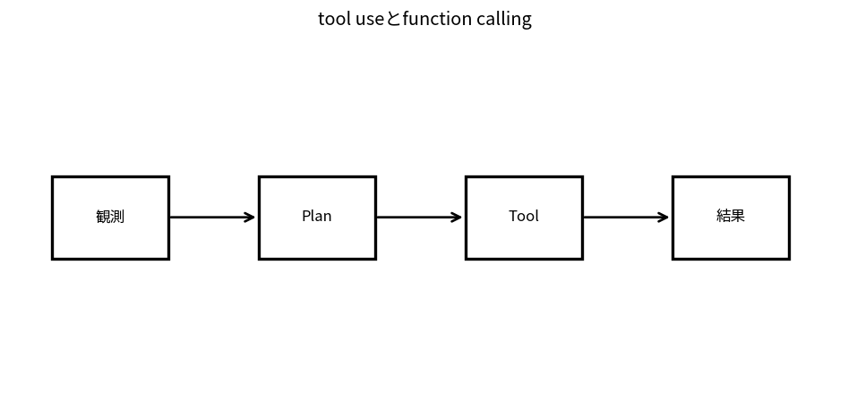

# tool useとfunction calling

Course 10｜Frontier｜Topic 08/20

---
layout: center
---

## 今回の問い

## 到達目標

- 定義と代表式を、自分の言葉と記号で説明できる。
- 成立条件を確認し、手計算と結果を検算できる。

## 理解確認

- 定義・条件・計算結果を自分の言葉で説明できるか確認する。

tool useとfunction callingの代表式は、どの定義・仮定から、なぜその形になるのか。

---

## なぜ今これを学ぶのか

前Topic `frontier-vector-databases-search` で得た概念を使い、ここでは tool useとfunction calling へ進む。

---

## 直感

agentは観測→状態更新→action/tool選択→結果観測を繰り返す閉ループsystem。

---

## 図解

plan, act, observe, memoryの循環を矢印で描く。 model出力がtool actionを選び、tool observationが次のmodel入力へ戻るloopを描く。単発生成と違い、外部状態の変化を観測しながら複数stepで方針を更新する。

---

## 記号と代表式

- $s_t$：current state/context
- $\mathcal T$：available tools/schema
- $a_t$：tool callまたはlanguage action
- $\pi(a_t|s_t,\mathcal T)$：action policy

$$
\pi(a_t\mid s_t,\mathcal{T})
$$

---

## 導出 1

current stateとtool descriptionsからaction name+argumentsを生成。schema validationでsyntax spaceを狭める。

---

## 導出 2

tool executionはmodel内部knowledgeではなくexternal stateを変化/照会しobservation o_{t+1}を返す。

---

## 例題

currency conversion: live rate tool→result→calculation→answer。model memoryだけよりfresh dataを使える。

---

## 条件を変えるとどうなるか

JSON schemaに合うcallでもsemantically正しい/安全とは限らない。wrong recipient/delete action等。

---

## よくある誤解

tool useとfunction callingでは、式へ数値を代入するだけでは不十分である。JSON schemaに合うcallでもsemantically正しい/安全とは限らない。wrong recipient/delete action等。 という失敗例が示すように、式を使える条件と結論の範囲を区別する必要がある。

---

## 実装・計算上の注意

tool allowlist、argument validation、timeouts、idempotency、retry、audit log、user confirmation boundaries。

---

## 一段先へ

複数tool stepsをgoal達成まで組むとagent planning/memory problemになる。

---

## 自分で説明できるか

- 「action selection」を式を見ずに説明できるか
- 「closed loop」までの論理を一段ずつ再現できるか
- tool useとfunction callingの条件を1つ外した反例を説明できるか

---
layout: center
---

## 教科書と演習

- [教科書](../../textbook/frontier-tool-use-function-calling)
- [10問の演習](../../exercises/frontier-tool-use-function-calling)
