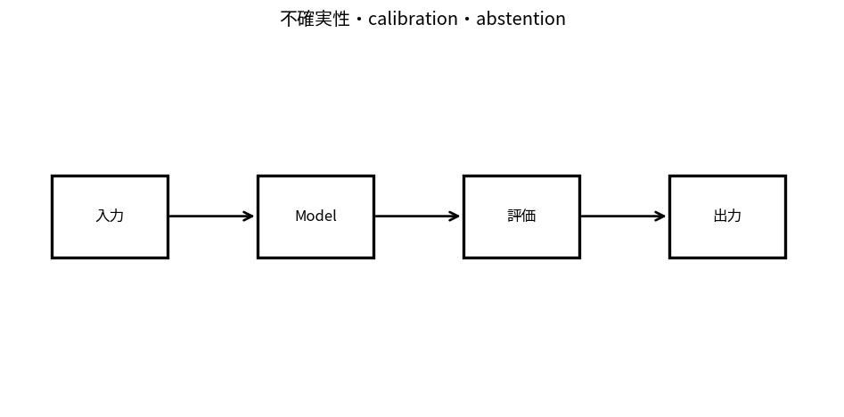

# 不確実性・calibration・abstention

Course 10｜Frontier｜Topic 15/20

---
layout: center
---

## 今回の問い

## 到達目標

- 定義と代表式を、自分の言葉と記号で説明できる。
- 成立条件を確認し、手計算と結果を検算できる。

## 理解確認

- 定義・条件・計算結果を自分の言葉で説明できるか確認する。

不確実性・calibration・abstentionの代表式は、どの定義・仮定から、なぜその形になるのか。

---

## なぜ今これを学ぶのか

前Topic `frontier-interpretability-mechanistic` で得た概念を使い、ここでは 不確実性・calibration・abstention へ進む。

---

## 直感

abstentionは確信度が低い入力で無理に回答せず、閾値以下を保留することでriskを制御する。

---

## 図解

confidence thresholdを動かしcoverageとerrorのtrade-offを見る。 予測分布の広がりや複数sampleの不一致を不確実性指標とし、閾値以上ならabstainする。回答率と誤答率のtrade-offを曲線として評価する。

---

## 記号と代表式

- $p_k$：class/answer confidence proxy
- $\tau$：abstention threshold
- $coverage=P(accept)$
- $risk=P(error|accept)$

$$
\hat{y}=\begin{cases}\arg\max_k p_k,&\max_kp_k\ge\tau\\\text{abstain},&\text{otherwise}\end{cases}
$$

---

## 導出 1

max confidence≥τならanswer、otherwise abstain。τを上げるとcoverage通常低下。

---

## 導出 2

accept subsetだけのerrorをmeasure。良いuncertainty rankingならlow-confidence casesを除くほどrisk低下。

---

## 例題

τ=0.9で50%coverage,error2%; τ=0.6で90%coverage,error8%のようなrisk-coverage curve。

---

## 条件を変えるとどうなるか

softmax/token probabilityが高い=事実正しいではない。model can be confidently wrong。

---

## よくある誤解

不確実性・calibration・abstentionでは、式へ数値を代入するだけでは不十分である。softmax/token probabilityが高い=事実正しいではない。model can be confidently wrong。 という失敗例が示すように、式を使える条件と結論の範囲を区別する必要がある。

---

## 実装・計算上の注意

calibration set、OOD subgroup、abstain utility/cost、risk-coverage/AURC。

---

## 一段先へ

serving costを抑えつつqualityを保つquantization/sparsity/MoEへ。

---

## 自分で説明できるか

- 「decision rule」を式を見ずに説明できるか
- 「calibration」までの論理を一段ずつ再現できるか
- 不確実性・calibration・abstentionの条件を1つ外した反例を説明できるか

---
layout: center
---

## 教科書と演習

- [教科書](../../textbook/frontier-uncertainty-calibration-abstention)
- [10問の演習](../../exercises/frontier-uncertainty-calibration-abstention)
