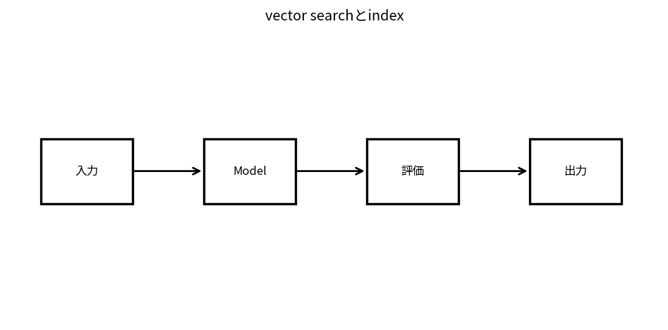

# vector searchとindex

Course 10｜Frontier｜Topic 07/20

---
layout: center
---

## 今回の問い

## 到達目標

- 定義と代表式を、自分の言葉と記号で説明できる。
- 成立条件を確認し、手計算と結果を検算できる。

## 理解確認

- 定義・条件・計算結果を自分の言葉で説明できるか確認する。

vector searchとindexの代表式は、どの定義・仮定から、なぜその形になるのか。

---

## なぜ今これを学ぶのか

前Topic `frontier-retrieval-augmented-generation` で得た概念を使い、ここでは vector searchとindex へ進む。

---

## 直感

vector searchはqueryと文書をembeddingへ写し、近傍探索で意味的に近い候補を返す。

---

## 図解

query点とvector database点群、top-k近傍を描く。 query embeddingとdocument embeddingの距離/類似度を計算し、近い候補を上位へ返す。indexは全件比較を近似・高速化するためのdata structureである。

---

## 記号と代表式

- $q,x\in\mathbb R^d$：query/item embeddings
- $sim(q,x)$：cosine/dot/L2由来score
- $k$：neighbors
- ANN index

$$
\operatorname{sim}(\mathbf{q},\mathbf{x})=\frac{\mathbf{q}^{\mathsf T}\mathbf{x}}{\|\mathbf{q}\|\|\mathbf{x}\|}
$$

---

## 導出 1

$cos(q,x)=q^Tx/(||q||||x||)$。両vector unit normalizeならcosine=dot product。

---

## 導出 2

N vectors全てscore計算はO(Nd)。N大でlatency/memory bandwidth支配。

---

## 例題

unit normalized embeddingsなら最大inner product searchでcosine top-kを得られる。

---

## 条件を変えるとどうなるか

embedding similarityがsemantic truth/authorizationを保証しない。access controlはvector distanceと別layer。

---

## よくある誤解

vector searchとindexでは、式へ数値を代入するだけでは不十分である。embedding similarityがsemantic truth/authorizationを保証しない。access controlはvector distanceと別layer。 という失敗例が示すように、式を使える条件と結論の範囲を区別する必要がある。

---

## 実装・計算上の注意

recall@k vs exact baseline、p95 latency、index build/update cost、dimension、distance conventionをbenchmark。

---

## 一段先へ

retrieved knowledgeだけでなくcalculator/API/code等へactionを出すtool useへ。

---

## 自分で説明できるか

- 「cosine normalization」を式を見ずに説明できるか
- 「ANN tradeoff」までの論理を一段ずつ再現できるか
- vector searchとindexの条件を1つ外した反例を説明できるか

---
layout: center
---

## 教科書と演習

- [教科書](../../textbook/frontier-vector-databases-search)
- [10問の演習](../../exercises/frontier-vector-databases-search)
