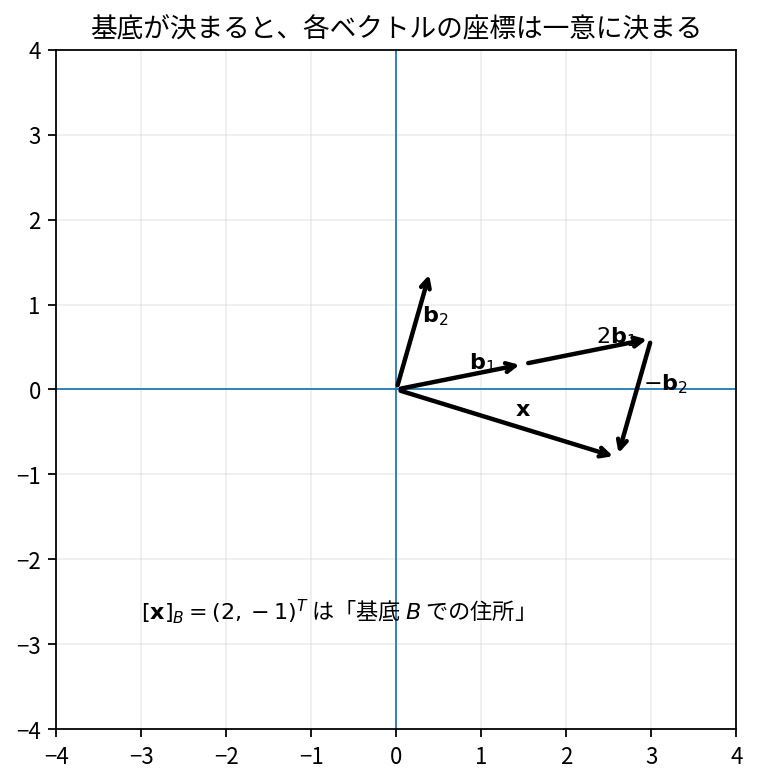

# 基底・座標・次元

Course 02｜線形代数

---
layout: center
---

## 今回の問い

## 到達目標

- 定義と代表式を、自分の言葉と記号で説明できる。
- 成立条件を確認し、手計算と結果を検算できる。

基底は「空間を重複なく生成する最小限の方向セット」。座標は、基底を使ってベクトルを再現する係数である。次元は基底ベクトルの本数で、基底の選び方によらない。

---

## 直感を先に作る

基底は「空間を重複なく生成する最小限の方向セット」。座標は、基底を使ってベクトルを再現する係数である。次元は基底ベクトルの本数で、基底の選び方によらない。

---

## 図で確認

---

## 図のどこを見るか

- 入力と出力を区別する
- 方向・長さ・部分空間・残差のどれが変わるか見る
- 数式の各項と図の要素を対応させる

---

## 記号とshape

- $\mathcal{B}=(\mathbf{v}_1,\ldots,\mathbf{v}_k)$: 順序付きの基底。
- $\mathbf{x}$: 基底$\mathcal{B}$で表したいベクトル。
- $[\mathbf{x}]_{\mathcal{B}}\in\mathbb{R}^k$: $\mathcal{B}$に関する座標ベクトル。
- $c_i$: $\mathbf{x}=\sum_i c_i\mathbf{v}_i$を満たす座標成分。

- 行列 $\mathbf{A}\in\mathbb{R}^{m\times n}$ は $n$ 次元入力を $m$ 次元出力へ写す
- ベクトル・行列は初出時に次元を固定する
- shapeが合うことと数学的条件が成立することは別

---

## 代表式

$$
[\mathbf{x}]_{\mathcal{B}}=[c_1,\ldots,c_k]^{\mathsf T}
$$

式を「左辺の意味 → 右辺の操作 → 条件」の順に読む。

---

## なぜ成り立つ？

spanにより全ベクトルを表現でき、独立性により表現の一意性が保証される。この2条件が「座標系」として機能する理由。

---

## 小さな例

$\mathcal{B}=((1,1)^T,(1,-1)^T)$。$x=(4,2)^T$ は $3(1,1)+1(1,-1)$ なので $[x]_\mathcal{B}=(3,1)^T$。

---

## 手計算

$B=((1,0,1)^T,(0,1,1)^T)$ が張る平面で $x=(2,-1,1)^T$ のB座標を求めよ。

**答え:** $c_1(1,0,1)+c_2(0,1,1)=(c_1,c_2,c_1+c_2)$。$c_1=2,c_2=-1$ で3成分目も1。よって座標は $(2,-1)^T$。

---

## 計算手順

基底ベクトルを列にしたBを作り $Bc=x$ を解いて座標cを得る。基底なら正方かつ可逆（空間全体の場合）。

---

## 失敗条件

- 座標ベクトルと元のベクトルを同じものとみなさない。
- 基底は順序付きと考える。順序を変えると座標成分も変わる。
- 生成集合が基底になるには独立性も必要。

---

## 誤答を診断

「「同じベクトルなら、どの基底でも座標成分は同じ」」

→ 座標は基底依存。幾何的ベクトルは同じでも、基底を変えると係数は変わる。

---

## 数値実装では

- 理論式とアルゴリズムを分ける
- 小さい例で期待値を作る
- 残差・rank・直交性・再構成誤差などで検算する

---

## 後続への接続

基底変換、固有ベクトル基底、Fourier/PCA表現の理解に直結。

---

## 理解確認

1. 定義を式なしで説明できるか
2. 代表式の各記号を定義できるか
3. 条件を外した反例を作れるか
4. 手計算と実装結果を照合できるか

[教科書](../../textbook/la-basis-coordinates-dimension) / [演習](../../exercises/la-basis-coordinates-dimension)
