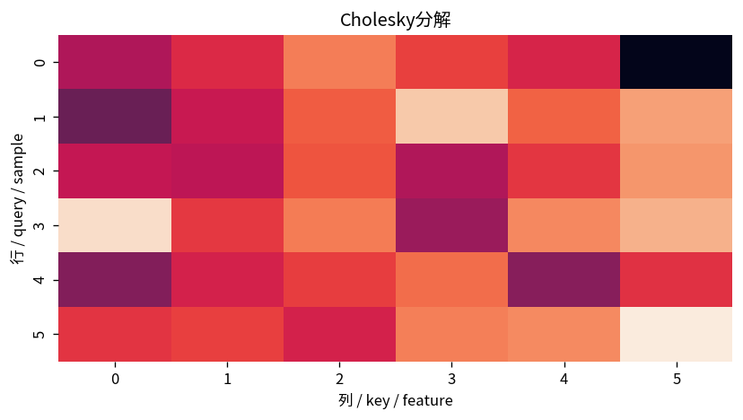

# Cholesky分解

Course 02｜線形代数

---
layout: center
---

## 今回の問い

## 到達目標

- 定義と代表式を、自分の言葉と記号で説明できる。
- 成立条件を確認し、手計算と結果を検算できる。

Cholesky分解は対称正定値行列に特化した「平方根のような」三角分解。一般LUより構造を利用でき、計算量・メモリ・安定性の面で有利。

---

## 直感を先に作る

Cholesky分解は対称正定値行列に特化した「平方根のような」三角分解。一般LUより構造を利用でき、計算量・メモリ・安定性の面で有利。

---

## 図で確認

---

## 図のどこを見るか

- 入力と出力を区別する
- 方向・長さ・部分空間・残差のどれが変わるか見る
- 数式の各項と図の要素を対応させる

---

## 記号とshape

- $\mathbf{A}\in\mathbb{R}^{n\times n}$: 対称正定値行列。
- $\mathbf{L}$: 正の対角成分を持つ下三角行列。
- $\mathbf{A}=\mathbf{L}\mathbf{L}^{\mathsf T}$: Cholesky分解。
- 対称正定値条件により、標準的なCholesky因子$\mathbf{L}$は一意に定まる。

- 行列 $\mathbf{A}\in\mathbb{R}^{m\times n}$ は $n$ 次元入力を $m$ 次元出力へ写す
- ベクトル・行列は初出時に次元を固定する
- shapeが合うことと数学的条件が成立することは別

---

## 代表式

$$
\mathbf{A}=\mathbf{L}\mathbf{L}^{\mathsf T}
$$

式を「左辺の意味 → 右辺の操作 → 条件」の順に読む。

---

## なぜ成り立つ？

$x^TAx=x^TLL^Tx=\|L^Tx\|^2$ なのでCholesky形は正定値性と自然に結びつく。逐次的に対角要素の平方根と下三角成分を決められる。

---

## 小さな例

$A=\begin{bmatrix}4&2\\2&3\end{bmatrix}$ は $L=\begin{bmatrix}2&0\\1&\sqrt2\end{bmatrix}$ で $LL^T=A$。

---

## 手計算

$A=\begin{bmatrix}9&3\\3&5\end{bmatrix}$ のCholesky因子Lを求めよ。

**答え:** $l_{11}=3$, $l_{21}=1$, $l_{22}=\sqrt{5-1}=2$。よって $L=\begin{bmatrix}3&0\\1&2\end{bmatrix}$。

---

## 計算手順

対称性・PDを確認→Cholesky→$Ly=b$ 前進代入→$L^Tx=y$ 後退代入。

---

## 失敗条件

- semidefiniteや不定行列では通常のCholeskyが失敗する。
- Aを明示的に逆行列へしない。
- 対角の平方根が負/zeroに近い場合、PD性や丸め誤差を疑う。

---

## 誤答を診断

「「任意の可逆行列はCholesky分解できる」」

→ Choleskyには（実数の場合）対称正定値という強い条件が必要。

---

## 数値実装では

- 理論式とアルゴリズムを分ける
- 小さい例で期待値を作る
- 残差・rank・直交性・再構成誤差などで検算する

---

## 後続への接続

WLS/GLS、Gaussian process、共分散行列、最適化のNewton系。

---

## 理解確認

1. 定義を式なしで説明できるか
2. 代表式の各記号を定義できるか
3. 条件を外した反例を作れるか
4. 手計算と実装結果を照合できるか

[教科書](../../textbook/la-cholesky-factorization) / [演習](../../exercises/la-cholesky-factorization)
