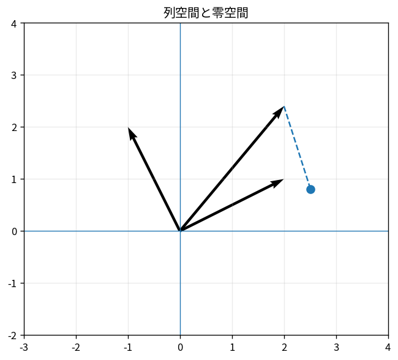

# 列空間と零空間

Course 02｜線形代数

---
layout: center
---

## 今回の問い

## 到達目標

- 定義と代表式を、自分の言葉と記号で説明できる。
- 成立条件を確認し、手計算と結果を検算できる。

列空間は「Aが出力として作れるもの」、零空間は「Aが見えなくしてしまう入力」を表す。$Ax=b$ の解の存在と一意性を、この2つで整理できる。

---

## 直感を先に作る

列空間は「Aが出力として作れるもの」、零空間は「Aが見えなくしてしまう入力」を表す。$Ax=b$ の解の存在と一意性を、この2つで整理できる。

---

## 図で確認

---

## 図のどこを見るか

- 入力と出力を区別する
- 方向・長さ・部分空間・残差のどれが変わるか見る
- 数式の各項と図の要素を対応させる

---

## 記号とshape

- $\mathbf{A}\in\mathbb{R}^{m\times n}$: 線形写像を表す行列。
- $\operatorname{Col}(\mathbf{A})\subseteq\mathbb{R}^m$: $\mathbf{A}$の列空間、すなわち到達可能な出力の集合。
- $\operatorname{Null}(\mathbf{A})\subseteq\mathbb{R}^n$: $\mathbf{A}\mathbf{x}=\mathbf{0}$となる入力の集合（零空間）。
- $\mathbf{0}$: 対応する次元のzeroベクトル。

- 行列 $\mathbf{A}\in\mathbb{R}^{m\times n}$ は $n$ 次元入力を $m$ 次元出力へ写す
- ベクトル・行列は初出時に次元を固定する
- shapeが合うことと数学的条件が成立することは別

---

## 代表式

$$
\operatorname{Null}(\mathbf{A})=\{\mathbf{x}\mid\mathbf{A}\mathbf{x}=\mathbf{0}\}
$$

式を「左辺の意味 → 右辺の操作 → 条件」の順に読む。

---

## なぜ成り立つ？

$Ax=b$ が解を持つのは $b\in\operatorname{Col}(A)$ のとき。もし $z\in\operatorname{Null}(A)$ なら、解$x_p$から$x_p+z$も同じbへ写る。

---

## 小さな例

$A=\begin{bmatrix}1&2&3\\0&1&1\end{bmatrix}$ では第3列 $(3,1)^T$ は第1列 $(1,0)^T$ と第2列 $(2,1)^T$ の和である。したがって列は従属であり、RREFから零空間の自由変数を求められる。

---

## 手計算

$A=\begin{bmatrix}1&2&3\\0&1&1\end{bmatrix}$ の零空間の基底を求めよ。

**答え:** $x_2+x_3=0$ より $x_2=-x_3$、$x_1+2x_2+3x_3=0$ より $x_1=-x_3$。したがって $x=t(-1,-1,1)^T$。

---

## 計算手順

RREFでpivot列を特定し、列空間の基底は元のAのpivot列から取る。null spaceはRREFの自由変数ごとのspecial solutionから基底を作る。

---

## 失敗条件

- 列空間の基底にRREFの列をそのまま使わない（元の列空間が変わる）。
- null spaceは入力側 $\mathbb{R}^n$ にある。
- column spaceは出力側 $\mathbb{R}^m$ にある。

---

## 誤答を診断

「「行基本変形しても列空間そのものは保存される」」

→ 行空間・零空間に関する情報は保たれるが、列空間の具体的なベクトル集合は一般に変わる。pivot列の番号を元のAへ戻す。

---

## 数値実装では

- 理論式とアルゴリズムを分ける
- 小さい例で期待値を作る
- 残差・rank・直交性・再構成誤差などで検算する

---

## 後続への接続

最小二乗ではbを列空間へ射影し、rank不足ではnull spaceが解の非一意性を生む。

---

## 理解確認

1. 定義を式なしで説明できるか
2. 代表式の各記号を定義できるか
3. 条件を外した反例を作れるか
4. 手計算と実装結果を照合できるか

[教科書](../../textbook/la-column-space-null-space) / [演習](../../exercises/la-column-space-null-space)
