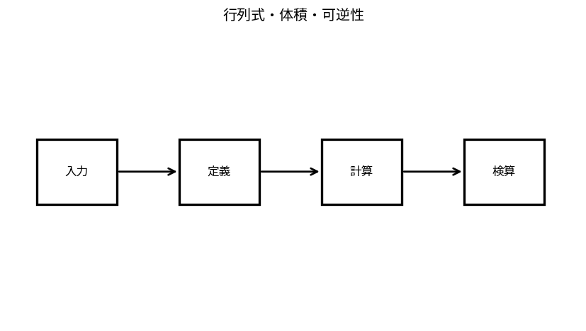

# 行列式・体積・可逆性

Course 02｜線形代数

---
layout: center
---

## 今回の問い

## 到達目標

- 定義と代表式を、自分の言葉と記号で説明できる。
- 成立条件を確認し、手計算と結果を検算できる。

行列式は、線形写像が向き付き体積を何倍にするかを表す一つのスカラー。0なら少なくとも1方向を潰して体積が0になり、可逆でない。

---

## 直感を先に作る

行列式は、線形写像が向き付き体積を何倍にするかを表す一つのスカラー。0なら少なくとも1方向を潰して体積が0になり、可逆でない。

---

## 図で確認

---

## 図のどこを見るか

- 入力と出力を区別する
- 方向・長さ・部分空間・残差のどれが変わるか見る
- 数式の各項と図の要素を対応させる

---

## 記号とshape

- $\det(\mathbf{A})$: 正方行列$\mathbf{A}$の行列式。
- $\mathbf{A},\mathbf{B}\in\mathbb{R}^{n\times n}$: 正方行列。
- $|\det(\mathbf{A})|$: 線形写像$\mathbf{A}$による$n$次元体積の倍率。
- $\det(\mathbf{A})=0$は体積を潰す方向があり、$\mathbf{A}$が非可逆であることと同値。

- 行列 $\mathbf{A}\in\mathbb{R}^{m\times n}$ は $n$ 次元入力を $m$ 次元出力へ写す
- ベクトル・行列は初出時に次元を固定する
- shapeが合うことと数学的条件が成立することは別

---

## 代表式

$$
\det(\mathbf{A}\mathbf{B})=\det(\mathbf{A})\det(\mathbf{B})
$$

式を「左辺の意味 → 右辺の操作 → 条件」の順に読む。

---

## なぜ成り立つ？

三角行列のdetは対角積。消去でAを三角化し、行交換で符号反転、行の定数倍でdetも同倍率という規則を追えば効率よく計算できる。

---

## 小さな例

$A=\begin{bmatrix}2&1\\0&3\end{bmatrix}$ はdet=6。単位正方形の面積を6倍する。

---

## 手計算

$A=\begin{bmatrix}1&2\\3&5\end{bmatrix}$ のdetと可逆性を判定せよ。

**答え:** $\det A=1\cdot5-2\cdot3=-1$。0でないので可逆。面積倍率は1、向きは反転。

---

## 計算手順

小行列は公式、一般にはLU分解を使ってdetを対角積とpivot符号から求める。大規模ではdetそのものよりlogdetを使うことも多い。

---

## 失敗条件

- detは長方形行列には通常定義しない。
- detが大きい/小さいだけで条件数は判断できない。
- 余因子展開は理論には便利だが大規模数値計算には非効率。

---

## 誤答を診断

「「det(A+B)=det(A)+det(B)」」

→ 一般には成り立たない。detは行列積に対して乗法的だが、加法的ではない。

---

## 数値実装では

- 理論式とアルゴリズムを分ける
- 小さい例で期待値を作る
- 残差・rank・直交性・再構成誤差などで検算する

---

## 後続への接続

可逆性、体積変換、確率密度の変数変換、正定値行列のlog determinant。

---

## 理解確認

1. 定義を式なしで説明できるか
2. 代表式の各記号を定義できるか
3. 条件を外した反例を作れるか
4. 手計算と実装結果を照合できるか

[教科書](../../textbook/la-determinants-volume-invertibility) / [演習](../../exercises/la-determinants-volume-invertibility)
