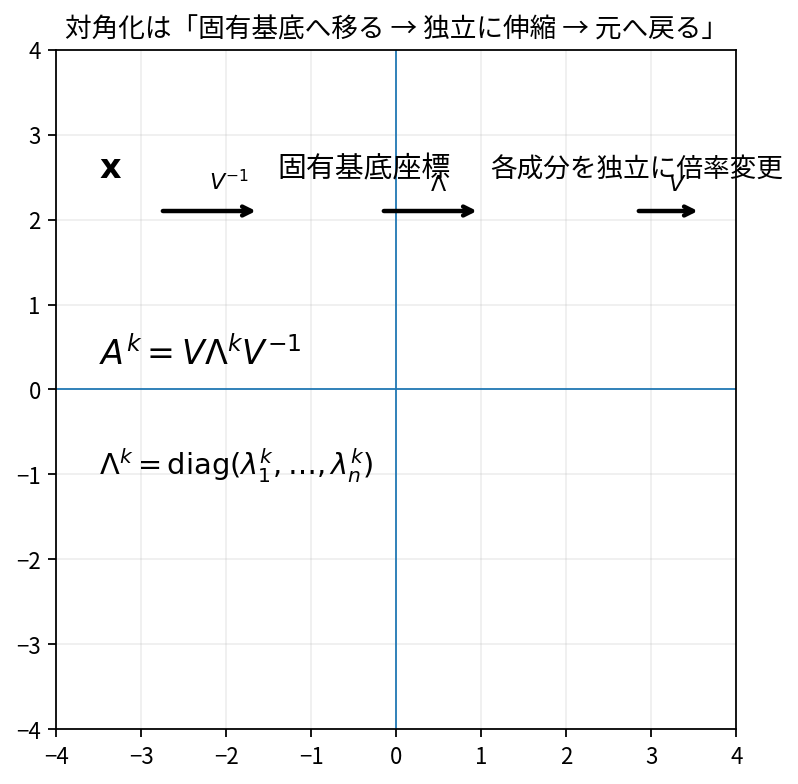

# 対角化と行列の累乗

Course 02｜線形代数

---
layout: center
---

## 今回の問い

## 到達目標

- 定義と代表式を、自分の言葉と記号で説明できる。
- 成立条件を確認し、手計算と結果を検算できる。

十分な数の独立な固有ベクトルがあると、行列を固有ベクトル基底で見るだけで対角行列になる。すると累乗は固有値を累乗するだけになる。

---

## 直感を先に作る

十分な数の独立な固有ベクトルがあると、行列を固有ベクトル基底で見るだけで対角行列になる。すると累乗は固有値を累乗するだけになる。

---

## 図で確認

---

## 図のどこを見るか

- 入力と出力を区別する
- 方向・長さ・部分空間・残差のどれが変わるか見る
- 数式の各項と図の要素を対応させる

---

## 記号とshape

- $\mathbf{V}$: 独立な固有ベクトルを列に並べた可逆行列。
- $\mathbf{\Lambda}$: 対応する固有値を対角に並べた対角行列。
- $k$: 非負整数の累乗回数。
- 対角化可能なら$\mathbf{A}=\mathbf{V}\mathbf{\Lambda}\mathbf{V}^{-1}$であり、累乗は対角成分ごとの累乗へ還元できる。

- 行列 $\mathbf{A}\in\mathbb{R}^{m\times n}$ は $n$ 次元入力を $m$ 次元出力へ写す
- ベクトル・行列は初出時に次元を固定する
- shapeが合うことと数学的条件が成立することは別

---

## 代表式

$$
\mathbf{A}^{k}=\mathbf{V}\mathbf{\Lambda}^{k}\mathbf{V}^{-1}
$$

式を「左辺の意味 → 右辺の操作 → 条件」の順に読む。

---

## なぜ成り立つ？

$A(Ve_i)=\lambda_i(Ve_i)$ なので $AV=V\Lambda$。右から$V^{-1}$を掛ければ分解が得られる。累乗では中間の$V^{-1}V$が消える。

---

## 小さな例

$A=\begin{bmatrix}2&0\\0&3\end{bmatrix}$ は既に対角。$A^5=\operatorname{diag}(32,243)$。非対角でも固有基底へ移れば同様。

---

## 手計算

$A=\operatorname{diag}(1/2,2)$ の $A^4(1,1)^T$ を求めよ。

**答え:** $A^4=\operatorname{diag}(1/16,16)$ なので結果は $(1/16,16)^T$。各固有方向が独立に倍率を累乗する。

---

## 計算手順

固有値・固有ベクトルを求める→Vがfull rankか確認→$V^{-1}AV$が対角になるか検算。

---

## 失敗条件

- すべての行列が対角化可能ではない。
- 固有値の重複だけで不可とは言えない。幾何重複度を見る。
- 数値計算で ill-conditioned V は不安定。

---

## 誤答を診断

「「固有値が全部実数なら必ず対角化できる」」

→ 誤り。例 $\begin{bmatrix}1&1\\0&1\end{bmatrix}$ は実固有値1のみだが独立固有ベクトルが1本しかなく対角化できない。

---

## 数値実装では

- 理論式とアルゴリズムを分ける
- 小さい例で期待値を作る
- 残差・rank・直交性・再構成誤差などで検算する

---

## 後続への接続

差分方程式、Markov chain、行列指数、長時間反復の解析。

---

## 理解確認

1. 定義を式なしで説明できるか
2. 代表式の各記号を定義できるか
3. 条件を外した反例を作れるか
4. 手計算と実装結果を照合できるか

[教科書](../../textbook/la-diagonalization-matrix-powers) / [演習](../../exercises/la-diagonalization-matrix-powers)
