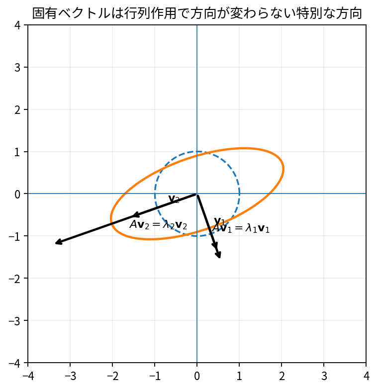

# 固有値と固有ベクトル

Course 02｜線形代数

---
layout: center
---

## 今回の問い

## 到達目標

- 定義と代表式を、自分の言葉と記号で説明できる。
- 成立条件を確認し、手計算と結果を検算できる。

固有ベクトルは、行列を作用させても「向きが変わらず、伸び縮みだけする」特別な方向。固有値がその倍率である。

---

## 直感を先に作る

固有ベクトルは、行列を作用させても「向きが変わらず、伸び縮みだけする」特別な方向。固有値がその倍率である。

---

## 図で確認

---

## 図のどこを見るか

- 入力と出力を区別する
- 方向・長さ・部分空間・残差のどれが変わるか見る
- 数式の各項と図の要素を対応させる

---

## 記号とshape

- $\mathbf{A}\in\mathbb{R}^{n\times n}$: 正方行列。
- $\mathbf{v}\ne\mathbf{0}$: 固有ベクトル。
- $\lambda$: $\mathbf{v}$に対応する固有値。
- $\mathbf{A}\mathbf{v}=\lambda\mathbf{v}$は、$\mathbf{v}$方向が$\mathbf{A}$で向きを変えず倍率$\lambda$だけ伸縮することを表す。

- 行列 $\mathbf{A}\in\mathbb{R}^{m\times n}$ は $n$ 次元入力を $m$ 次元出力へ写す
- ベクトル・行列は初出時に次元を固定する
- shapeが合うことと数学的条件が成立することは別

---

## 代表式

$$
\mathbf{A}\mathbf{v}=\lambda\mathbf{v}
$$

式を「左辺の意味 → 右辺の操作 → 条件」の順に読む。

---

## なぜ成り立つ？

一般のベクトルは方向も変わるが、固有方向では作用がスカラー倍に簡約される。固有ベクトル基底があれば複雑な反復作用も成分ごとの倍率計算になる。

---

## 小さな例

$A=\begin{bmatrix}2&0\\0&3\end{bmatrix}$ ならe1,e2が固有ベクトル、固有値2,3。

---

## 手計算

$A=\begin{bmatrix}2&1\\0&3\end{bmatrix}$ の固有値を求めよ。

**答え:** 上三角なので固有値は対角成分2,3。特性多項式も $(2-\lambda)(3-\lambda)$。

---

## 計算手順

小行列は特性方程式。数値計算では `eig`/対称なら `eigh`。得た固有対は残差 $\|Av-\lambda v\|$ で検算。

---

## 失敗条件

- 0ベクトルは固有ベクトルではない。
- 固有値が重複しても独立な固有ベクトルが同数あるとは限らない。
- 非対称行列では複素固有値がありうる。

---

## 誤答を診断

「「固有ベクトルは行列の列ベクトルである」」

→ 一般には無関係。固有ベクトルは $Av=\lambda v$ を満たす入力方向で、Aの列そのものとは限らない。

---

## 数値実装では

- 理論式とアルゴリズムを分ける
- 小さい例で期待値を作る
- 残差・rank・直交性・再構成誤差などで検算する

---

## 後続への接続

動的系、Markov chain、PCA（共分散固有ベクトル）、安定性解析。

---

## 理解確認

1. 定義を式なしで説明できるか
2. 代表式の各記号を定義できるか
3. 条件を外した反例を作れるか
4. 手計算と実装結果を照合できるか

[教科書](../../textbook/la-eigenvalues-eigenvectors) / [演習](../../exercises/la-eigenvalues-eigenvectors)
