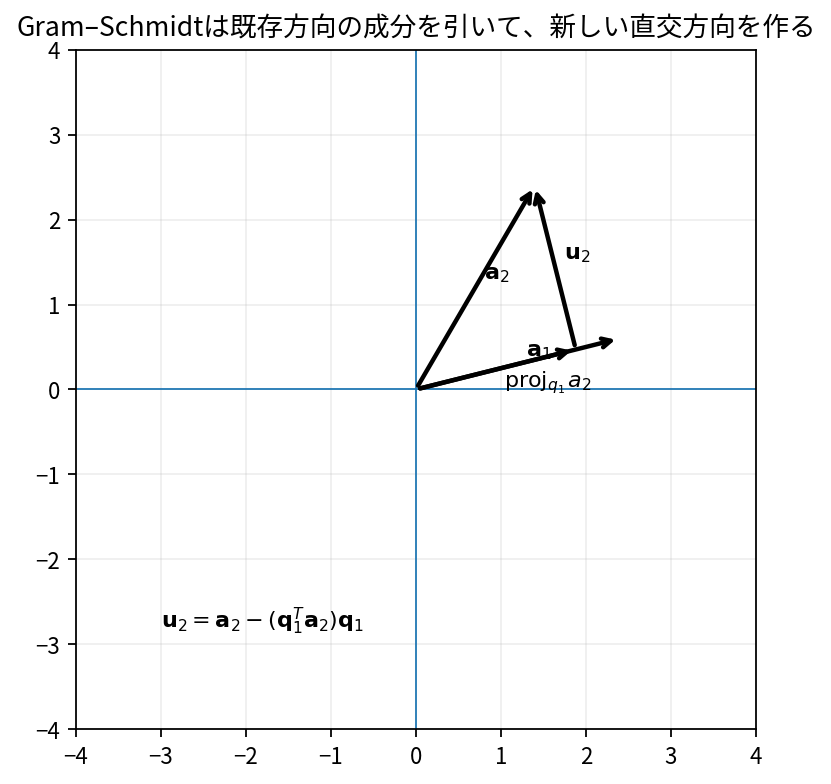

# Gram–Schmidt法とQR分解

Course 02｜線形代数

---
layout: center
---

## 今回の問い

## 到達目標

- 定義と代表式を、自分の言葉と記号で説明できる。
- 成立条件を確認し、手計算と結果を検算できる。

Gram–Schmidt法は、同じspanを保ったまま、ベクトル集合から互いに直交する方向を順番に取り出す。QR分解はその結果を行列としてまとめたもの。

---

## 直感を先に作る

Gram–Schmidt法は、同じspanを保ったまま、ベクトル集合から互いに直交する方向を順番に取り出す。QR分解はその結果を行列としてまとめたもの。

---

## 図で確認

---

## 図のどこを見るか

- 入力と出力を区別する
- 方向・長さ・部分空間・残差のどれが変わるか見る
- 数式の各項と図の要素を対応させる

---

## 記号とshape

- $\mathbf{A}\in\mathbb{R}^{m\times n}$: 独立な列を持つ入力行列（基本形）。
- $\mathbf{Q}\in\mathbb{R}^{m\times n}$: 同じ列空間を張る正規直交列を持つ行列。
- $\mathbf{R}\in\mathbb{R}^{n\times n}$: 上三角行列。
- QR分解は$\mathbf{A}$の列座標を直交基底$\mathbf{Q}$上の係数$\mathbf{R}$へ分離する。

- 行列 $\mathbf{A}\in\mathbb{R}^{m\times n}$ は $n$ 次元入力を $m$ 次元出力へ写す
- ベクトル・行列は初出時に次元を固定する
- shapeが合うことと数学的条件が成立することは別

---

## 代表式

$$
\mathbf{A}=\mathbf{Q}\mathbf{R}
$$

式を「左辺の意味 → 右辺の操作 → 条件」の順に読む。

---

## なぜ成り立つ？

新しい列から既に確保した直交方向の成分をすべて引けば、その残りは既存のq_iすべてに直交する。Rは各a_jのQ基底座標を持つ上三角行列。

---

## 小さな例

$a_1=(1,1)^T$, $a_2=(1,0)^T$。$q_1=(1,1)/\sqrt2$、$u_2=(1,0)-(1/\sqrt2)q_1=(1/2,-1/2)$、$q_2=(1,-1)/\sqrt2$。

---

## 手計算

$a_1=(1,0,1)^T$, $a_2=(1,1,0)^T$ のGram–Schmidt第2残差 $u_2$ を求めよ。

**答え:** $q_1=a_1/\sqrt2$。$q_1^Ta_2=1/\sqrt2$ なので射影は $(1/2,0,1/2)^T$。よって $u_2=(1/2,1,-1/2)^T$。

---

## 計算手順

列を順に処理し、既存qへの射影を引く→ノルムで割る。実装では古典Gram–Schmidtよりmodified Gram–SchmidtやHouseholder QRが安定。

---

## 失敗条件

- 入力列が従属だと途中の残差ノルムが0になる。
- 数値計算で古典GSは直交性を失いやすい。
- QとRのshapeを確認する（reduced QRかfull QRか）。

---

## 誤答を診断

「「Gram–Schmidtは入力ベクトルのspanを変える」」

→ 各新ベクトルは元の列の線形結合であり、逆に元の列もQの線形結合で再現できるのでspanは同じ。

---

## 数値実装では

- 理論式とアルゴリズムを分ける
- 小さい例で期待値を作る
- 残差・rank・直交性・再構成誤差などで検算する

---

## 後続への接続

最小二乗の安定解法、正規直交基底の生成、Krylov法。

---

## 理解確認

1. 定義を式なしで説明できるか
2. 代表式の各記号を定義できるか
3. 条件を外した反例を作れるか
4. 手計算と実装結果を照合できるか

[教科書](../../textbook/la-gram-schmidt-qr) / [演習](../../exercises/la-gram-schmidt-qr)
