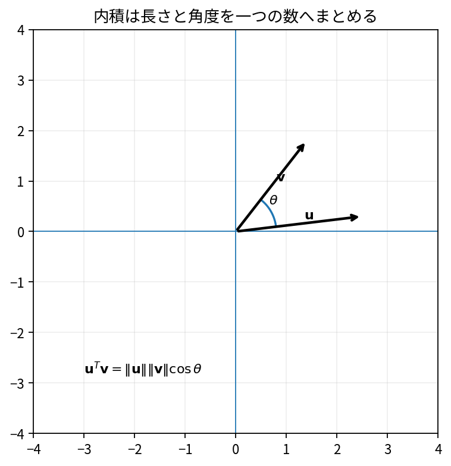

# 内積・ノルム・角度

Course 02｜線形代数

---
layout: center
---

## 今回の問い

## 到達目標

- 定義と代表式を、自分の言葉と記号で説明できる。
- 成立条件を確認し、手計算と結果を検算できる。

内積は二つのベクトルの「向きの一致度」を数値化し、ノルムは長さを与える。角度はこの二つを正規化した量として得られる。

---

## 直感を先に作る

内積は二つのベクトルの「向きの一致度」を数値化し、ノルムは長さを与える。角度はこの二つを正規化した量として得られる。

---

## 図で確認

---

## 図のどこを見るか

- 入力と出力を区別する
- 方向・長さ・部分空間・残差のどれが変わるか見る
- 数式の各項と図の要素を対応させる

---

## 記号とshape

- $\mathbf{x},\mathbf{y}\in\mathbb{R}^n$: 比較する非zeroベクトル。
- $\mathbf{x}^{\mathsf T}\mathbf{y}$: Euclidean内積。
- $\|\mathbf{x}\|_2$: Euclidean norm（2-norm）。
- $\theta\in[0,\pi]$: 2ベクトルのなす角。

- 行列 $\mathbf{A}\in\mathbb{R}^{m\times n}$ は $n$ 次元入力を $m$ 次元出力へ写す
- ベクトル・行列は初出時に次元を固定する
- shapeが合うことと数学的条件が成立することは別

---

## 代表式

$$
\cos\theta=\frac{\mathbf{x}^{\mathsf T}\mathbf{y}}{\|\mathbf{x}\|_2\|\mathbf{y}\|_2}
$$

式を「左辺の意味 → 右辺の操作 → 条件」の順に読む。

---

## なぜ成り立つ？

Cauchy–Schwarz不等式により $|x^Ty|\le\|x\|\|y\|$ なので比は[-1,1]に入り、余弦として解釈できる。

---

## 小さな例

$x=(1,1)^T$, $y=(1,0)^T$。内積1、長さ$\sqrt2$と1なので $\cos\theta=1/\sqrt2$、$\theta=45^\circ$。

---

## 手計算

$x=(2,-1,2)^T$, $y=(1,2,0)^T$ の内積とノルムを求めよ。

**答え:** $x^Ty=2-2+0=0$。$\|x\|_2=3$、$\|y\|_2=\sqrt5$。したがって直交。

---

## 計算手順

内積→各ノルム→0ベクトルでないこと確認→cosを計算。数値誤差でcosがわずかに[-1,1]を外れたらclipしてacosする。

---

## 失敗条件

- 0ベクトルとの角度は定義しない。
- 内積0は直交を意味するが、独立性一般とは別概念。
- cosine similarityとEuclidean distanceは異なる尺度。

---

## 誤答を診断

「「内積が小さければ必ず角度が90度に近い」」

→ スケール依存なので誤り。角度を見るにはノルムで正規化したcosineを使う。

---

## 数値実装では

- 理論式とアルゴリズムを分ける
- 小さい例で期待値を作る
- 残差・rank・直交性・再構成誤差などで検算する

---

## 後続への接続

射影、Gram–Schmidt、類似度、最小二乗、正規直交基底の基礎。

---

## 理解確認

1. 定義を式なしで説明できるか
2. 代表式の各記号を定義できるか
3. 条件を外した反例を作れるか
4. 手計算と実装結果を照合できるか

[教科書](../../textbook/la-inner-products-norms-angles) / [演習](../../exercises/la-inner-products-norms-angles)
