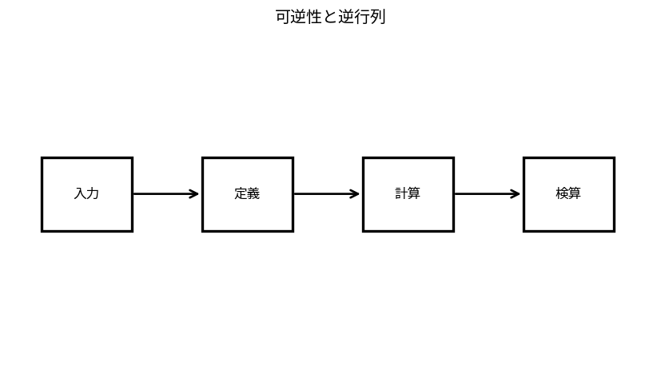

# 可逆性と逆行列

Course 02｜線形代数

---
layout: center
---

## 今回の問い

## 到達目標

- 定義と代表式を、自分の言葉と記号で説明できる。
- 成立条件を確認し、手計算と結果を検算できる。

逆行列は線形写像を「元に戻す」写像である。ただし正方行列なら必ず存在するわけではなく、情報を潰さない（rankが最大）場合に限る。

---

## 直感を先に作る

逆行列は線形写像を「元に戻す」写像である。ただし正方行列なら必ず存在するわけではなく、情報を潰さない（rankが最大）場合に限る。

---

## 図で確認

---

## 図のどこを見るか

- 入力と出力を区別する
- 方向・長さ・部分空間・残差のどれが変わるか見る
- 数式の各項と図の要素を対応させる

---

## 記号とshape

- $\mathbf{A}\in\mathbb{R}^{n\times n}$: 正方行列。
- $\mathbf{A}^{-1}$: $\mathbf{A}^{-1}\mathbf{A}=\mathbf{A}\mathbf{A}^{-1}=\mathbf{I}$を満たす逆行列。
- $\mathbf{I}\in\mathbb{R}^{n\times n}$: 単位行列。
- 可逆（invertible）: 逆行列が存在すること。

- 行列 $\mathbf{A}\in\mathbb{R}^{m\times n}$ は $n$ 次元入力を $m$ 次元出力へ写す
- ベクトル・行列は初出時に次元を固定する
- shapeが合うことと数学的条件が成立することは別

---

## 代表式

$$
\mathbf{A}^{-1}\mathbf{A}=\mathbf{I}
$$

式を「左辺の意味 → 右辺の操作 → 条件」の順に読む。

---

## なぜ成り立つ？

$A$ が可逆なら $A\mathbf{x}=\mathbf{0}$ に左から $A^{-1}$ を掛けて $\mathbf{x}=0$。したがってnull spaceは自明で列は独立。逆にrankが$n$なら各 $\mathbf{b}$ に一意解があり逆写像を定義できる。

---

## 小さな例

$\mathbf{A}=\begin{bmatrix}2&1\\1&1\end{bmatrix}$ は $\det A=1$ で、$\mathbf{A}^{-1}=\begin{bmatrix}1&-1\\-1&2\end{bmatrix}$。

---

## 手計算

$\mathbf{A}=\begin{bmatrix}3&1\\2&1\end{bmatrix}$ の逆行列を求め、$\mathbf{b}=(7,5)^T$ を解け。

**答え:** $\det A=1$ なので $A^{-1}=\begin{bmatrix}1&-1\\-2&3\end{bmatrix}$。$x=A^{-1}b=(2,1)^T$。

---

## 計算手順

理論上はGauss-Jordanで $[A\mid I]\to[I\mid A^{-1}]$。数値計算では逆行列を明示的に作らず `solve(A,b)` を使うのが基本。

---

## 失敗条件

- detが0に近い行列では理論上可逆でも数値的に不安定。
- 長方形行列に通常の逆行列はない。
- $A^{-1}b$ を計算するために `inv(A) @ b` を標準手順にしない。

---

## 誤答を診断

「「detが小さくても0でなければ数値計算上の問題はない」」

→ 誤り。detの絶対値だけで安定性は判断できないが、ほぼ特異な行列では条件数が大きくなり、入力誤差が解で増幅されうる。

---

## 数値実装では

- 理論式とアルゴリズムを分ける
- 小さい例で期待値を作る
- 残差・rank・直交性・再構成誤差などで検算する

---

## 後続への接続

一意な線形系、座標変換の逆変換、可逆な前処理の理解に使う。

---

## 理解確認

1. 定義を式なしで説明できるか
2. 代表式の各記号を定義できるか
3. 条件を外した反例を作れるか
4. 手計算と実装結果を照合できるか

[教科書](../../textbook/la-invertibility-inverse-matrices) / [演習](../../exercises/la-invertibility-inverse-matrices)
