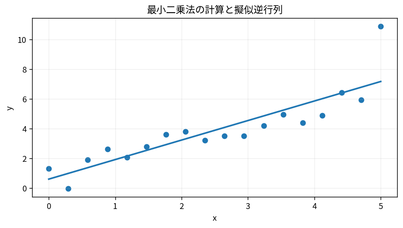

# 最小二乗法の計算と擬似逆行列

Course 02｜線形代数

---
layout: center
---

## 今回の問い

## 到達目標

- 定義と代表式を、自分の言葉と記号で説明できる。
- 成立条件を確認し、手計算と結果を検算できる。

最小二乗を計算する方法は一つではない。理論式として擬似逆行列が統一的だが、数値計算ではQRやSVDを使い、rank不足も含めて安定に扱う。

---

## 直感を先に作る

最小二乗を計算する方法は一つではない。理論式として擬似逆行列が統一的だが、数値計算ではQRやSVDを使い、rank不足も含めて安定に扱う。

---

## 図で確認

---

## 図のどこを見るか

- 入力と出力を区別する
- 方向・長さ・部分空間・残差のどれが変わるか見る
- 数式の各項と図の要素を対応させる

---

## 記号とshape

- $\mathbf{A}^{+}$: Moore–Penrose擬似逆行列。長方形・rank不足行列にも定義される。
- $\mathbf{b}$: 観測または右辺ベクトル。
- $\hat{\mathbf{x}}$: 擬似逆で得る最小二乗解。解が複数ある場合は最小2-norm解。
- SVDはsingular value decomposition（特異値分解）、QRはQR factorizationを指す。

- 行列 $\mathbf{A}\in\mathbb{R}^{m\times n}$ は $n$ 次元入力を $m$ 次元出力へ写す
- ベクトル・行列は初出時に次元を固定する
- shapeが合うことと数学的条件が成立することは別

---

## 代表式

$$
\hat{\mathbf{x}}=\mathbf{A}^{+}\mathbf{b}
$$

式を「左辺の意味 → 右辺の操作 → 条件」の順に読む。

---

## なぜ成り立つ？

SVD座標では各特異方向ごとに $\sigma_i z_i\approx u_i^Tb$ を解く。非zero特異値だけ逆数を取ることで、rank不足でも最小ノルム解を選べる。

---

## 小さな例

$A=\begin{bmatrix}1&0\\0&0\end{bmatrix}$, $b=(2,3)^T$。最小二乗では第2成分3は再現不能。擬似逆で最小ノルム解 $(2,0)^T$ を得る。

---

## 手計算

$A=\operatorname{diag}(2,0)$, $b=(6,5)^T$。$A^+$と最小ノルム最小二乗解を求めよ。

**答え:** $A^+=\operatorname{diag}(1/2,0)$。したがって $x=A^+b=(3,0)^T$。再構成は$(6,0)^T$で残差$(0,5)^T$。

---

## 計算手順

実装は `np.linalg.lstsq` またはQR/SVD。擬似逆行列を明示的に作るのは、多数のbへ繰り返し適用する等の理由がある場合に限定。

---

## 失敗条件

- $(A^TA)^{-1}A^T$ はrank不足では使えない。
- 小さい特異値の逆数はノイズを増幅する。
- `pinv`のcutoffは数値rankの定義に影響する。

---

## 誤答を診断

「「擬似逆行列は逆行列が存在するときだけ定義される」」

→ 逆。擬似逆は長方形・rank不足を含む任意行列に定義でき、可逆正方行列では通常の逆行列と一致する。

---

## 数値実装では

- 理論式とアルゴリズムを分ける
- 小さい例で期待値を作る
- 残差・rank・直交性・再構成誤差などで検算する

---

## 後続への接続

rank不足回帰、inverse problem、WLSMの拡張、minimum-norm solution。

---

## 理解確認

1. 定義を式なしで説明できるか
2. 代表式の各記号を定義できるか
3. 条件を外した反例を作れるか
4. 手計算と実装結果を照合できるか

[教科書](../../textbook/la-least-squares-computation-pseudoinverse) / [演習](../../exercises/la-least-squares-computation-pseudoinverse)
