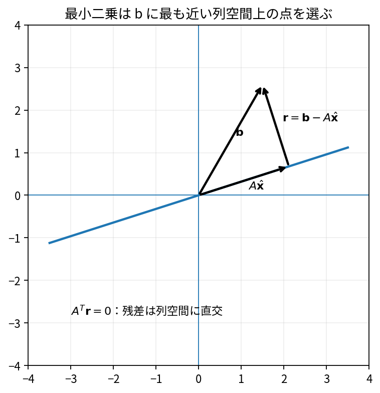

# 最小二乗法の幾何学

Course 02｜線形代数

---
layout: center
---

## 今回の問い

## 到達目標

- 定義と代表式を、自分の言葉と記号で説明できる。
- 成立条件を確認し、手計算と結果を検算できる。

方程式 $Ax=b$ が解けないとき、最小二乗法は「bに最も近い列空間上の点」を選ぶ。解そのものより、$A\hat x$ がbの直交射影になることが本質。

---

## 直感を先に作る

方程式 $Ax=b$ が解けないとき、最小二乗法は「bに最も近い列空間上の点」を選ぶ。解そのものより、$A\hat x$ がbの直交射影になることが本質。

---

## 図で確認

---

## 図のどこを見るか

- 入力と出力を区別する
- 方向・長さ・部分空間・残差のどれが変わるか見る
- 数式の各項と図の要素を対応させる

---

## 記号とshape

- $\mathbf{A}\in\mathbb{R}^{m\times n}$: design matrix（説明変数を列に持つ行列）。
- $\mathbf{x}\in\mathbb{R}^n$: 推定する係数ベクトル。
- $\mathbf{b}\in\mathbb{R}^m$: 観測ベクトル。
- $\mathbf{r}=\mathbf{b}-\mathbf{A}\mathbf{x}$: 残差。最小二乗解では$\mathbf{r}$が$\operatorname{Col}(\mathbf{A})$に直交する。

- 行列 $\mathbf{A}\in\mathbb{R}^{m\times n}$ は $n$ 次元入力を $m$ 次元出力へ写す
- ベクトル・行列は初出時に次元を固定する
- shapeが合うことと数学的条件が成立することは別

---

## 代表式

$$
\min_{\mathbf{x}}\|\mathbf{A}\mathbf{x}-\mathbf{b}\|_2^2
$$

式を「左辺の意味 → 右辺の操作 → 条件」の順に読む。

---

## なぜ成り立つ？

目的関数を微分してもよいし、幾何学的に残差rがCol(A)へ直交することから $A^Tr=0$ を得てもよい。後者がMIT 18.06の中心的見方。

---

## 小さな例

点$(0,1),(1,2),(2,2)$へ直線 $y=c+mx$ を当てる。Aの列は定数項とx、bはy値。bをCol(A)へ射影して係数を得る。

---

## 手計算

$A=\begin{bmatrix}1\\1\end{bmatrix}$, $b=(2,4)^T$。定数$c$でbを近似する最小二乗解を求めよ。

**答え:** $c$は平均で3。$A\hat c=(3,3)^T$、残差$(-1,1)^T$はAの列$(1,1)^T$と内積0。

---

## 計算手順

design matrix Aとbを作る→QRや `lstsq` で解く→残差rを計算→$A^Tr\approx0$ を検算。

---

## 失敗条件

- 正規方程式を数値実装の第一選択にしない（条件数を二乗しうる）。
- 最小二乗解は「元の方程式を厳密に満たす解」とは限らない。
- residual normとparameter normを混同しない。

---

## 誤答を診断

「「最小二乗では残差ベクトルが0になる」」

→ bがCol(A)に入る場合だけ0。一般には残差は非zeroだが、Col(A)へ直交する。

---

## 数値実装では

- 理論式とアルゴリズムを分ける
- 小さい例で期待値を作る
- 残差・rank・直交性・再構成誤差などで検算する

---

## 後続への接続

線形回帰、スペクトルunmixing、校正曲線、過剰決定系。

---

## 理解確認

1. 定義を式なしで説明できるか
2. 代表式の各記号を定義できるか
3. 条件を外した反例を作れるか
4. 手計算と実装結果を照合できるか

[教科書](../../textbook/la-least-squares-geometry) / [演習](../../exercises/la-least-squares-geometry)
