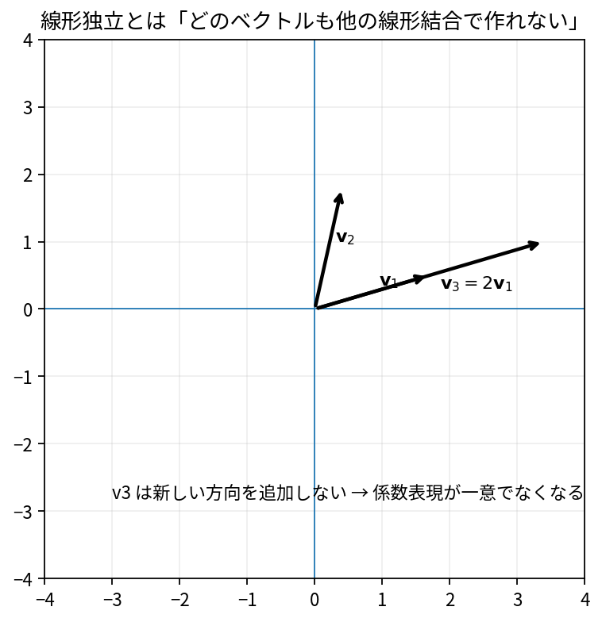

# 線形独立と線形従属

Course 02｜線形代数

---
layout: center
---

## 今回の問い

## 到達目標

- 定義と代表式を、自分の言葉と記号で説明できる。
- 成立条件を確認し、手計算と結果を検算できる。

線形独立とは「どのベクトルも他のベクトルの線形結合で作れない」こと。独立なら係数表現に冗長性がない。

---

## 直感を先に作る

線形独立とは「どのベクトルも他のベクトルの線形結合で作れない」こと。独立なら係数表現に冗長性がない。

---

## 図で確認

---

## 図のどこを見るか

- 入力と出力を区別する
- 方向・長さ・部分空間・残差のどれが変わるか見る
- 数式の各項と図の要素を対応させる

---

## 記号とshape

- $\mathbf{v}_1,\ldots,\mathbf{v}_k$: 独立性を判定するベクトル。
- $c_1,\ldots,c_k$: 線形関係の係数。
- $\mathbf{0}$: zeroベクトル。
- 「線形独立」とは、zeroベクトルを作る係数が$c_1=\cdots=c_k=0$だけであること。

- 行列 $\mathbf{A}\in\mathbb{R}^{m\times n}$ は $n$ 次元入力を $m$ 次元出力へ写す
- ベクトル・行列は初出時に次元を固定する
- shapeが合うことと数学的条件が成立することは別

---

## 代表式

$$
c_1\mathbf{v}_1+\cdots+c_k\mathbf{v}_k=\mathbf{0}
$$

式を「左辺の意味 → 右辺の操作 → 条件」の順に読む。

---

## なぜ成り立つ？

列を並べた行列Vに対し $Vc=0$ を考えると、独立性はnull spaceが$\{0\}$かどうかと同じ。pivotが各列にあるかでも判定できる。

---

## 小さな例

$v_1=(1,0)^T$, $v_2=(0,1)^T$ は独立。$v_3=(1,1)^T$ を加えると $v_1+v_2-v_3=0$ という非自明関係ができる。

---

## 手計算

$(1,2,0)^T,(0,1,1)^T,(1,3,1)^T$ は独立か。

**答え:** 3本目は1本目+2本目? $(1,2,0)+(0,1,1)=(1,3,1)$ なので従属。関係 $v_1+v_2-v_3=0$。

---

## 計算手順

ベクトルを列に並べてRREF→自由変数がなければ独立。少数なら明らかな線形関係を直接探してもよい。

---

## 失敗条件

- 直交なら独立だが、独立だから直交とは限らない。
- ゼロベクトルを含む集合は必ず従属。
- $\mathbb{R}^n$で$n$本を超えるベクトルは必ず従属。

---

## 誤答を診断

「「互いに平行でなければ3本のベクトルは必ず独立」」

→ $\mathbb{R}^2$では3本は必ず従属。また$\mathbb{R}^3$でも1本が他2本の和なら、どの2本も平行でなくても従属。

---

## 数値実装では

- 理論式とアルゴリズムを分ける
- 小さい例で期待値を作る
- 残差・rank・直交性・再構成誤差などで検算する

---

## 後続への接続

基底選択、特徴量の冗長性、full column rank、QRや最小二乗の一意性につながる。

---

## 理解確認

1. 定義を式なしで説明できるか
2. 代表式の各記号を定義できるか
3. 条件を外した反例を作れるか
4. 手計算と実装結果を照合できるか

[教科書](../../textbook/la-linear-independence) / [演習](../../exercises/la-linear-independence)
