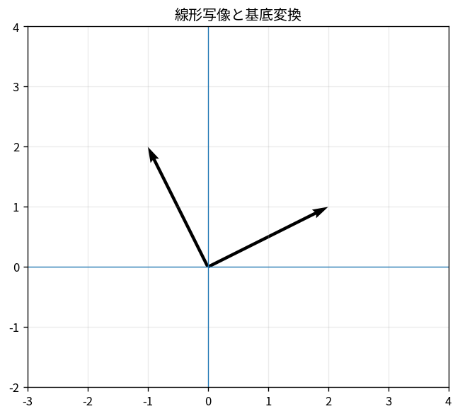

# 線形写像と基底変換

Course 02｜線形代数

---
layout: center
---

## 今回の問い

## 到達目標

- 定義と代表式を、自分の言葉と記号で説明できる。
- 成立条件を確認し、手計算と結果を検算できる。

同じ線形写像でも、基底を変えると行列表現は変わる。基底変換は「幾何学的対象を変える」のではなく「座標の書き方を変える」操作である。

---

## 直感を先に作る

同じ線形写像でも、基底を変えると行列表現は変わる。基底変換は「幾何学的対象を変える」のではなく「座標の書き方を変える」操作である。

---

## 図で確認

---

## 図のどこを見るか

- 入力と出力を区別する
- 方向・長さ・部分空間・残差のどれが変わるか見る
- 数式の各項と図の要素を対応させる

---

## 記号とshape

- $\mathcal{B},\mathcal{C}$: 同じベクトル空間の2つの順序付き基底。
- $[\mathbf{x}]_{\mathcal{B}},[\mathbf{x}]_{\mathcal{C}}$: 同じ幾何学的ベクトル$\mathbf{x}$の各基底での座標。
- $\mathbf{P}_{\mathcal{C}\leftarrow\mathcal{B}}$: $\mathcal{B}$座標を$\mathcal{C}$座標へ変換する基底変換行列。
- 矢印$\mathcal{C}\leftarrow\mathcal{B}$は「入力が$\mathcal{B}$、出力が$\mathcal{C}$」を表す。

- 行列 $\mathbf{A}\in\mathbb{R}^{m\times n}$ は $n$ 次元入力を $m$ 次元出力へ写す
- ベクトル・行列は初出時に次元を固定する
- shapeが合うことと数学的条件が成立することは別

---

## 代表式

$$
[\mathbf{x}]_{\mathcal{C}}=\mathbf{P}_{\mathcal{C}\leftarrow\mathcal{B}}[\mathbf{x}]_{\mathcal{B}}
$$

式を「左辺の意味 → 右辺の操作 → 条件」の順に読む。

---

## なぜ成り立つ？

まずB座標から実ベクトルへ戻し、次にC座標へ読み替える。この2段階を合成したものが基底変換行列。

---

## 小さな例

$B=((1,1),(1,-1))$, 標準基底E。$P_{E\leftarrow B}=\begin{bmatrix}1&1\\1&-1\end{bmatrix}$。B座標$(3,1)$は標準座標$(4,2)$へ変わる。

---

## 手計算

$B=((1,1)^T,(1,-1)^T)$。$[x]_B=(2,-1)^T$ を標準座標へ変換せよ。

**答え:** $x=2(1,1)-1(1,-1)=(1,3)^T$。変換行列を使っても $\begin{bmatrix}1&1\\1&-1\end{bmatrix}(2,-1)^T=(1,3)^T$。

---

## 計算手順

「どこからどこへ」を添字で固定する→基底ベクトルを適切な座標で列に並べる→必要なら逆行列で逆方向を得る。

---

## 失敗条件

- $P_{C\leftarrow B}$ と $P_{B\leftarrow C}$ を取り違えない。
- similarity変換の左右の順序を暗記だけで使わない。
- 基底変更で固有値は変わらない。

---

## 誤答を診断

「「基底を変えるとベクトル自体も別の幾何学的ベクトルになる」」

→ 変わるのは座標表示。対象ベクトルや線形写像そのものは同じ。

---

## 数値実装では

- 理論式とアルゴリズムを分ける
- 小さい例で期待値を作る
- 残差・rank・直交性・再構成誤差などで検算する

---

## 後続への接続

固有分解、対角化、PCA、物理の座標系、表現学習で同じ対象を便利な座標へ移す。

---

## 理解確認

1. 定義を式なしで説明できるか
2. 代表式の各記号を定義できるか
3. 条件を外した反例を作れるか
4. 手計算と実装結果を照合できるか

[教科書](../../textbook/la-linear-maps-change-of-basis) / [演習](../../exercises/la-linear-maps-change-of-basis)
