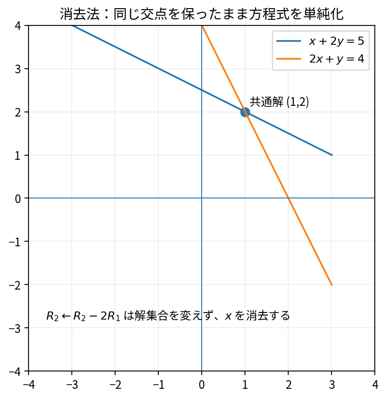
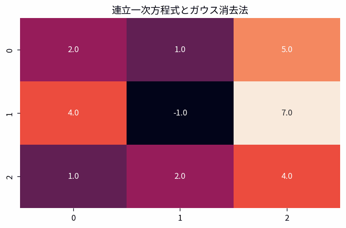

# 連立一次方程式とガウス消去法

Course 02｜線形代数

---
layout: center
---

## 今回の問い

連立一次方程式とガウス消去法で、何を入力し、代表式がどの量を出力し、どの成立条件を外すと結果が壊れるのか。

---

## 到達目標

- 連立一次方程式とガウス消去法の定義と代表式を言葉で説明できる
- 図と式の対応を説明できる
- 小さな例で成立条件と失敗条件を検算できる

---

## 直感

連立一次方程式を、解集合を変えない行基本変形で階段形へ整理する操作として見る。

**前提:** la-matrix-multiplication

---

## 図解

---

## 図を見るポイント

- 図の軸・点・矢印・領域を数式と対応づける
- 代表式の各項と図の要素を対応づける
- 条件を変えたとき、どこが変化するか予測する

---

## 代表式

$$
\mathbf{A}\mathbf{x}=\mathbf{b}
$$

左辺の出力 → 右辺の操作 → 入力の型の順で読む。

---

## 式をどう読むか

- **対象:** 連立一次方程式、ガウス消去法
- shape・次元・定義域を先に確定する
- 計算後に符号・大きさ・残差・確率などを図と照合する

---

## 小さな例

2変数または3変数の方程式を1行ずつ消去し、係数行列が三角化される過程を追う。

小さな例で、手計算と実装の結果を照合する。

---

## 動き／思考実験で確認

- 各frameで、何が固定され何が更新されるかを追う。

---

## 成立条件

- pivotが0または極端に小さい場合は行交換を考える。
- 行基本変形は解集合を保存する。
- 連立一次方程式とガウス消去法の定義と計算手順を区別し、数値例だけで一般性を判断しない。

---

## よくある誤解

- 連立一次方程式とガウス消去法の定義と計算手順を同一視する
- 成立条件を確認せず公式を適用する
- 数学上の次元と配列のshapeを混同する

---

## 数値・実装で検算

1. 小さい入力を作る
2. 定義式から期待値を手で求める
3. NumPy等の実装結果と比較する
4. shape・残差・許容誤差・seedを記録する

---

## 後続分野への接続

連立一次方程式とガウス消去法は、後続の数値計算・データ解析・機械学習で前提となる。

このTopicの量が、後続で入力・目的関数・制約・診断のどれとして使われるか確認する。

---

## 理解確認

- 連立一次方程式とガウス消去法を図→式→小例の順で説明できるか
- 条件を1つ外した反例を作れるか

[教科書](../../textbook/la-linear-systems-elimination)

[10問の演習](../../exercises/la-linear-systems-elimination)
