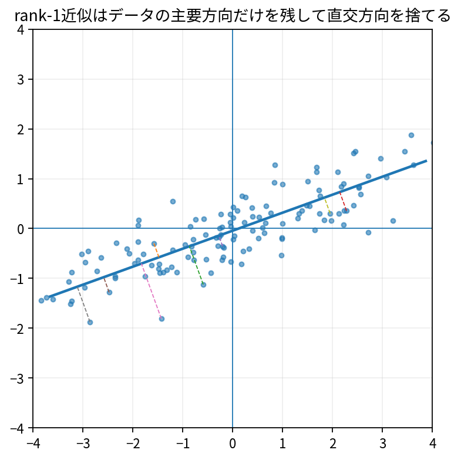

# 低ランク近似

Course 02｜線形代数

---
layout: center
---

## 今回の問い

## 到達目標

- 定義と代表式を、自分の言葉と記号で説明できる。
- 成立条件を確認し、手計算と結果を検算できる。

低ランク近似は、行列の情報を少数の主要な特異方向へ圧縮する。SVDは「どのrank-r近似がFrobenius/2-normで最良か」を直接与える。

---

## 直感を先に作る

低ランク近似は、行列の情報を少数の主要な特異方向へ圧縮する。SVDは「どのrank-r近似がFrobenius/2-normで最良か」を直接与える。

---

## 図で確認

---

## 図のどこを見るか

- 入力と出力を区別する
- 方向・長さ・部分空間・残差のどれが変わるか見る
- 数式の各項と図の要素を対応させる

---

## 記号とshape

- $\sigma_i$: 大きい順に並べた特異値。
- $\mathbf{u}_i,\mathbf{v}_i$: 第$i$左・右特異ベクトル。
- $r$: 残す特異成分の数（近似rank）。
- $\mathbf{A}_r$: 上位$r$成分だけで再構成したrank高々$r$の近似行列。

- 行列 $\mathbf{A}\in\mathbb{R}^{m\times n}$ は $n$ 次元入力を $m$ 次元出力へ写す
- ベクトル・行列は初出時に次元を固定する
- shapeが合うことと数学的条件が成立することは別

---

## 代表式

$$
\mathbf{A}_r=\sum_{i=1}^{r}\sigma_i\mathbf{u}_i\mathbf{v}_i^{\mathsf T}
$$

式を「左辺の意味 → 右辺の操作 → 条件」の順に読む。

---

## なぜ成り立つ？

SVDでは直交するrank-1成分が特異値順に並ぶ。小さい特異値の成分を捨てると、最大のエネルギーを保ちながらrankを下げられる。

---

## 小さな例

特異値が(10,3,0.2)ならrank1近似は10の成分だけ、rank2なら10と3を残す。rank2のspectral誤差は0.2。

---

## 手計算

特異値が $8,2,0.5$ の行列をrank1近似したときのspectral norm誤差とFrobenius norm誤差を求めよ。

**答え:** spectral誤差は次の特異値2。Frobenius誤差は $\sqrt{2^2+0.5^2}=\sqrt{4.25}\approx2.062$。

---

## 計算手順

SVD→特異値を可視化→rを選択→先頭r成分で再構成→再構成誤差と圧縮率を評価。

---

## 失敗条件

- rを増やせば訓練データ再構成は必ず改善するが、意味のある構造が増えるとは限らない。
- 特異値のscaleだけでrを自動決定しない。
- center/scaleの有無でデータ行列の低ランク構造は変わる。

---

## 誤答を診断

「「rank1近似は元行列の1行だけ残すこと」」

→ rank1近似は $\sigma_1u_1v_1^T$ という外積で、一般にすべての行・列に非zero成分を持つ。

---

## 数値実装では

- 理論式とアルゴリズムを分ける
- 小さい例で期待値を作る
- 残差・rank・直交性・再構成誤差などで検算する

---

## 後続への接続

画像圧縮、PCA、ノイズ除去、潜在因子、NMFとの比較。

---

## 理解確認

1. 定義を式なしで説明できるか
2. 代表式の各記号を定義できるか
3. 条件を外した反例を作れるか
4. 手計算と実装結果を照合できるか

[教科書](../../textbook/la-low-rank-approximation) / [演習](../../exercises/la-low-rank-approximation)
