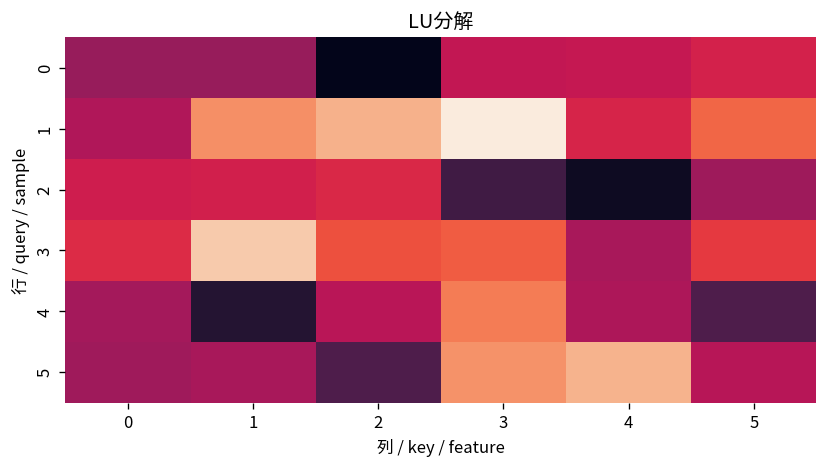

# LU分解

Course 02｜線形代数

---
layout: center
---

## 今回の問い

## 到達目標

- 定義と代表式を、自分の言葉と記号で説明できる。
- 成立条件を確認し、手計算と結果を検算できる。

LU分解はガウス消去を「一度分解として保存」する方法である。$L$ に消去係数、$U$ に消去後の上三角行列を持たせる。

---

## 直感を先に作る

LU分解はガウス消去を「一度分解として保存」する方法である。$L$ に消去係数、$U$ に消去後の上三角行列を持たせる。

---

## 図で確認

---

## 図のどこを見るか

- 入力と出力を区別する
- 方向・長さ・部分空間・残差のどれが変わるか見る
- 数式の各項と図の要素を対応させる

---

## 記号とshape

- $\mathbf{A}\in\mathbb{R}^{n\times n}$: 分解対象の行列。
- $\mathbf{L}$: 対角成分を1とする下三角行列（lower triangular matrix）。
- $\mathbf{U}$: 上三角行列（upper triangular matrix）。
- pivotingを含む実装では$\mathbf{P}\mathbf{A}=\mathbf{L}\mathbf{U}$とし、$\mathbf{P}$は行交換を表す置換行列。

- 行列 $\mathbf{A}\in\mathbb{R}^{m\times n}$ は $n$ 次元入力を $m$ 次元出力へ写す
- ベクトル・行列は初出時に次元を固定する
- shapeが合うことと数学的条件が成立することは別

---

## 代表式

$$
\mathbf{A}=\mathbf{L}\mathbf{U}
$$

式を「左辺の意味 → 右辺の操作 → 条件」の順に読む。

---

## なぜ成り立つ？

ガウス消去で使う「行$i$から$m_{ij}$倍のpivot行を引く」操作を逆に集めると、下三角行列$L$になる。右辺が変わってもAが同じなら分解を再利用できる。

---

## 小さな例

$\mathbf{A}=\begin{bmatrix}2&1\\4&3\end{bmatrix}$ は $L=\begin{bmatrix}1&0\\2&1\end{bmatrix}$, $U=\begin{bmatrix}2&1\\0&1\end{bmatrix}$。

---

## 手計算

$A=\begin{bmatrix}1&2\\3&8\end{bmatrix}$ をpivotingなしでLU分解せよ。

**答え:** 第1pivotで係数3を使うので $L=\begin{bmatrix}1&0\\3&1\end{bmatrix}$、$U=\begin{bmatrix}1&2\\0&2\end{bmatrix}$。積を戻すとAになる。

---

## 計算手順

pivoting付きLUを作る→$Ly=Pb$ を前進代入→$Ux=y$ を後退代入。複数の右辺を解くとき特に有利。

---

## 失敗条件

- pivotingなしLUが常に安定とは限らない。
- $L$ の対角を1とする流儀など規約を確認する。
- 分解と「逆行列を求めること」を混同しない。

---

## 誤答を診断

「「LU分解できればpivotingは不要」」

→ 存在と数値安定性は別。小さいpivotを使うと丸め誤差が増幅されるため、実装では部分pivotingを伴う $PA=LU$ が標準。

---

## 数値実装では

- 理論式とアルゴリズムを分ける
- 小さい例で期待値を作る
- 残差・rank・直交性・再構成誤差などで検算する

---

## 後続への接続

多数の右辺を持つ線形系、数値線形代数、最適化内部の線形ソルバで使われる。

---

## 理解確認

1. 定義を式なしで説明できるか
2. 代表式の各記号を定義できるか
3. 条件を外した反例を作れるか
4. 手計算と実装結果を照合できるか

[教科書](../../textbook/la-lu-factorization) / [演習](../../exercises/la-lu-factorization)
