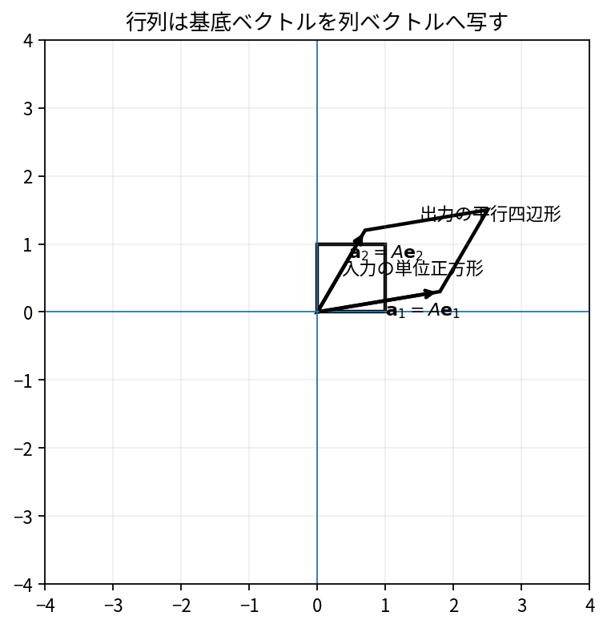

# 行列をデータと線形写像として見る

Course 02｜線形代数

---
layout: center
---

## 今回の問い

## 到達目標

- 定義と代表式を、自分の言葉と記号で説明できる。
- 成立条件を確認し、手計算と結果を検算できる。

行列には二つの読み方がある。数表として行・列に意味を持たせる読み方と、入力ベクトルを別のベクトルへ移す線形写像としての読み方である。後者では「各列は標準基底がどこへ移るか」を表す。

---

## 直感を先に作る

行列には二つの読み方がある。数表として行・列に意味を持たせる読み方と、入力ベクトルを別のベクトルへ移す線形写像としての読み方である。後者では「各列は標準基底がどこへ移るか」を表す。

---

## 図で確認

---

## 図のどこを見るか

- 入力と出力を区別する
- 方向・長さ・部分空間・残差のどれが変わるか見る
- 数式の各項と図の要素を対応させる

---

## 記号とshape

- $\mathbf{A}\in\mathbb{R}^{m\times n}$: 線形写像を表す行列。列数$n$が入力次元、行数$m$が出力次元。
- $\mathbf{x}\in\mathbb{R}^n$: 入力ベクトル。
- $T:\mathbb{R}^n\to\mathbb{R}^m$: 行列$\mathbf{A}$が定める線形写像。
- $T(\mathbf{x})\in\mathbb{R}^m$: 出力ベクトル。

- 行列 $\mathbf{A}\in\mathbb{R}^{m\times n}$ は $n$ 次元入力を $m$ 次元出力へ写す
- ベクトル・行列は初出時に次元を固定する
- shapeが合うことと数学的条件が成立することは別

---

## 代表式

$$
T(\mathbf{x})=\mathbf{A}\mathbf{x}
$$

式を「左辺の意味 → 右辺の操作 → 条件」の順に読む。

---

## なぜ成り立つ？

標準基底 $\mathbf{e}_j$ を入力すると $\mathbf{A}\mathbf{e}_j$ は第$j$列になる。したがって任意の入力の出力は、列ベクトルを入力成分で重み付けした線形結合になる。

---

## 小さな例

$\mathbf{A}=\begin{bmatrix}2&1\\0&1\end{bmatrix}$ なら $\mathbf{e}_1\mapsto(2,0)^T$、$\mathbf{e}_2\mapsto(1,1)^T$。単位正方形はこの2本を辺にもつ平行四辺形へ写る。

---

## 手計算

$\mathbf{A}=\begin{bmatrix}1&2\\-1&3\end{bmatrix}$ と $\mathbf{x}=(2,-1)^T$ に対して $T(\mathbf{x})$ を求めよ。

**答え:** $\mathbf{A}\mathbf{x}=(1\cdot2+2\cdot(-1),-1\cdot2+3\cdot(-1))^T=(0,-5)^T$。

---

## 計算手順

行列のshapeを $(m,n)$ と確認し、入力が長さ$n$、出力が長さ$m$になることを先に予測する。列の意味と行の意味を区別してから積を計算する。

---

## 失敗条件

- 行列の行数と列数の意味を逆にしない。
- 行列を単なる表と見て、入力空間・出力空間を無視しない。
- 線形写像には原点を原点へ送る性質がある。平行移動は行列だけでは表せない。

---

## 誤答を診断

「「$2\times3$ 行列は $\mathbb{R}^2$ を $\mathbb{R}^3$ へ写す」」

→ 逆である。列数3が入力次元、行数2が出力次元なので $\mathbb{R}^3\to\mathbb{R}^2$。

---

## 数値実装では

- 理論式とアルゴリズムを分ける
- 小さい例で期待値を作る
- 残差・rank・直交性・再構成誤差などで検算する

---

## 後続への接続

ニューラルネットの線形層、回帰のdesign matrix、座標変換、画像変換はいずれもこの見方に直結する。

---

## 理解確認

1. 定義を式なしで説明できるか
2. 代表式の各記号を定義できるか
3. 条件を外した反例を作れるか
4. 手計算と実装結果を照合できるか

[教科書](../../textbook/la-matrices-data-linear-maps) / [演習](../../exercises/la-matrices-data-linear-maps)
