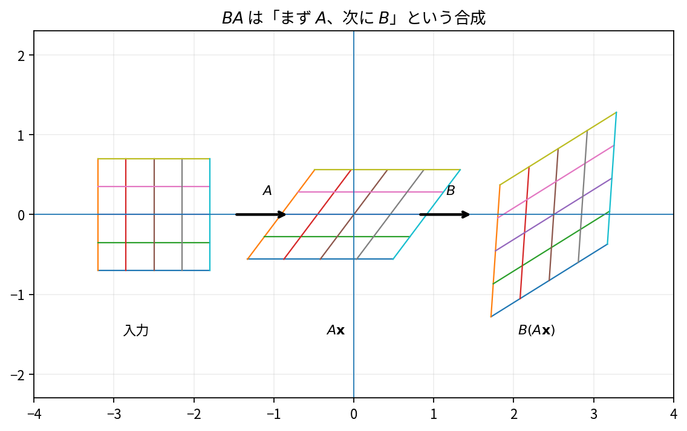

# 行列積

Course 02｜線形代数

---
layout: center
---

## 今回の問い

## 到達目標

- 定義と代表式を、自分の言葉と記号で説明できる。
- 成立条件を確認し、手計算と結果を検算できる。

行列積は「写像の合成」である。要素ごとの積ではない。$\mathbf{B}$ を先に作用させ、その結果へ $\mathbf{A}$ を作用させる写像が $\mathbf{A}\mathbf{B}$ である。

---

## 直感を先に作る

行列積は「写像の合成」である。要素ごとの積ではない。$\mathbf{B}$ を先に作用させ、その結果へ $\mathbf{A}$ を作用させる写像が $\mathbf{A}\mathbf{B}$ である。

---

## 図で確認

---

## 図のどこを見るか

- 入力と出力を区別する
- 方向・長さ・部分空間・残差のどれが変わるか見る
- 数式の各項と図の要素を対応させる

---

## 記号とshape

- $\mathbf{A}\in\mathbb{R}^{m\times n}$、$\mathbf{B}\in\mathbb{R}^{n\times p}$: 掛け合わせる2行列。
- $\mathbf{C}=\mathbf{A}\mathbf{B}\in\mathbb{R}^{m\times p}$: 積の行列。
- $a_{ik},b_{kj},c_{ij}$: 各行列の対応する成分。
- $k$: $\mathbf{A}$の列と$\mathbf{B}$の行を走査する総和添字。

- 行列 $\mathbf{A}\in\mathbb{R}^{m\times n}$ は $n$ 次元入力を $m$ 次元出力へ写す
- ベクトル・行列は初出時に次元を固定する
- shapeが合うことと数学的条件が成立することは別

---

## 代表式

$$
c_{ij}=\sum_{k=1}^{n}a_{ik}b_{kj}
$$

式を「左辺の意味 → 右辺の操作 → 条件」の順に読む。

---

## なぜ成り立つ？

第$j$列について $(\mathbf{A}\mathbf{B})_{:j}=\mathbf{A}(\mathbf{B}_{:j})$。つまり積の各列は、$\mathbf{B}$ の列を $\mathbf{A}$ で変換したもの。これが合成の意味を最も直接に示す。

---

## 小さな例

$\mathbf{A}=\begin{bmatrix}1&2\\0&1\end{bmatrix}$、$\mathbf{B}=\begin{bmatrix}2&0\\1&3\end{bmatrix}$ なら $\mathbf{A}\mathbf{B}=\begin{bmatrix}4&6\\1&3\end{bmatrix}$。

---

## 手計算

$\mathbf{A}=\begin{bmatrix}1&-1&2\\0&2&1\end{bmatrix}$、$\mathbf{B}=\begin{bmatrix}2&1\\1&0\\-1&3\end{bmatrix}$ の積を求めよ。

**答え:** $\mathbf{A}\mathbf{B}=\begin{bmatrix}-1&7\\1&3\end{bmatrix}$。例えば左上は $1\cdot2+(-1)\cdot1+2\cdot(-1)=-1$。

---

## 計算手順

まず内側の次元が一致するか確認する。次に「行×列」の内積として各要素を計算するか、列ごとに $\mathbf{A}\mathbf{b}_j$ を計算する。

---

## 失敗条件

- 一般に $\mathbf{A}\mathbf{B}\neq\mathbf{B}\mathbf{A}$。
- Hadamard積（要素ごとの積）と混同しない。
- 積のshapeは外側の次元 $(m,p)$ になる。

---

## 誤答を診断

「「$\mathbf{A}\mathbf{B}$ が定義されれば $\mathbf{B}\mathbf{A}$ も必ず定義される」」

→ 誤り。$\mathbf{A}$ が $2\times3$、$\mathbf{B}$ が $3\times4$ なら $AB$ は定義されるが $BA$ は $4$ と $2$ が一致せず定義されない。

---

## 数値実装では

- 理論式とアルゴリズムを分ける
- 小さい例で期待値を作る
- 残差・rank・直交性・再構成誤差などで検算する

---

## 後続への接続

複数の線形層の合成、基底変換、共分散変換、連鎖的な座標変換で不可欠。

---

## 理解確認

1. 定義を式なしで説明できるか
2. 代表式の各記号を定義できるか
3. 条件を外した反例を作れるか
4. 手計算と実装結果を照合できるか

[教科書](../../textbook/la-matrix-multiplication) / [演習](../../exercises/la-matrix-multiplication)
