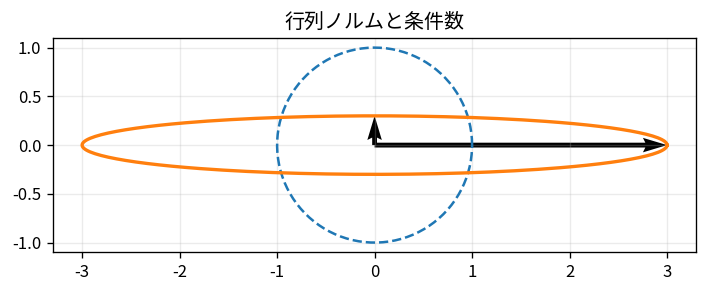

# 行列ノルムと条件数

Course 02｜線形代数

---
layout: center
---

## 今回の問い

## 到達目標

- 定義と代表式を、自分の言葉と記号で説明できる。
- 成立条件を確認し、手計算と結果を検算できる。

行列ノルムは「行列がベクトルをどれだけ大きくできるか」を測り、条件数は「逆問題で入力誤差がどれだけ解へ増幅されうるか」を測る。

---

## 直感を先に作る

行列ノルムは「行列がベクトルをどれだけ大きくできるか」を測り、条件数は「逆問題で入力誤差がどれだけ解へ増幅されうるか」を測る。

---

## 図で確認

---

## 図のどこを見るか

- 入力と出力を区別する
- 方向・長さ・部分空間・残差のどれが変わるか見る
- 数式の各項と図の要素を対応させる

---

## 記号とshape

- $\|\mathbf{A}\|_2=\sigma_{\max}(\mathbf{A})$: 2-normに対応するspectral norm。
- $\sigma_{\max},\sigma_{\min}$: 最大・最小特異値（可逆正方行列では$\sigma_{\min}>0$）。
- $\kappa_2(\mathbf{A})$: 2-norm条件数。入力・丸め誤差が解へどれだけ増幅され得るかの感度尺度。
- singularな行列では通常$\kappa_2=\infty$とみなす。

- 行列 $\mathbf{A}\in\mathbb{R}^{m\times n}$ は $n$ 次元入力を $m$ 次元出力へ写す
- ベクトル・行列は初出時に次元を固定する
- shapeが合うことと数学的条件が成立することは別

---

## 代表式

$$
\kappa_2(\mathbf{A})=\frac{\sigma_{\max}(\mathbf{A})}{\sigma_{\min}(\mathbf{A})}
$$

式を「左辺の意味 → 右辺の操作 → 条件」の順に読む。

---

## なぜ成り立つ？

最大特異値方向は最も伸びる方向、最小特異値方向は最も潰れる方向。逆写像は後者を$1/\sigma_{min}$倍するため、比が大きいほど誤差に敏感。

---

## 小さな例

$A=\operatorname{diag}(100,1)$ は $\kappa_2=100$。第2方向と比較して第1方向のスケール差が大きく、逆問題の相対誤差が増幅されうる。

---

## 手計算

$A=\operatorname{diag}(5,0.1)$ の2-normと2-norm条件数を求めよ。

**答え:** 特異値は5と0.1。$\|A\|_2=5$、$\kappa_2=5/0.1=50$。

---

## 計算手順

用途に合うnormを選ぶ。2-norm/condition numberはSVDで評価。`cond(A)`を使い、値だけでなくスケーリングや特異値分布も確認。

---

## 失敗条件

- 条件数はアルゴリズムの悪さではなく問題自体の感度。
- 大きなdetでも条件数が大きいことはある。
- $A^TA$を形成すると2-norm条件数が概ね二乗される。

---

## 誤答を診断

「「条件数が大きいのはソルバ実装が悪いから」」

→ 条件数は問題の感度を表す。安定なアルゴリズムでもill-conditioned問題ではforward errorが大きくなりうる。

---

## 数値実装では

- 理論式とアルゴリズムを分ける
- 小さい例で期待値を作る
- 残差・rank・直交性・再構成誤差などで検算する

---

## 後続への接続

数値線形代数、WLSM、逆問題、正規方程式を避ける理由、モデルidentifiability。

---

## 理解確認

1. 定義を式なしで説明できるか
2. 代表式の各記号を定義できるか
3. 条件を外した反例を作れるか
4. 手計算と実装結果を照合できるか

[教科書](../../textbook/la-matrix-norms-condition-number) / [演習](../../exercises/la-matrix-norms-condition-number)
