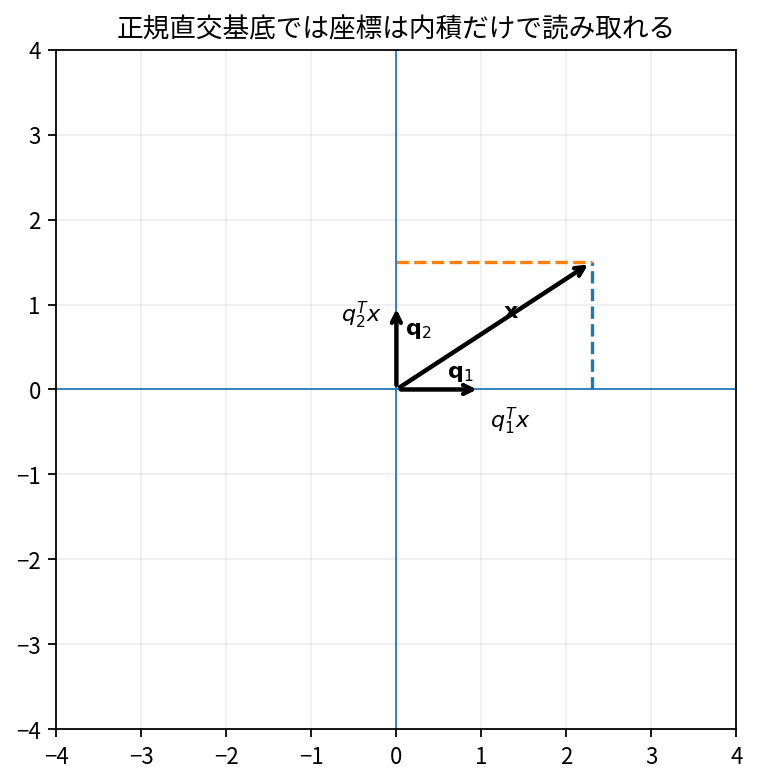

# 直交基底と正規直交基底

Course 02｜線形代数

---
layout: center
---

## 今回の問い

## 到達目標

- 定義と代表式を、自分の言葉と記号で説明できる。
- 成立条件を確認し、手計算と結果を検算できる。

直交基底では各方向が干渉しない。さらに長さ1へ正規化した正規直交基底なら、座標係数は単純な内積で取り出せる。

---

## 直感を先に作る

直交基底では各方向が干渉しない。さらに長さ1へ正規化した正規直交基底なら、座標係数は単純な内積で取り出せる。

---

## 図で確認

---

## 図のどこを見るか

- 入力と出力を区別する
- 方向・長さ・部分空間・残差のどれが変わるか見る
- 数式の各項と図の要素を対応させる

---

## 記号とshape

- $\mathbf{Q}\in\mathbb{R}^{m\times k}$: 列に基底ベクトルを並べた行列。
- $\mathbf{Q}^{\mathsf T}$: $\mathbf{Q}$の転置。
- $\mathbf{I}\in\mathbb{R}^{k\times k}$: 単位行列。
- $\mathbf{Q}^{\mathsf T}\mathbf{Q}=\mathbf{I}$は列同士が互いに直交し、各列の2-normが1であることを表す。

- 行列 $\mathbf{A}\in\mathbb{R}^{m\times n}$ は $n$ 次元入力を $m$ 次元出力へ写す
- ベクトル・行列は初出時に次元を固定する
- shapeが合うことと数学的条件が成立することは別

---

## 代表式

$$
\mathbf{Q}^{\mathsf T}\mathbf{Q}=\mathbf{I}
$$

式を「左辺の意味 → 右辺の操作 → 条件」の順に読む。

---

## なぜ成り立つ？

$x=\sum_i c_iq_i$ に $q_j^T$ を掛けると交差項が0になり、正規直交なら $c_j=q_j^Tx$。

---

## 小さな例

$q_1=(1,1)^T/\sqrt2$, $q_2=(1,-1)^T/\sqrt2$ は正規直交。$x=(3,1)^T$ の係数は $(2\sqrt2,\sqrt2)$。

---

## 手計算

$q_1=(3,4)^T/5$ と $q_2=(-4,3)^T/5$ が正規直交か確認せよ。

**答え:** 各ノルムは1、内積は $(-12+12)/25=0$。よって正規直交。

---

## 計算手順

内積行列 $Q^TQ$ を計算しIになるか確認。浮動小数点では `allclose` を使う。

---

## 失敗条件

- 直交だけでは各列の長さが1とは限らない。
- 長方形Qでは $Q^TQ=I$ でも $QQ^T=I$ とは限らない。
- 「正規」と「正規直交」を混同しない。

---

## 誤答を診断

「「列が正規直交なら長方形Qでも $QQ^T=I$」」

→ $Q^TQ=I$ は列空間側の恒等だが、$QQ^T$ は列空間への射影。列が空間全体を張る正方QのときだけI。

---

## 数値実装では

- 理論式とアルゴリズムを分ける
- 小さい例で期待値を作る
- 残差・rank・直交性・再構成誤差などで検算する

---

## 後続への接続

QR、射影、数値安定な最小二乗、固有ベクトル、SVD。

---

## 理解確認

1. 定義を式なしで説明できるか
2. 代表式の各記号を定義できるか
3. 条件を外した反例を作れるか
4. 手計算と実装結果を照合できるか

[教科書](../../textbook/la-orthogonal-orthonormal-bases) / [演習](../../exercises/la-orthogonal-orthonormal-bases)
