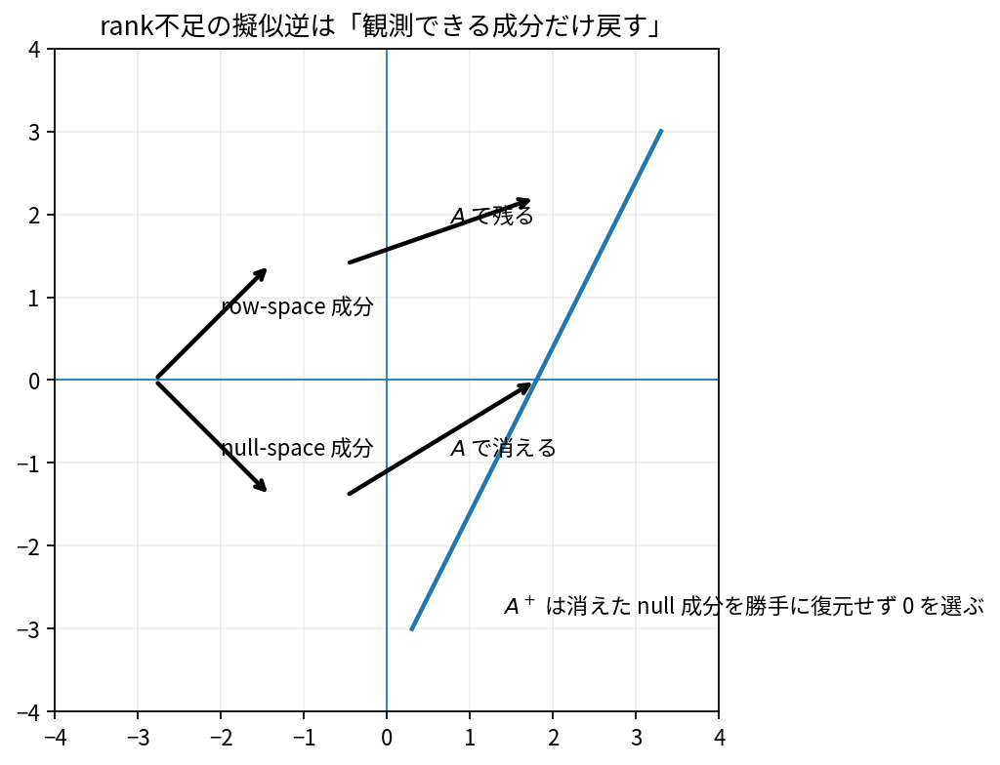

# 擬似逆行列とrank不足の連立方程式

Course 02｜線形代数

---
layout: center
---

## 今回の問い

擬似逆行列とrank不足の連立方程式で、何を入力し、代表式がどの量を出力し、どの成立条件を外すと結果が壊れるのか。

---

## 到達目標

- 擬似逆行列とrank不足の連立方程式の定義と代表式を言葉で説明できる
- 図と式の対応を説明できる
- 小さな例で成立条件と失敗条件を検算できる

---

## 直感

擬似逆行列は逆行列がない場合にも、最小二乗または最小ノルムの意味で「逆らしい」解を選ぶ。

**前提:** la-singular-value-decomposition, la-least-squares-computation-pseudoinverse

---

## 図解

---

## 図を見るポイント

- 軸・node・矢印・領域が何を表すか確認する
- 代表式の各項と図の要素を対応づける
- 条件を変えたとき、どこが変化するか予測する

---

## 代表式

$$
\mathbf{A}^{+}=\mathbf{V}\mathbf{\Sigma}^{+}\mathbf{U}^{\mathsf T}
$$

左辺の出力 → 右辺の操作 → 入力の型の順で読む。

---

## 式をどう読むか

- **対象:** 擬似逆行列、rank不足の連立方程式
- shape・次元・定義域を先に確定する
- 計算後に符号・大きさ・残差・確率などを図と照合する

---

## 小さな例

rank不足の写像で複数解から最小ノルム解を選ぶ。

最小の非自明な設定で、手計算と実装を照合する。

---

## 動き／思考実験で確認

- このTopicでは静止図を中心に条件を1つずつ変える思考実験を行う。
- 図の形がどう変わるか予測してから次へ進む。

---

## 成立条件

- A^+は単なる要素ごとの逆数ではない。
- 小さい特異値はノイズ増幅の原因。
- 擬似逆行列とrank不足の連立方程式の定義と計算手順を区別し、数値例だけで一般性を判断しない。

---

## よくある誤解

- 擬似逆行列とrank不足の連立方程式の定義と計算手順を同一視する
- 成立条件を確認せず公式を適用する
- 数学上の次元と配列のshapeを混同する

---

## 数値・実装で検算

1. 小さい入力を作る
2. 定義式から期待値を手で求める
3. NumPy等の実装結果と比較する
4. shape・残差・許容誤差・seedを記録する

---

## 後続分野への接続

擬似逆行列とrank不足の連立方程式は、後続の数値計算・データ解析・機械学習で前提となる。

このTopicの量が、後続で入力・目的関数・制約・診断のどれとして使われるか確認する。

---

## 理解確認

- 擬似逆行列とrank不足の連立方程式を図→式→小例の順で説明できるか
- 条件を1つ外した反例を作れるか

[教科書](../../textbook/la-pseudoinverse-rank-deficient-systems)

[10問の演習](../../exercises/la-pseudoinverse-rank-deficient-systems)
