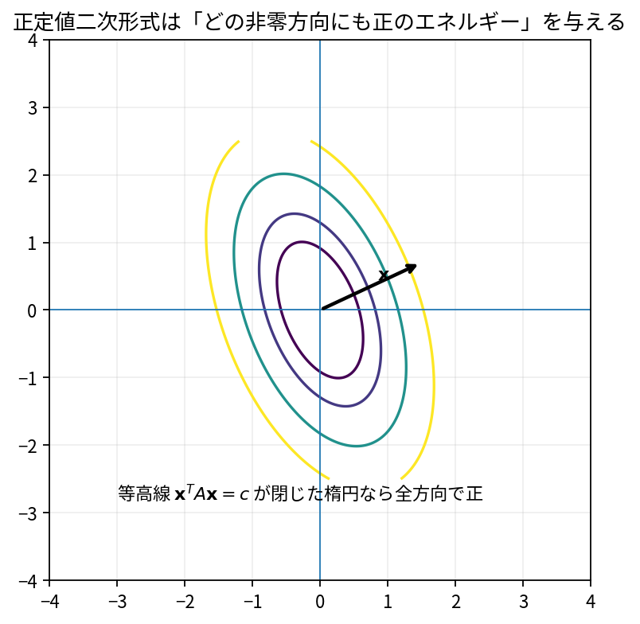

# 二次形式と正定値行列

Course 02｜線形代数

---
layout: center
---

## 今回の問い

## 到達目標

- 定義と代表式を、自分の言葉と記号で説明できる。
- 成立条件を確認し、手計算と結果を検算できる。

二次形式 $x^TAx$ は方向xに沿った「エネルギー」や曲率を測る。正定値ならどの非zero方向でも正で、原点を底に持つ椀型の幾何になる。

---

## 直感を先に作る

二次形式 $x^TAx$ は方向xに沿った「エネルギー」や曲率を測る。正定値ならどの非zero方向でも正で、原点を底に持つ椀型の幾何になる。

---

## 図で確認

---

## 図のどこを見るか

- 入力と出力を区別する
- 方向・長さ・部分空間・残差のどれが変わるか見る
- 数式の各項と図の要素を対応させる

---

## 記号とshape

- $\mathbf{A}=\mathbf{A}^{\mathsf T}\in\mathbb{R}^{n\times n}$: 二次形式を定める実対称行列。
- $\mathbf{x}\in\mathbb{R}^n$: 入力ベクトル。
- $q(\mathbf{x})=\mathbf{x}^{\mathsf T}\mathbf{A}\mathbf{x}$: 二次形式。
- 正定値（positive definite）とは、すべての$\mathbf{x}\ne\mathbf{0}$で$q(\mathbf{x})>0$となること。

- 行列 $\mathbf{A}\in\mathbb{R}^{m\times n}$ は $n$ 次元入力を $m$ 次元出力へ写す
- ベクトル・行列は初出時に次元を固定する
- shapeが合うことと数学的条件が成立することは別

---

## 代表式

$$
q(\mathbf{x})=\mathbf{x}^{\mathsf T}\mathbf{A}\mathbf{x}
$$

式を「左辺の意味 → 右辺の操作 → 条件」の順に読む。

---

## なぜ成り立つ？

$A=Q\Lambda Q^T$ と置き $z=Q^Tx$ とすれば $x^TAx=\sum_i\lambda_i z_i^2$。したがって全固有値が正なら全方向で正。

---

## 小さな例

$A=\operatorname{diag}(2,5)$ なら $q(x)=2x_1^2+5x_2^2>0$。等高線は楕円。

---

## 手計算

$A=\begin{bmatrix}2&1\\1&2\end{bmatrix}$ が正定値か判定せよ。

**答え:** 固有値は3と1で両方正。よってPD。あるいは leading minors 2>0, det=3>0。

---

## 計算手順

対称性確認→`eigvalsh`で固有値、またはCholeskyを試す。小行列ならSylvester条件（leading principal minors）も使える。

---

## 失敗条件

- 「成分が全部正」だけではPDを保証しない。
- PDは正方・対称行列を基本に議論する。
- semidefinite（≥0）とdefinite（>0）を区別する。

---

## 誤答を診断

「「対角成分がすべて正なら正定値」」

→ 必要条件の一部だが十分でない。例 $\begin{bmatrix}1&2\\2&1\end{bmatrix}$ は対角正でも固有値3,-1で不定。

---

## 数値実装では

- 理論式とアルゴリズムを分ける
- 小さい例で期待値を作る
- 残差・rank・直交性・再構成誤差などで検算する

---

## 後続への接続

最小化問題のHessian、共分散/precision、WLSの重み、Gaussian分布。

---

## 理解確認

1. 定義を式なしで説明できるか
2. 代表式の各記号を定義できるか
3. 条件を外した反例を作れるか
4. 手計算と実装結果を照合できるか

[教科書](../../textbook/la-quadratic-forms-positive-definite) / [演習](../../exercises/la-quadratic-forms-positive-definite)
