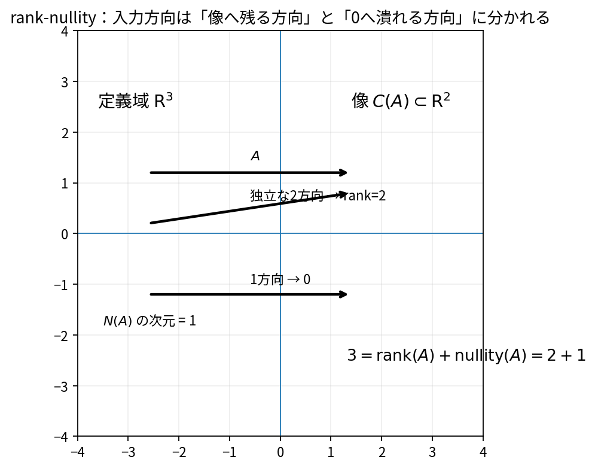

# 階数とrank-nullity

Course 02｜線形代数

---
layout: center
---

## 今回の問い

## 到達目標

- 定義と代表式を、自分の言葉と記号で説明できる。
- 成立条件を確認し、手計算と結果を検算できる。

rankは行列が保っている独立な情報の数、nullityは失っている入力方向の数である。入力次元はこの二つへ分解される。

---

## 直感を先に作る

rankは行列が保っている独立な情報の数、nullityは失っている入力方向の数である。入力次元はこの二つへ分解される。

---

## 図で確認

---

## 図のどこを見るか

- 入力と出力を区別する
- 方向・長さ・部分空間・残差のどれが変わるか見る
- 数式の各項と図の要素を対応させる

---

## 記号とshape

- $\mathbf{A}\in\mathbb{R}^{m\times n}$: 対象行列。
- $\operatorname{rank}(\mathbf{A})$: 列空間の次元、すなわち独立な列方向の数。
- $\operatorname{nullity}(\mathbf{A})$: 零空間の次元。
- $n$: $\mathbf{A}$の列数、すなわち入力空間の次元。

- 行列 $\mathbf{A}\in\mathbb{R}^{m\times n}$ は $n$ 次元入力を $m$ 次元出力へ写す
- ベクトル・行列は初出時に次元を固定する
- shapeが合うことと数学的条件が成立することは別

---

## 代表式

$$
\operatorname{rank}(\mathbf{A})+\operatorname{nullity}(\mathbf{A})=n
$$

式を「左辺の意味 → 右辺の操作 → 条件」の順に読む。

---

## なぜ成り立つ？

RREFでは$n$個の変数がpivot変数と自由変数に分かれる。pivotの個数がrank、自由変数の個数がnullityなので和はn。

---

## 小さな例

$2\times4$ 行列にpivotが2個ならrank=2、nullity=2。入力4次元のうち2方向だけが独立な出力として残り、2方向は0へ潰れる。

---

## 手計算

$A=\begin{bmatrix}1&2&3&4\\0&1&1&2\\1&3&4&6\end{bmatrix}$ のrankが2だと分かった。nullityはいくつか。

**答え:** 列数$n=4$なのでrank-nullityより nullity $=4-2=2$。

---

## 計算手順

RREFまたはSVDでrankを判定する。厳密計算ならpivot数、浮動小数点なら特異値に閾値を設ける。

---

## 失敗条件

- rankは単に行数や列数の小さい方とは限らない（上限にすぎない）。
- 数値rankは閾値依存。
- rank-nullityのnは列数＝入力次元。

---

## 誤答を診断

「「$3\times5$ 行列でrank=3ならnullity=0」」

→ nullityは列数5からrank3を引いて2。full row rankでもnull spaceは残りうる。

---

## 数値実装では

- 理論式とアルゴリズムを分ける
- 小さい例で期待値を作る
- 残差・rank・直交性・再構成誤差などで検算する

---

## 後続への接続

解の自由度、特徴量冗長性、identifiability、擬似逆行列、低ランク近似へ接続。

---

## 理解確認

1. 定義を式なしで説明できるか
2. 代表式の各記号を定義できるか
3. 条件を外した反例を作れるか
4. 手計算と実装結果を照合できるか

[教科書](../../textbook/la-rank-rank-nullity) / [演習](../../exercises/la-rank-rank-nullity)
