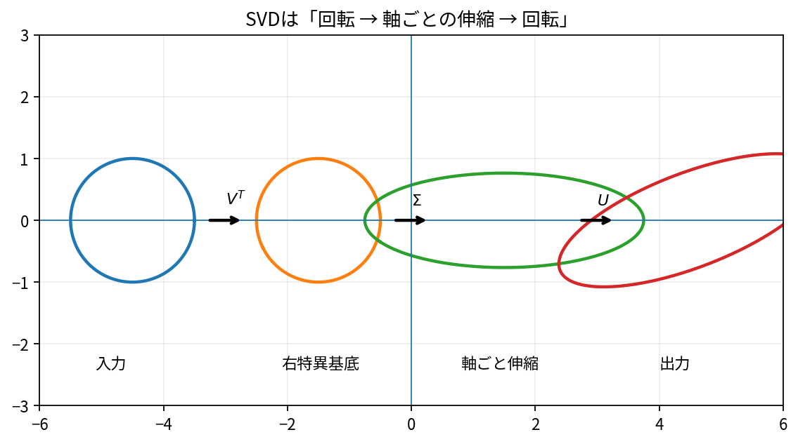

# 特異値分解

Course 02｜線形代数

---
layout: center
---

## 今回の問い

SVDは任意の行列を「入力側の直交回転 → 軸ごとの伸縮 → 出力側の直交回転」に分ける。固有分解より適用範囲が広く、長方形・rank不足でも使える。

---

## 直感を先に作る

SVDは任意の行列を「入力側の直交回転 → 軸ごとの伸縮 → 出力側の直交回転」に分ける。固有分解より適用範囲が広く、長方形・rank不足でも使える。

---

## 図で確認

---

## 図の解説

図は左から、入力の単位円、$\mathbf V^T$ で右特異ベクトル座標へ回転した円、$\mathbf\Sigma$ で各軸を異なる倍率に伸ばした楕円、$\mathbf U$ で出力方向へ回転した最終形を並べている。
特異値 $\sigma_i$ は楕円の半軸長に対応する。$\sigma_i=0$ の方向があれば、その軸は完全に潰れて低次元になる。

---

## 記号とshape

- $\mathbf{A}\in\mathbb{R}^{m\times n}$: 任意の実行列。
- $\mathbf{U}$: 左特異ベクトル、$\mathbf{V}$: 右特異ベクトルを持つ直交（または列正規直交）行列。
- $\mathbf{\Sigma}$: 非負の特異値$\sigma_1\ge\sigma_2\ge\cdots\ge0$を対角に持つ行列。
- SVDはsingular value decomposition（特異値分解）。$\mathbf{A}\mathbf{v}_i=\sigma_i\mathbf{u}_i$。

- 行列 $\mathbf{A}\in\mathbb{R}^{m\times n}$ は $n$ 次元入力を $m$ 次元出力へ写す
- ベクトル・行列は初出時に次元を固定する
- shapeが合うことと数学的条件が成立することは別

---

## 代表式

$$
\mathbf{A}=\mathbf{U}\mathbf{\Sigma}\mathbf{V}^{\mathsf T}
$$

---

## なぜ成り立つ？

$\mathbf A^T\mathbf A$ は$n\times n$の対称半正定値行列。したがってスペクトル定理により

$$
\mathbf A^T\mathbf A
=\mathbf V\mathbf\Lambda\mathbf V^T
$$

と直交対角化できる。半正定値なので固有値 $\lambda_i\ge0$。

### 2. 特異値を平方根で定義する

$$
\sigma_i=\sqrt{\lambda_i}\ge0.
$$

右固有ベクトル $\mathbf v_i$ について

$$
\mathbf A^T\mathbf A\mathbf v_i
=\sigma_i^2\mathbf v_i.
$$

両辺の内積を $\mathbf v_i^T$ で取ると

$$
\|\mathbf A\mathbf v_i\|_2^2=\sigma_i^2.
$$

$\|\mathbf v_i\|=1$ なので、$\sigma_i$ は方向 $\mathbf v_i$ を $\mathbf A$ が何倍の長さへ伸ばすかを表す。

### 3. 左特異ベクトルを作る

$\sigma_i>0$ の方向で

$$
\mathbf u_i=\frac{\mathbf A\mathbf v_i}{\sigma_i}
$$

と定義する。すると

$$
\mathbf A\mathbf v_i=\sigma_i\mathbf u_i.
$$

また$i\ne j$について

$$
\mathbf u_i^T\mathbf u_j
=\frac{\mathbf v_i^T\mathbf A^T\mathbf A\mathbf v_j}{\sigma_i\sigma_j}
=\frac{\sigma_j^2\mathbf v_i^T\mathbf v_j}{\sigma_i\sigma_j}=0,
$$

かつ $\|\mathbf u_i\|=1$。よって左特異ベクトルも正規直交。

### 4. 行列全体を再構成する

$\mathbf A\mathbf v_i=\sigma_i\mathbf u_i$ を列ごとにまとめると

$$
\mathbf A\mathbf V=\mathbf U\mathbf\Sigma.
$$

右から $\mathbf V^T$ を掛け、$\mathbf V\mathbf V^T=\mathbf I$ を使えば

$$
\boxed{\mathbf A=\mathbf U\mathbf\Sigma\mathbf V^T}.
$$

### 5. rankとの関係

$\sigma_i=0$ なら $\mathbf A\mathbf v_i=0$ なので $\mathbf v_i\in N(\mathbf A)$。正の特異値方向だけが出力へ残る。したがって

$$
\operatorname{rank}(\mathbf A)=\#\{i:\sigma_i>0\}.
$$

---

## 小さな例

$A=\operatorname{diag}(3,1)$ ではU=V=I、Σ=diag(3,1)。単位円は長軸3、短軸1の楕円へ写る。

---

## 手計算

$A=\begin{bmatrix}3&0\\0&-2\end{bmatrix}$ の特異値を求めよ。

**答え:** $A^TA=\operatorname{diag}(9,4)$ の固有値平方根なので特異値は3,2。符号はU/V側へ吸収され、特異値は非負。

---

## 計算手順

`svd(A, full_matrices=False)`→特異値の並び・再構成誤差・U/Vの直交性を検算。

---

## 失敗条件

- Vと$V^T$の返り値規約に注意（NumPyはVh）。
- 特異値は負にならない。
- 固有値と特異値を同一視しない（対称PSDでは関係が特に単純）。

---

## 誤答を診断

「「SVDは正方可逆行列にしか使えない」」

→ 任意の実/複素行列に存在し、長方形・特異行列で特に有用。

---

## 数値実装では

- 理論式とアルゴリズムを分ける
- 小さい例で期待値を作る
- 残差・rank・直交性・再構成誤差などで検算する

---

## 後続への接続

擬似逆、低ランク近似、PCA、condition number、inverse problem、spectral unmixing。

---

## 理解確認

1. 定義を式なしで説明できるか
2. 代表式の各記号を定義できるか
3. 条件を外した反例を作れるか
4. 手計算と実装結果を照合できるか

[教科書](../../textbook/la-singular-value-decomposition) / [演習](../../exercises/la-singular-value-decomposition)
