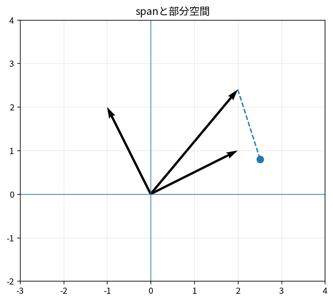

# spanと部分空間

Course 02｜線形代数

---
layout: center
---

## 今回の問い

## 到達目標

- 定義と代表式を、自分の言葉と記号で説明できる。
- 成立条件を確認し、手計算と結果を検算できる。

spanは「与えたベクトルの線形結合で到達できる全点」である。部分空間は、足し算とスカラー倍をしても外へ出ない集合で、必ず原点を含む。

---

## 直感を先に作る

spanは「与えたベクトルの線形結合で到達できる全点」である。部分空間は、足し算とスカラー倍をしても外へ出ない集合で、必ず原点を含む。

---

## 図で確認

---

## 図のどこを見るか

- 入力と出力を区別する
- 方向・長さ・部分空間・残差のどれが変わるか見る
- 数式の各項と図の要素を対応させる

---

## 記号とshape

- $\mathbf{v}_1,\ldots,\mathbf{v}_k\in\mathbb{R}^n$: 生成ベクトル。
- $c_1,\ldots,c_k\in\mathbb{R}$: 任意のスカラー係数。
- $\operatorname{span}\{\mathbf{v}_1,\ldots,\mathbf{v}_k\}$: それらの全線形結合からなる集合。
- 部分空間: zeroベクトルを含み、加法とスカラー倍に閉じた集合。

- 行列 $\mathbf{A}\in\mathbb{R}^{m\times n}$ は $n$ 次元入力を $m$ 次元出力へ写す
- ベクトル・行列は初出時に次元を固定する
- shapeが合うことと数学的条件が成立することは別

---

## 代表式

$$
\operatorname{span}\{\mathbf{v}_1,\ldots,\mathbf{v}_k\}
$$

式を「左辺の意味 → 右辺の操作 → 条件」の順に読む。

---

## なぜ成り立つ？

spanは定義から線形結合に閉じているため、必ず部分空間になる。逆に多くの部分空間は適切な生成ベクトルのspanとして表せる。

---

## 小さな例

$(1,0,1)^T$ と $(0,1,1)^T$ のspanは $\{(a,b,a+b)^T\}$ という原点を通る平面。

---

## 手計算

$v_1=(1,1,0)^T$, $v_2=(0,1,1)^T$。$x=(2,3,1)^T$ はspanに入るか。

**答え:** $c_1v_1+c_2v_2=(c_1,c_1+c_2,c_2)$。$c_1=2,c_2=1$ で $(2,3,1)$ になるので入る。

---

## 計算手順

候補集合が部分空間かは、ゼロベクトル・加法閉性・スカラー倍閉性を調べる。span membershipは $Vc=x$ が解を持つかで判定する。

---

## 失敗条件

- 原点を通らない平面は部分空間ではない。
- 生成ベクトルの本数とspanの次元は一致しないことがある。
- spanは有限個の点ではなく無限集合。

---

## 誤答を診断

「「$x+y=1$ を満たす点集合は$\mathbb{R}^2$の部分空間」」

→ 原点 $(0,0)$ が $x+y=1$ を満たさないので部分空間ではない。

---

## 数値実装では

- 理論式とアルゴリズムを分ける
- 小さい例で期待値を作る
- 残差・rank・直交性・再構成誤差などで検算する

---

## 後続への接続

列空間、零空間、基底、固有空間など「空間」を理解する土台。

---

## 理解確認

1. 定義を式なしで説明できるか
2. 代表式の各記号を定義できるか
3. 条件を外した反例を作れるか
4. 手計算と実装結果を照合できるか

[教科書](../../textbook/la-span-subspaces) / [演習](../../exercises/la-span-subspaces)
