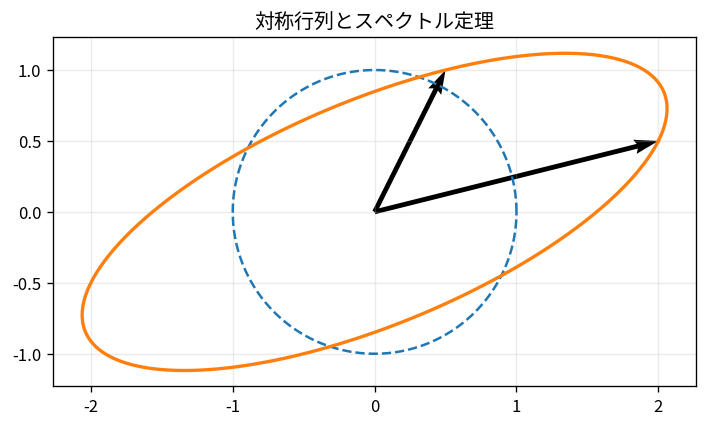

# 対称行列とスペクトル定理

Course 02｜線形代数

---
layout: center
---

## 今回の問い

## 到達目標

- 定義と代表式を、自分の言葉と記号で説明できる。
- 成立条件を確認し、手計算と結果を検算できる。

実対称行列は特別に扱いやすい。固有値はすべて実数で、互いに直交する固有ベクトルから正規直交基底を選べる。

---

## 直感を先に作る

実対称行列は特別に扱いやすい。固有値はすべて実数で、互いに直交する固有ベクトルから正規直交基底を選べる。

---

## 図で確認

---

## 図のどこを見るか

- 入力と出力を区別する
- 方向・長さ・部分空間・残差のどれが変わるか見る
- 数式の各項と図の要素を対応させる

---

## 記号とshape

- $\mathbf{A}=\mathbf{A}^{\mathsf T}\in\mathbb{R}^{n\times n}$: 実対称行列。
- $\mathbf{Q}$: 固有ベクトルを列に持つ直交行列。
- $\mathbf{\Lambda}$: 実固有値を対角に並べた対角行列。
- スペクトル定理は実対称行列が正規直交基底で必ず対角化できることを保証する。

- 行列 $\mathbf{A}\in\mathbb{R}^{m\times n}$ は $n$ 次元入力を $m$ 次元出力へ写す
- ベクトル・行列は初出時に次元を固定する
- shapeが合うことと数学的条件が成立することは別

---

## 代表式

$$
\mathbf{A}=\mathbf{Q}\mathbf{\Lambda}\mathbf{Q}^{\mathsf T}
$$

式を「左辺の意味 → 右辺の操作 → 条件」の順に読む。

---

## なぜ成り立つ？

異なる固有値に属する固有ベクトルu,vについて $u^TAv=\lambda_vu^Tv$ と $(Au)^Tv=\lambda_uu^Tv$ が等しいため、$(\lambda_v-\lambda_u)u^Tv=0$。

---

## 小さな例

$A=\begin{bmatrix}2&1\\1&2\end{bmatrix}$ の固有方向は $(1,1)$ と $(1,-1)$、固有値3と1。互いに直交する。

---

## 手計算

$A=\begin{bmatrix}4&2\\2&4\end{bmatrix}$ の固有値を求めよ。

**答え:** $(1,1)^T$ 方向で6、$(1,-1)^T$ 方向で2。正規化すれば直交行列Qを作れる。

---

## 計算手順

対称性を確認し `eigh` を使う。再構成 $Q\Lambda Q^T$、直交性 $Q^TQ\approx I$ を検算。

---

## 失敗条件

- 対称でない行列に $Q\Lambda Q^T$ を期待しない。
- 重複固有値の固有空間内では基底は一意でない。
- 浮動小数点で対称性がわずかに崩れている場合は原因を確認する。

---

## 誤答を診断

「「対称行列の固有ベクトルは必ず一意」」

→ 符号は自由で、重複固有値の固有空間内では任意の正規直交基底を選べる。

---

## 数値実装では

- 理論式とアルゴリズムを分ける
- 小さい例で期待値を作る
- 残差・rank・直交性・再構成誤差などで検算する

---

## 後続への接続

共分散行列、Hessian、PCA、正定値性、二次形式。

---

## 理解確認

1. 定義を式なしで説明できるか
2. 代表式の各記号を定義できるか
3. 条件を外した反例を作れるか
4. 手計算と実装結果を照合できるか

[教科書](../../textbook/la-symmetric-matrices-spectral-theorem) / [演習](../../exercises/la-symmetric-matrices-spectral-theorem)
