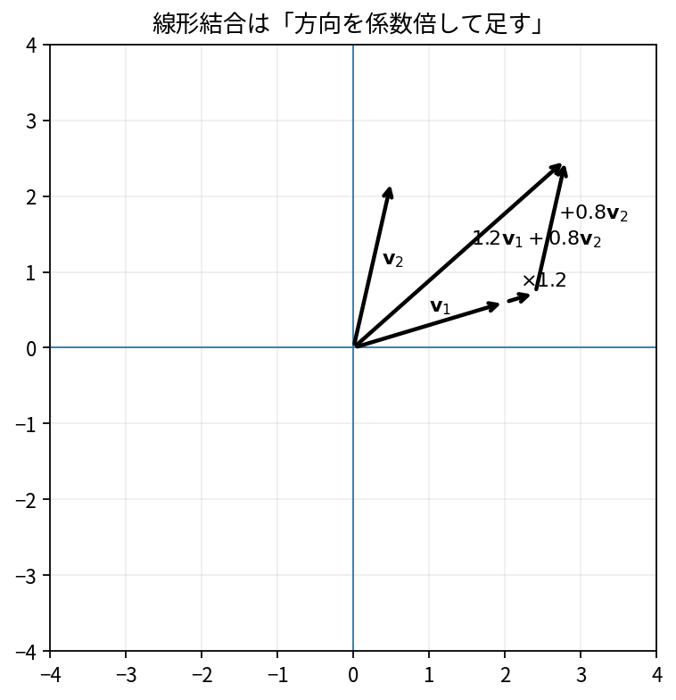

# ベクトルと線形結合

Course 02｜線形代数

---
layout: center
---

## 今回の問い

## 到達目標

- 定義と代表式を、自分の言葉と記号で説明できる。
- 成立条件を確認し、手計算と結果を検算できる。

ベクトルは「向きと大きさを持つ矢印」だけでなく、複数の量を順序付きでまとめた対象である。線形結合は、既知のベクトルをスカラー倍して足し、新しいベクトルを作る最も基本的な操作である。

---

## 直感を先に作る

ベクトルは「向きと大きさを持つ矢印」だけでなく、複数の量を順序付きでまとめた対象である。線形結合は、既知のベクトルをスカラー倍して足し、新しいベクトルを作る最も基本的な操作である。

---

## 図で確認

---

## 図のどこを見るか

- 入力と出力を区別する
- 方向・長さ・部分空間・残差のどれが変わるか見る
- 数式の各項と図の要素を対応させる

---

## 記号とshape

- $\mathbf{v}_j\in\mathbb{R}^n$: 第$j$の入力ベクトル。
- $c_j\in\mathbb{R}$: 第$j$ベクトルに掛けるスカラー係数。
- $\mathbf{y}\in\mathbb{R}^n$: 線形結合で得る出力ベクトル。
- $k$: 組み合わせるベクトルの本数。

- 行列 $\mathbf{A}\in\mathbb{R}^{m\times n}$ は $n$ 次元入力を $m$ 次元出力へ写す
- ベクトル・行列は初出時に次元を固定する
- shapeが合うことと数学的条件が成立することは別

---

## 代表式

$$
\mathbf{y}=c_1\mathbf{v}_1+\cdots+c_k\mathbf{v}_k
$$

式を「左辺の意味 → 右辺の操作 → 条件」の順に読む。

---

## なぜ成り立つ？

線形代数の多くは「どのベクトルを、どの係数で足せば目的のベクトルになるか」という問いに還元できる。行列とベクトルの積も、行列の列ベクトルの線形結合として読める。

---

## 小さな例

$\mathbf{v}_1=(1,2)^\mathsf{T}$、$\mathbf{v}_2=(2,-1)^\mathsf{T}$ とする。$3\mathbf{v}_1-2\mathbf{v}_2=(-1,8)^\mathsf{T}$。係数 $(3,-2)$ が「2本の方向をどれだけ使うか」を指定している。

---

## 手計算

$\mathbf{a}=(2,-1,3)^\mathsf{T}$、$\mathbf{b}=(-1,4,0)^\mathsf{T}$ に対して $2\mathbf{a}+3\mathbf{b}$ を求めよ。

**答え:** $2\mathbf{a}=(4,-2,6)^\mathsf{T}$、$3\mathbf{b}=(-3,12,0)^\mathsf{T}$ なので、答えは $(1,10,6)^\mathsf{T}$。

---

## 計算手順

成分数が一致していることを確認し、各ベクトルをスカラー倍してから成分ごとに加える。行列表現では列を並べた行列 $\mathbf{V}$ と係数ベクトル $\mathbf{c}$ を使い $\mathbf{V}\mathbf{c}$ と書ける。

---

## 失敗条件

- ベクトルの「次元」とNumPy配列の `ndim` を同一視しない。
- 係数はベクトルではなくスカラーである。
- 異なる次元のベクトル同士は通常の線形結合として足せない。

---

## 誤答を診断

「「2本のベクトルを線形結合すれば必ず平面全体を作れる」」

→ 誤り。同一直線上の2本なら生成できるのはその直線だけである。たとえば $(1,2)^T$ と $(2,4)^T$ は従属で、spanは1次元。

---

## 数値実装では

- 理論式とアルゴリズムを分ける
- 小さい例で期待値を作る
- 残差・rank・直交性・再構成誤差などで検算する

---

## 後続への接続

後続のspan、列空間、基底、行列積、最小二乗法はすべて線形結合の言葉で統一できる。

---

## 理解確認

1. 定義を式なしで説明できるか
2. 代表式の各記号を定義できるか
3. 条件を外した反例を作れるか
4. 手計算と実装結果を照合できるか

[教科書](../../textbook/la-vectors-linear-combinations) / [演習](../../exercises/la-vectors-linear-combinations)
