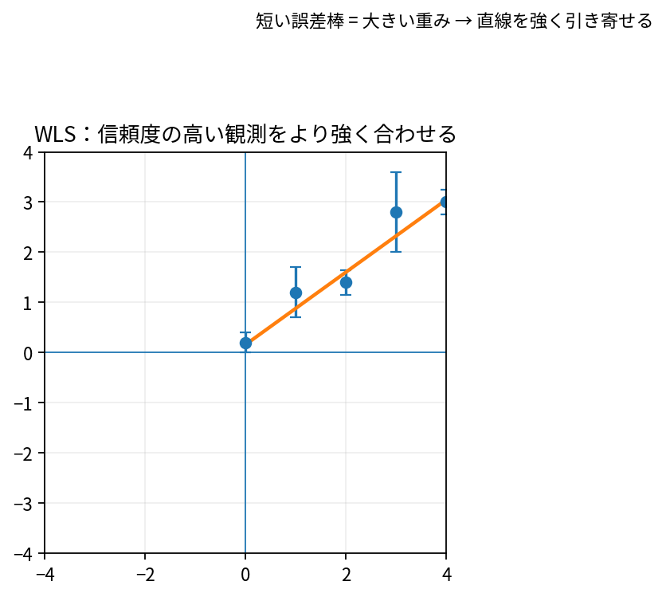

# 重み付き最小二乗法の導入

Course 02｜線形代数

---
layout: center
---

## 今回の問い

## 到達目標

- 定義と代表式を、自分の言葉と記号で説明できる。
- 成立条件を確認し、手計算と結果を検算できる。

重み付き最小二乗（WLS）は、残差をすべて同じ重要度で数えるのではなく、信頼度や分散に応じて方向ごとのペナルティを変える。

---

## 直感を先に作る

重み付き最小二乗（WLS）は、残差をすべて同じ重要度で数えるのではなく、信頼度や分散に応じて方向ごとのペナルティを変える。

---

## 図で確認

---

## 図のどこを見るか

- 入力と出力を区別する
- 方向・長さ・部分空間・残差のどれが変わるか見る
- 数式の各項と図の要素を対応させる

---

## 記号とshape

- $\mathbf{A}\in\mathbb{R}^{m\times n}$: design matrix。
- $\mathbf{x}\in\mathbb{R}^n$: 推定係数、$\mathbf{b}\in\mathbb{R}^m$: 観測。
- $\mathbf{W}\in\mathbb{R}^{m\times m}$: 対称正定値または半正定値の重み行列。
- WLSはweighted least squares（重み付き最小二乗法）。対角$\mathbf{W}$なら各観測の残差へ異なる重みを付ける。

- 行列 $\mathbf{A}\in\mathbb{R}^{m\times n}$ は $n$ 次元入力を $m$ 次元出力へ写す
- ベクトル・行列は初出時に次元を固定する
- shapeが合うことと数学的条件が成立することは別

---

## 代表式

$$
\min_{\mathbf{x}}(\mathbf{A}\mathbf{x}-\mathbf{b})^{\mathsf T}\mathbf{W}(\mathbf{A}\mathbf{x}-\mathbf{b})
$$

式を「左辺の意味 → 右辺の操作 → 条件」の順に読む。

---

## なぜ成り立つ？

独立な観測誤差の分散が$\sigma_i^2$なら、$W=\operatorname{diag}(1/\sigma_i^2)$ とすると、ばらつきの小さい観測をより強く合わせる。これはwhitening後の通常LSと同じ。

---

## 小さな例

2観測の残差が同じ1でも、分散が1と9なら逆分散重みは1と1/9。第1観測のずれを第2より9倍強く罰する。

---

## 手計算

定数$c$を観測 $b=(1,5)^T$ に合わせる。重み $w=(4,1)$ のWLS解を求めよ。

**答え:** 目的は $4(c-1)^2+(c-5)^2$。微分 $8(c-1)+2(c-5)=0$ より $10c-18=0$、$c=1.8$。重い第1観測へ近い。

---

## 計算手順

誤差共分散または重みを定義→Wが対称正定値か確認→Cholesky等でwhitening→QR/SVDでLSを解く。normal equationを直接形成しない。

---

## 失敗条件

- 重みを「大きい分散ほど大きく」設定しない（逆分散が基本）。
- Wのスケール全体を定数倍しても最適解は変わらないが目的値は変わる。
- 相関誤差では対角Wだけでは不十分。

---

## 誤答を診断

「「WLSの重みを全部2倍すると推定値も2倍になる」」

→ 目的関数全体が2倍になるだけでargminは同じ。

---

## 数値実装では

- 理論式とアルゴリズムを分ける
- 小さい例で期待値を作る
- 残差・rank・直交性・再構成誤差などで検算する

---

## 後続への接続

ユーザーのWLSM学習、heteroscedastic regression、センサ統合、spectral unmixing。

---

## 理解確認

1. 定義を式なしで説明できるか
2. 代表式の各記号を定義できるか
3. 条件を外した反例を作れるか
4. 手計算と実装結果を照合できるか

[教科書](../../textbook/la-weighted-least-squares-introduction) / [演習](../../exercises/la-weighted-least-squares-introduction)
