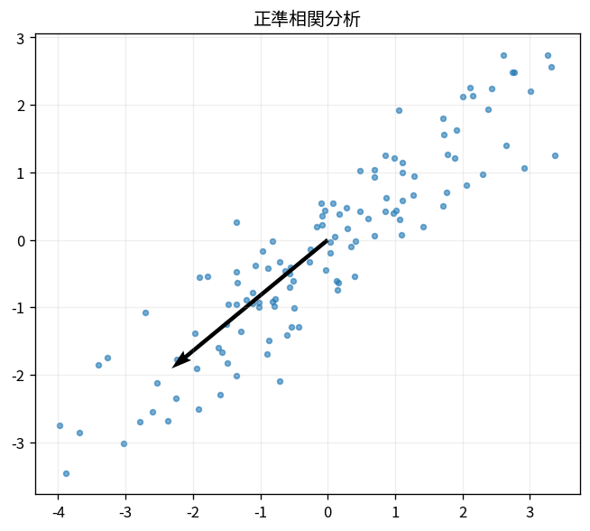

# 正準相関分析

Course 07｜データ解析の行列手法｜Topic 16/20

---
layout: center
---

## 今回の問い

## 到達目標

- 定義と代表式を、自分の言葉と記号で説明できる。
- 成立条件を確認し、手計算と結果を検算できる。

## 理解確認

- 定義・条件・計算結果を自分の言葉で説明できるか確認する。

正準相関分析の代表式は、どの定義・仮定から、なぜその形になるのか。

---

## なぜ今これを学ぶのか

前Topic `mat-ica-independent-components` で得た概念を使い、ここでは 正準相関分析 へ進む。

---

## 直感

複数viewの共通構造は、別々の特徴空間で相関が最大になる射影方向として捉えられる。

---

## 図解

2つのデータviewをそれぞれ1次元へ射影し、対応点の相関を見る。 2つのデータ表の射影方向を選び、射影後の相関を最大にする。個々の分散最大化ではなく、2 viewの共変動を強くする方向を探す点がPCAと異なる。

---

## 記号と代表式

- $X,Y$：same samplesの2 views
- $a,b$：projection vectors
- $Xa,Yb$：canonical variates

$$
\max_{\mathbf{a},\mathbf{b}}\operatorname{corr}(\mathbf{X}\mathbf{a},\mathbf{Y}\mathbf{b})
$$

---

## 導出 1

$corr(Xa,Yb)=a^TS_{XY}b/\sqrt{a^TS_{XX}a\;b^TS_{YY}b}$。

---

## 導出 2

$a^TS_{XX}a=1,b^TS_{YY}b=1$ としてcross covarianceをmaximize。

---

## 例題

gene expressionとprotein measurementのsame samplesで共有latent axesを探す。

---

## 条件を変えるとどうなるか

p>nでcovariance singularならnaive CCA overfit/undefined。regularized CCAが必要。

---

## よくある誤解

正準相関分析では、式へ数値を代入するだけでは不十分である。p>nでcovariance singularならnaive CCA overfit/undefined。regularized CCAが必要。 という失敗例が示すように、式を使える条件と結論の範囲を区別する必要がある。

---

## 実装・計算上の注意

train/validation split内でstandardization/covariance fit。canonical correlationのin-sample optimismに注意。

---

## 一段先へ

distance geometryを低dimへ保つrandom projectionへ。

---

## 自分で説明できるか

- 「correlationを書く」を式を見ずに説明できるか
- 「generalized eigen/SVD」までの論理を一段ずつ再現できるか
- 正準相関分析の条件を1つ外した反例を説明できるか

---
layout: center
---

## 教科書と演習

- [教科書](../../textbook/mat-cca-multiview)
- [10問の演習](../../exercises/mat-cca-multiview)
