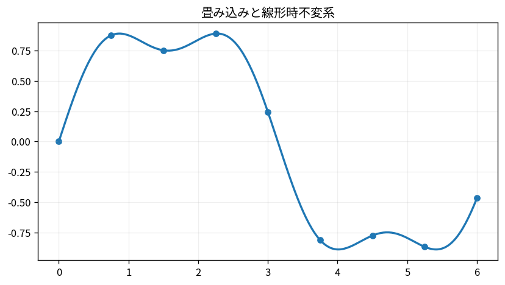

# 畳み込みと線形時不変系

Course 07｜データ解析の行列手法｜Topic 12/20

---
layout: center
---

## 今回の問い

## 到達目標

- 定義と代表式を、自分の言葉と記号で説明できる。
- 成立条件を確認し、手計算と結果を検算できる。

## 理解確認

- 定義・条件・計算結果を自分の言葉で説明できるか確認する。

畳み込みと線形時不変系の代表式は、どの定義・仮定から、なぜその形になるのか。

---

## なぜ今これを学ぶのか

前Topic `mat-fourier-bases-dft` で得た概念を使い、ここでは 畳み込みと線形時不変系 へ進む。

---

## 直感

畳み込みはkernelをずらしながら局所的な積和を取り、線形時不変系の応答を表す。

---

## 図解

短い1D信号上をkernelが移動する様子を描く。 kernelを信号上でずらしながら局所内積を取る操作を描く。Fourier領域ではこの畳み込みが周波数成分ごとの積へ変わる。

---

## 記号と代表式

- $x$：input sequence
- $h$：impulse response/kernel
- $y=x*h$
- $h_{n-k}$：shifted kernel

$$
(x*h)_n=\sum_k x_k h_{n-k}
$$

---

## 導出 1

$x=\sum_kx_k\delta_{n-k}$。

---

## 導出 2

impulse δ shifted bykへのresponseはh_{n-k}。係数x_kでscaleし全て足す。

---

## 例題

moving average h=(1/3,1/3,1/3)は近傍3点を平均しhigh-frequency variationを減らす。

---

## 条件を変えるとどうなるか

correlationとconvolutionはkernel reversalの有無が異なる。DL libraryの“conv”はcross-correlation実装が多い。

---

## よくある誤解

畳み込みと線形時不変系では、式へ数値を代入するだけでは不十分である。correlationとconvolutionはkernel reversalの有無が異なる。DL libraryの“conv”はcross-correlation実装が多い。 という失敗例が示すように、式を使える条件と結論の範囲を区別する必要がある。

---

## 実装・計算上の注意

direct O(NK) vs FFT O(N log N)、small kernelではdirectが速いことも。padding/strideを仕様化。

---

## 一段先へ

frequency response H(ω)を設計してfiltering/regularizationへ。

---

## 自分で説明できるか

- 「inputをimpulse basisへ」を式を見ずに説明できるか
- 「convolution formula」までの論理を一段ずつ再現できるか
- 畳み込みと線形時不変系の条件を1つ外した反例を説明できるか

---
layout: center
---

## 教科書と演習

- [教科書](../../textbook/mat-convolution-linear-systems)
- [10問の演習](../../exercises/mat-convolution-linear-systems)
