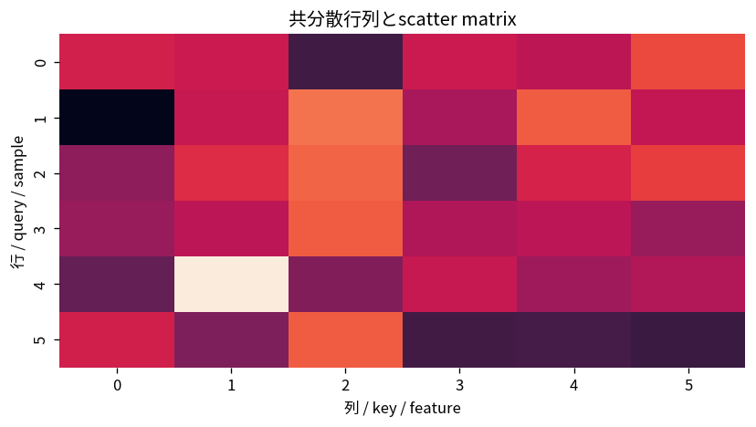

# 共分散行列とscatter matrix

Course 07｜データ解析の行列手法｜Topic 02/20

---
layout: center
---

## 今回の問い

## 到達目標

- 定義と代表式を、自分の言葉と記号で説明できる。
- 成立条件を確認し、手計算と結果を検算できる。

## 理解確認

- 定義・条件・計算結果を自分の言葉で説明できるか確認する。

共分散行列とscatter matrixの代表式は、どの定義・仮定から、なぜその形になるのか。

---

## なぜ今これを学ぶのか

前Topic `mat-data-matrices-centering-scaling` で得た概念を使い、ここでは 共分散行列とscatter matrix へ進む。

---

## 直感

同時分布は複数変数の組を一度に扱い、周辺化は不要な軸を足し合わせる操作。

---

## 図解

2次元ヒートマップから行・列方向に足して周辺分布を作る。 2軸は2つの変数、各セルや密度の高さは同時にその値を取る重みを表す。一方の軸方向へ足し上げる・積分すると他方だけの周辺分布が残る。

---

## 記号と代表式

- $X_c\in\mathbb R^{n\times p}$
- $S=(n-1)^{-1}X_c^TX_c\in\mathbb R^{p\times p}$
- $S_{jk}$：feature j,kのsample covariance

$$
\mathbf{S}=\frac{1}{n-1}\mathbf{X}_c^{\mathsf T}\mathbf{X}_c
$$

---

## 導出 1

$(X_c^TX_c)_{jk}=\sum_i(X_{ij}-\mu_j)(X_{ik}-\mu_k)$。これはsample covariance numerator。

---

## 導出 2

$v^TSv=(n-1)^{-1}\|X_cv\|²\ge0$ なのでPSD。

---

## 例題

2 featuresが完全に同じならcovariance matrixはrank1。difference direction (1,-1)のvarianceは0。

---

## 条件を変えるとどうなるか

centerせず $X^TX$ をcovarianceと呼ぶとmean成分を含むsecond momentになる。

---

## よくある誤解

共分散行列とscatter matrixでは、式へ数値を代入するだけでは不十分である。centerせず $X^TX$ をcovarianceと呼ぶとmean成分を含むsecond momentになる。 という失敗例が示すように、式を使える条件と結論の範囲を区別する必要がある。

---

## 実装・計算上の注意

n<pではsample covarianceはrank≤n-1でsingular。inverseを必要とする手法でregularizationが必要。

---

## 一段先へ

directional varianceを最大化する方向を選ぶとPCA eigenproblemが自然に出る。

---

## 自分で説明できるか

- 「entryを展開」を式を見ずに説明できるか
- 「directional variance」までの論理を一段ずつ再現できるか
- 共分散行列とscatter matrixの条件を1つ外した反例を説明できるか

---
layout: center
---

## 教科書と演習

- [教科書](../../textbook/mat-covariance-scatter-matrices)
- [10問の演習](../../exercises/mat-covariance-scatter-matrices)
