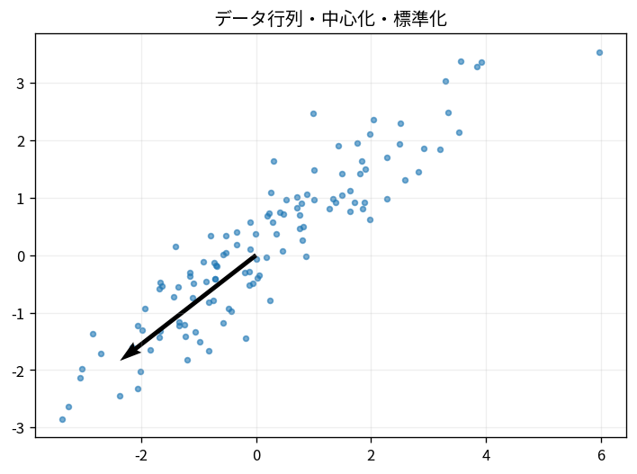

# データ行列・中心化・標準化

Course 07｜データ解析の行列手法｜Topic 01/20

---
layout: center
---

## 今回の問い

## 到達目標

- 定義と代表式を、自分の言葉と記号で説明できる。
- 成立条件を確認し、手計算と結果を検算できる。

## 理解確認

- 定義・条件・計算結果を自分の言葉で説明できるか確認する。

データ行列・中心化・標準化の代表式は、どの定義・仮定から、なぜその形になるのか。

---

## なぜ今これを学ぶのか

Course 07 の入口として、データ行列・中心化・標準化 を定義から組み立てる。

---

## 直感

中心化・標準化は各特徴の基準点とスケールを揃え、後続の距離・共分散・最適化を解釈しやすくする。

---

## 図解

異なる単位の2特徴を標準化前後で散布図比較する。 各軸が特徴量、点が標本である。中心化は点群の重心を原点へ移し、標準化は軸ごとの尺度をそろえるので、距離や内積への寄与が変わる。

---

## 記号と代表式

- $X\in\mathbb R^{n\times p}$：rows=samples, columns=features
- $\boldsymbol\mu\in\mathbb R^p$：column means
- $\mathbf1\in\mathbb R^n$
- $X_c=X-\mathbf1\mu^T$：centered data

$$
\mathbf{X}_c=\mathbf{X}-\mathbf{1}\boldsymbol{\mu}^{\mathsf T}
$$

---

## 導出 1

$\mathbf1\mu^T$ はn行全てが同じmean row vector。shapeはn×pでXと引ける。

---

## 導出 2

$\mathbf1^TX_c=\mathbf1^TX-n\mu^T=0^T$。したがって各column meanが0。

---

## 例題

身長cmと体重kgをそのままEuclidean distanceへ入れると単位scaleが距離に影響。z-score化で「何SD違うか」へ揃える。

---

## 条件を変えるとどうなるか

train+testをまとめてmean/SD計算するとtest情報がtrain transformへ漏れる。preprocessing parameterはtrainだけでfit。

---

## よくある誤解

データ行列・中心化・標準化では、式へ数値を代入するだけでは不十分である。train+testをまとめてmean/SD計算するとtest情報がtrain transformへ漏れる。preprocessing parameterはtrainだけでfit。 という失敗例が示すように、式を使える条件と結論の範囲を区別する必要がある。

---

## 実装・計算上の注意

axisを間違えるとsample meanを引いてしまう。pipelineにfit/transformを分離し、constant featureのzero SD処理を決める。

---

## 一段先へ

中心化したdataのscatter $X_c^TX_c$ がcovariance matrixを作り、feature間のjoint variationを表す。

---

## 自分で説明できるか

- 「meanをmatrixで複製する」を式を見ずに説明できるか
- 「標準化」までの論理を一段ずつ再現できるか
- データ行列・中心化・標準化の条件を1つ外した反例を説明できるか

---
layout: center
---

## 教科書と演習

- [教科書](../../textbook/mat-data-matrices-centering-scaling)
- [10問の演習](../../exercises/mat-data-matrices-centering-scaling)
