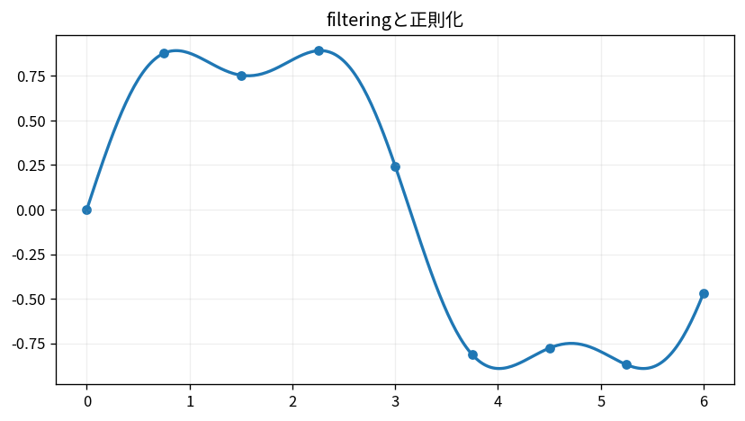

# filteringと正則化

Course 07｜データ解析の行列手法｜Topic 13/20

---
layout: center
---

## 今回の問い

## 到達目標

- 定義と代表式を、自分の言葉と記号で説明できる。
- 成立条件を確認し、手計算と結果を検算できる。

## 理解確認

- 定義・条件・計算結果を自分の言葉で説明できるか確認する。

filteringと正則化の代表式は、どの定義・仮定から、なぜその形になるのか。

---

## なぜ今これを学ぶのか

前Topic `mat-convolution-linear-systems` で得た概念を使い、ここでは filteringと正則化 へ進む。

---

## 直感

Fourier表現は信号を周波数ごとの正弦波成分へ分解し、時間領域と周波数領域を往復する。

---

## 図解

2つの周波数を足した信号とDFTスペクトルを並べる。 時間/空間領域の信号を、周波数ごとのsin/cosまたは複素指数の係数へ分解する。周期の短い成分ほど高い周波数binに現れる。

---

## 記号と代表式

- $H(\omega)$：frequency response
- $\hat x(\omega)=H(\omega)x(\omega)$
- $\lambda$：regularization

$$
\hat{x}(\omega)=H(\omega)x(\omega)
$$

---

## 導出 1

time convolution y=h*xはfrequencyでY=HX。

---

## 導出 2

|H|をlow frequencyで1、高frequencyでsmallにするとfast variationを抑える。

---

## 例題

finite difference noiseはhigh frequencyで大きいためlow-passでsmoothできるがedgeもblurする。

---

## 条件を変えるとどうなるか

filteringで消したfrequency情報は後からexact recoveryできない。denoisingとdetail loss tradeoff。

---

## よくある誤解

filteringと正則化では、式へ数値を代入するだけでは不十分である。filteringで消したfrequency情報は後からexact recoveryできない。denoisingとdetail loss tradeoff。 という失敗例が示すように、式を使える条件と結論の範囲を区別する必要がある。

---

## 実装・計算上の注意

phase response、boundary/windowを確認。filter designとdata leakage（future data使用）もtime seriesで重要。

---

## 一段先へ

次はnonnegative constraintを使うfactorization NMFへ。

---

## 自分で説明できるか

- 「convolution theorem」を式を見ずに説明できるか
- 「regularized inverse」までの論理を一段ずつ再現できるか
- filteringと正則化の条件を1つ外した反例を説明できるか

---
layout: center
---

## 教科書と演習

- [教科書](../../textbook/mat-filtering-regularization)
- [10問の演習](../../exercises/mat-filtering-regularization)
