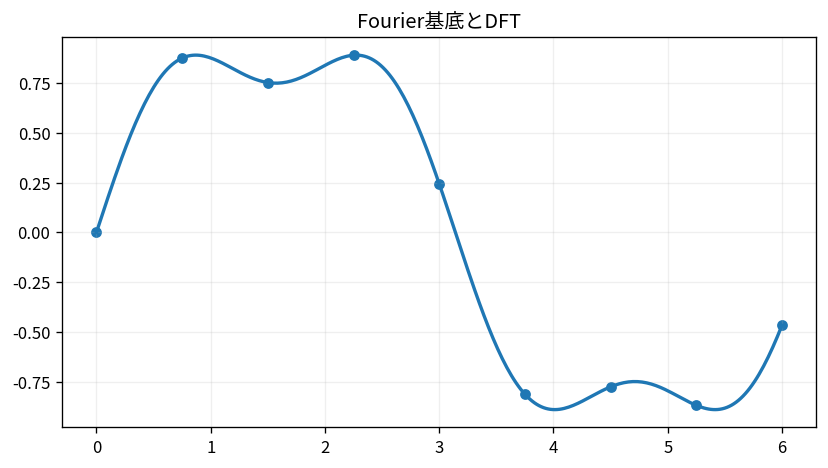

# Fourier基底とDFT

Course 07｜データ解析の行列手法｜Topic 11/20

---
layout: center
---

## 今回の問い

## 到達目標

- 定義と代表式を、自分の言葉と記号で説明できる。
- 成立条件を確認し、手計算と結果を検算できる。

## 理解確認

- 定義・条件・計算結果を自分の言葉で説明できるか確認する。

Fourier基底とDFTの代表式は、どの定義・仮定から、なぜその形になるのか。

---

## なぜ今これを学ぶのか

前Topic `mat-robust-regression-m-estimators` で得た概念を使い、ここでは Fourier基底とDFT へ進む。

---

## 直感

Fourier表現は信号を周波数ごとの正弦波成分へ分解し、時間領域と周波数領域を往復する。

---

## 図解

2つの周波数を足した信号とDFTスペクトルを並べる。 時間/空間領域の信号を、周波数ごとのsin/cosまたは複素指数の係数へ分解する。周期の短い成分ほど高い周波数binに現れる。

---

## 記号と代表式

- $x_n,n=0,\ldots,N-1$
- $X_k$：frequency coefficient
- $e^{-2\pi i kn/N}$：complex sinusoid basis

$$
X_k=\sum_{n=0}^{N-1}x_n e^{-2\pi i kn/N}
$$

---

## 導出 1

$\sum_{n=0}^{N-1}e^{2\pi i(k-l)n/N}=0$ for k≠l, =N for k=l。geometric seriesから従う。

---

## 導出 2

orthogonal basisへのprojectionとして $X_k=\sum_n x_ne^{-2πikn/N}$。normalization conventionはforward/inverseで分配。

---

## 例題

constant signal x_n=1はDC k=0 coefficient Nのみ、他frequency0。

---

## 条件を変えるとどうなるか

DFT bin外frequencyの有限window sinusoidは1 binだけでなくspectral leakage。

---

## よくある誤解

Fourier基底とDFTでは、式へ数値を代入するだけでは不十分である。DFT bin外frequencyの有限window sinusoidは1 binだけでなくspectral leakage。 という失敗例が示すように、式を使える条件と結論の範囲を区別する必要がある。

---

## 実装・計算上の注意

FFTはDFTと同じ数学変換をO(N log N)で計算。normalization、frequency ordering、real FFT shapeを確認。

---

## 一段先へ

frequency domainでconvolutionがpointwise multiplicationになる。

---

## 自分で説明できるか

- 「basis orthogonality」を式を見ずに説明できるか
- 「reconstruction」までの論理を一段ずつ再現できるか
- Fourier基底とDFTの条件を1つ外した反例を説明できるか

---
layout: center
---

## 教科書と演習

- [教科書](../../textbook/mat-fourier-bases-dft)
- [10問の演習](../../exercises/mat-fourier-bases-dft)
