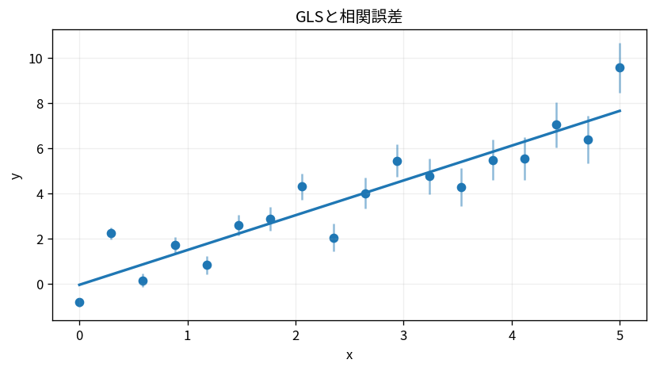

# GLSと相関誤差

Course 07｜データ解析の行列手法｜Topic 08/20

---
layout: center
---

## 今回の問い

## 到達目標

- 定義と代表式を、自分の言葉と記号で説明できる。
- 成立条件を確認し、手計算と結果を検算できる。

## 理解確認

- 定義・条件・計算結果を自分の言葉で説明できるか確認する。

GLSと相関誤差の代表式は、どの定義・仮定から、なぜその形になるのか。

---

## なぜ今これを学ぶのか

前Topic `mat-wls-inverse-variance` で得た概念を使い、ここでは GLSと相関誤差 へ進む。

---

## 直感

観測ごとの信頼度が異なるとき、残差を同じ重みで扱わず、分散の小さい観測を強く反映する。

---

## 図解

同じ散布点にOLSと逆分散WLSを当て、誤差バーの小さい点へ線が寄る様子を見る。 各点から回帰線への残差に異なる重みが掛かる。分散の小さい観測ほど信頼度が高いとき1/σ_i²で重くするのはGaussian likelihoodから導かれる。

---

## 記号と代表式

- $Cov(\varepsilon)=\Sigma\succ0$
- $\Sigma^{-1}$：precision
- $L L^T=\Sigma$：Cholesky

$$
\min_{\boldsymbol{\beta}}(\mathbf{y}-\mathbf{X}\boldsymbol{\beta})^{\mathsf T}\mathbf{\Sigma}^{-1}(\mathbf{y}-\mathbf{X}\boldsymbol{\beta})
$$

---

## 導出 1

$-\log p(y|β)=const+\frac12r^TΣ^{-1}r+\frac12\log|Σ|$。Σ fixedならβに関係するのはquadratic term。

---

## 導出 2

$Σ=LL^T$ とし $L^{-1}r$ のEuclidean normを最小化。$r^TΣ^{-1}r=\|L^{-1}r\|²$。

---

## 例題

time series residualが隣接時点でpositive correlatedなら独立WLSよりeffective informationが少ない。

---

## 条件を変えるとどうなるか

Σ estimated poorly/singularならinverse unstable。correlation structureを無視したstandard errorsは過小評価し得る。

---

## よくある誤解

GLSと相関誤差では、式へ数値を代入するだけでは不十分である。Σ estimated poorly/singularならinverse unstable。correlation structureを無視したstandard errorsは過小評価し得る。 という失敗例が示すように、式を使える条件と結論の範囲を区別する必要がある。

---

## 実装・計算上の注意

Cholesky triangular solveでwhitenしinverseを作らない。structured covariance(AR,block)を利用。

---

## 一段先へ

regularizationはnoise modelとは別にcoefficient complexityへconstraint/penaltyを加える。

---

## 自分で説明できるか

- 「Gaussian log likelihood」を式を見ずに説明できるか
- 「GLS normal equation」までの論理を一段ずつ再現できるか
- GLSと相関誤差の条件を1つ外した反例を説明できるか

---
layout: center
---

## 教科書と演習

- [教科書](../../textbook/mat-gls-correlated-errors)
- [10問の演習](../../exercises/mat-gls-correlated-errors)
