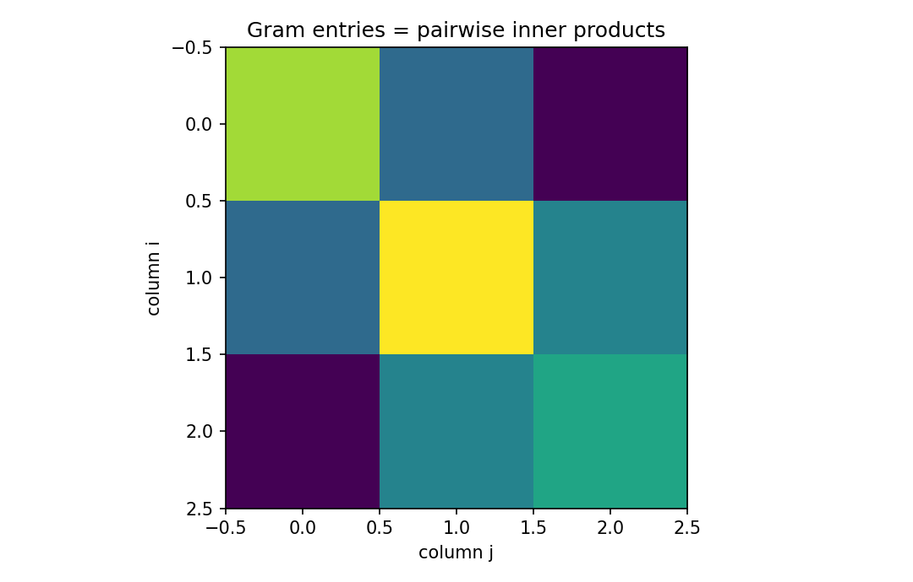

# Gram matrix

行列・ベクトル微分

---

## 問い

複数ベクトルの内積関係を、1枚の行列にどう集約するか。

---

## 記号とshape

- `$\mathbf X`: 列にベクトルを並べた行列 (m\times n)
- `$\mathbf G`: Gram行列 (n\times n)
- `$\mathbf x_i`: 第i列ベクトル (m)

---

## 中心式

$$
\mathbf G=\mathbf X^{\mathsf T}\mathbf X,\qquad G_{ij}=\mathbf x_i^{\mathsf T}\mathbf x_j
$$

---

## 導出

- 積の(i,j)成分を展開すると $(\mathbf X^{\mathsf T}\mathbf X)_{ij}=\sum_{k=1}^m X_{ki}X_{kj}$ となる。
- 右辺は列 $\mathbf x_i$ と $\mathbf x_j$ のEuclidean inner productそのものである。
- 任意の $\mathbf a$ に対して $\mathbf a^{\mathsf T}\mathbf G\mathbf a=\|\mathbf X\mathbf a\|_2^2\ge0$ なので $\mathbf G$ はpositive semidefiniteである。

---

## 図

---

## 小さな例

$\mathbf X=[(1,0)^{\mathsf T},(1,1)^{\mathsf T}]$ なら $\mathbf G=\begin{bmatrix}1&1\\1&2\end{bmatrix}$。対角は各列の二乗norm、非対角は列間の重なりである。

---

## 何がわかるか

least squares、kernel method、Hotspot Matrixでは、設計列・スペクトル列の識別可能性をGram構造から診断する。

---

## 失敗条件

列がほぼ平行だとGram行列は悪条件化する。逆行列の大きさだけを見て、元の列幾何を確認しないとcollinearityの原因を見失う。

---

## 実装検算

`G = X.T @ X` を作り、`eigvalsh(G)` と `svd(X)` の二乗特異値が一致するかを確認する。

---

## 式の読み方を固定する

Gram matrixでは、局所線形化・内積・行列積のどこに微分対象が入るかを追う。$\mathbf X$ は 列にベクトルを並べた行列（m\times n）、$\mathbf G$ は Gram行列（n\times n）、$\mathbf x_i$ は 第i列ベクトル（m）。特に行列積は一般に可換でないため、中心式 `\mathbf G=\mathbf X^{\mathsf T}\mathbf X,\qquad G_{ij}=\mathbf x_i^{\mathsf T}\mathbf x_j` の積順序を保持したままdifferentialまたはJacobianへ落とすことが重要である。転置を1つ動かしただけでshapeが変わるので、式変形ごとに入力次元と出力次元を再確認する。

---

## 極限・反例で検算

- 手計算例: $\mathbf X=[(1,0)^{\mathsf T},(1,1)^{\mathsf T}]$ なら $\mathbf G=\begin{bmatrix}1&1\\1&2\end{bmatrix}$。対角は各列の二乗norm、非対角は列間の重なりである。
- 失敗条件: 列がほぼ平行だとGram行列は悪条件化する。逆行列の大きさだけを見て、元の列幾何を確認しないとcollinearityの原因を見失う。
- 実装検算: `G = X.T @ X` を作り、`eigvalsh(G)` と `svd(X)` の二乗特異値が一致するかを確認する。

---

## 工学での位置づけ

least squares、kernel method、Hotspot Matrixでは、設計列・スペクトル列の識別可能性をGram構造から診断する。

中心式 `\mathbf G=\mathbf X^{\mathsf T}\mathbf X,\qquad G_{ij}=\mathbf x_i^{\mathsf T}\mathbf x_j` のどの量が観測・未知parameter・weight・frequency成分に対応するかを区別する。

---

## 試験で書けるべきこと

- `Gram matrix` の記号とshapeを定義する
- `積の(i,j)成分を展開すると $(\mathbf X^{\mathsf T}\mathbf X)_{ij}=\sum_{k=1}^m X_{ki}X_{kj}$ となる。` から中心式を導く
- `$\mathbf X=[(1,0)^{\mathsf T},(1,1)^{\mathsf T}]$ なら $\mathbf G=\begin{bmatrix}1&1\\1&2\end{bmatrix}$。対角は各列の二乗norm、非対角は列間の重なりである。` を最後まで追う
- `列がほぼ平行だとGram行列は悪条件化する。逆行列の大きさだけを見て、元の列幾何を確認しないとcollinearityの原因を見失う。` がなぜ問題か説明する

---

## 接続

Prerequisites: la-inner-products-norms-angles, la-matrix-multiplication

[教科書](../../textbook/mat-gram-matrix)
[10問の演習](../../exercises/mat-gram-matrix)
