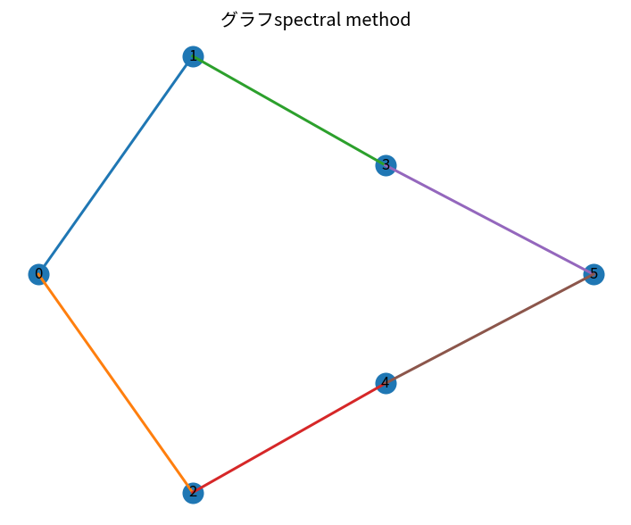

# グラフspectral method

Course 07｜データ解析の行列手法｜Topic 19/20

---
layout: center
---

## 今回の問い

## 到達目標

- 定義と代表式を、自分の言葉と記号で説明できる。
- 成立条件を確認し、手計算と結果を検算できる。

## 理解確認

- 定義・条件・計算結果を自分の言葉で説明できるか確認する。

グラフspectral methodの代表式は、どの定義・仮定から、なぜその形になるのか。

---

## なぜ今これを学ぶのか

前Topic `mat-matrix-completion` で得た概念を使い、ここでは グラフspectral method へ進む。

---

## 直感

グラフは頂点と辺で関係を表し、道・連結性・次数は局所と大域の構造をつなぐ。

---

## 図解

小さなグラフで次数、最短路、連結成分を色分けする。 頂点が対象、辺が対象間の関係である。pathは隣接辺を順にたどる列、cycleは始点へ戻るpathであり、連結性や到達可能性を図上で直接確認できる。

---

## 記号と代表式

- $A$：adjacency
- $D$：degree diagonal
- $L=D-A$：graph Laplacian
- $x^TLx=\sum_{(i,j)\in E}(x_i-x_j)^2$（undirected）

$$
\mathbf{L}=\mathbf{D}-\mathbf{A}
$$

---

## 導出 1

$x^TDx- x^TAx$ をedge sumへ整理すると各edge difference squareの和。

---

## 導出 2

square sumなので≥0。constant vectorは全difference0でL1=0。

---

## 例題

connected path graphのsecond eigenvectorは端から端へ滑らかに変化しspectral embedding coordinateになる。

---

## 条件を変えるとどうなるか

directed/negative-weight graphではstandard symmetric Laplacianの性質をそのまま使えない。

---

## よくある誤解

グラフspectral methodでは、式へ数値を代入するだけでは不十分である。directed/negative-weight graphではstandard symmetric Laplacianの性質をそのまま使えない。 という失敗例が示すように、式を使える条件と結論の範囲を区別する必要がある。

---

## 実装・計算上の注意

sparse eigensolverでsmall eigenpairs。isolated nodes、normalization conventionを確認。

---

## 一段先へ

matrixからさらに多way interactionを持つtensorへ一般化する。

---

## 自分で説明できるか

- 「quadratic form展開」を式を見ずに説明できるか
- 「components」までの論理を一段ずつ再現できるか
- グラフspectral methodの条件を1つ外した反例を説明できるか

---
layout: center
---

## 教科書と演習

- [教科書](../../textbook/mat-graph-spectral-methods)
- [10問の演習](../../exercises/mat-graph-spectral-methods)
