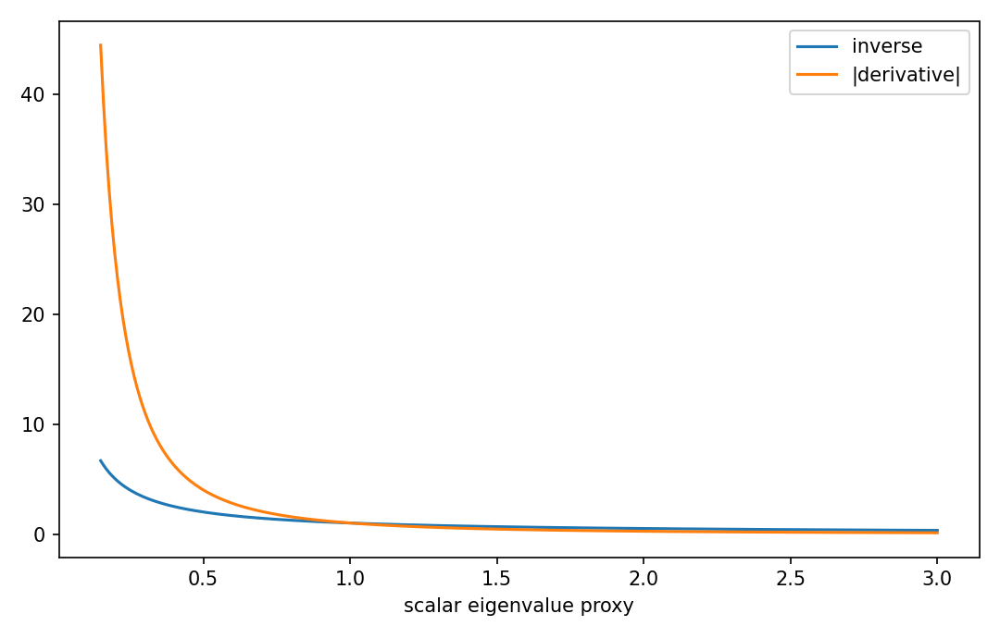

# Inverse matrix derivative

行列・ベクトル微分

---

## 問い

逆行列の微分を、成分暗記なしで恒等式からどう導くか。

---

## 記号とshape

- `$\mathbf A`: invertible matrix (n\times n)
- `$\mathbf A^{-1}`: inverse (n\times n)

---

## 中心式

$$
d(\mathbf A^{-1})=-\mathbf A^{-1}(d\mathbf A)\mathbf A^{-1}
$$

---

## 導出

- 恒等式 $\mathbf A\mathbf A^{-1}=\mathbf I$ を微分する。
- product ruleで $(d\mathbf A)\mathbf A^{-1}+\mathbf A d(\mathbf A^{-1})=0$。
- 左から $\mathbf A^{-1}$ を掛けて目的式を得る。順序は可換ではないので保存する。

---

## 図

---

## 小さな例

$\mathbf A(t)=\operatorname{diag}(t,2)$ なら $\mathbf A^{-1}=\operatorname{diag}(1/t,1/2)$。公式の(1,1)成分は $-dt/t^2$ となりscalar微分と一致する。

---

## 何がわかるか

Kalman filter、covariance inverse、implicit differentiation、GLSの感度解析に現れる。

---

## 失敗条件

singularまたはほぼsingularな点では逆行列自体が存在しない、または感度が爆発する。condition numberと同時に見る。

---

## 実装検算

`inv(A+hD)` の差分と `-inv(A)@D@inv(A)` を比較する。

---

## 式の読み方を固定する

Inverse matrix derivativeでは、局所線形化・内積・行列積のどこに微分対象が入るかを追う。$\mathbf A$ は invertible matrix（n\times n）、$\mathbf A^{-1}$ は inverse（n\times n）。特に行列積は一般に可換でないため、中心式 `d(\mathbf A^{-1})=-\mathbf A^{-1}(d\mathbf A)\mathbf A^{-1}` の積順序を保持したままdifferentialまたはJacobianへ落とすことが重要である。転置を1つ動かしただけでshapeが変わるので、式変形ごとに入力次元と出力次元を再確認する。

---

## 極限・反例で検算

- 手計算例: $\mathbf A(t)=\operatorname{diag}(t,2)$ なら $\mathbf A^{-1}=\operatorname{diag}(1/t,1/2)$。公式の(1,1)成分は $-dt/t^2$ となりscalar微分と一致する。
- 失敗条件: singularまたはほぼsingularな点では逆行列自体が存在しない、または感度が爆発する。condition numberと同時に見る。
- 実装検算: `inv(A+hD)` の差分と `-inv(A)@D@inv(A)` を比較する。

---

## 工学での位置づけ

Kalman filter、covariance inverse、implicit differentiation、GLSの感度解析に現れる。

中心式 `d(\mathbf A^{-1})=-\mathbf A^{-1}(d\mathbf A)\mathbf A^{-1}` のどの量が観測・未知parameter・weight・frequency成分に対応するかを区別する。

---

## 試験で書けるべきこと

- `Inverse matrix derivative` の記号とshapeを定義する
- `恒等式 $\mathbf A\mathbf A^{-1}=\mathbf I$ を微分する。` から中心式を導く
- `$\mathbf A(t)=\operatorname{diag}(t,2)$ なら $\mathbf A^{-1}=\operatorname{diag}(1/t,1/2)$。公式の(1,1)成分は $-dt/t^2$ となりscalar微分と一致する。` を最後まで追う
- `singularまたはほぼsingularな点では逆行列自体が存在しない、または感度が爆発する。condition numberと同時に見る。` がなぜ問題か説明する

---

## 接続

Prerequisites: mat-matrix-differential, la-invertibility-inverse-matrices

[教科書](../../textbook/mat-inverse-matrix-derivative)
[10問の演習](../../exercises/mat-inverse-matrix-derivative)
