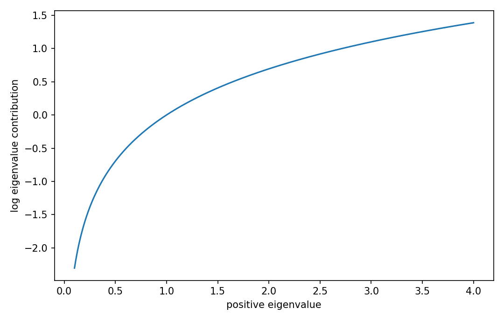

# Log-determinant derivative

行列・ベクトル微分

---

## 問い

positive definite matrixの体積・normalizationを表すlog-detのgradientをどう得るか。

---

## 記号とshape

- `$\mathbf A`: invertible matrix; SPDならlogが実数 (n\times n)
- `$det\mathbf A`: determinant (1)

---

## 中心式

$$
d\log\det\mathbf A=\operatorname{tr}(\mathbf A^{-1}d\mathbf A)
$$

---

## 導出

- Jacobiの公式 $d\det\mathbf A=\det\mathbf A\,\operatorname{tr}(\mathbf A^{-1}d\mathbf A)$ を使う。
- $d\log z=dz/z$ を $z=\det\mathbf A$ に適用する。
- $\det\mathbf A$ が約分され、traceだけが残る。symmetric variableならgradientは $\mathbf A^{-\mathsf T}$。

---

## 図

---

## 小さな例

$\mathbf A=\operatorname{diag}(a,b)$ なら $\log\det\mathbf A=\log a+\log b$。微分は $da/a+db/b$ でtrace公式と一致する。

---

## 何がわかるか

Gaussian likelihood、covariance estimation、optimal design、barrier methodの中心式になる。

---

## 失敗条件

determinantが非正の場合、実数のlog-detは定義できない。数値計算では`det`後にlogを取らず`slogdet`やCholeskyを使う。

---

## 実装検算

`np.linalg.slogdet(A)` のdirectional finite differenceと `trace(inv(A)@D)` を比較する。

---

## 式の読み方を固定する

Log-determinant derivativeでは、局所線形化・内積・行列積のどこに微分対象が入るかを追う。$\mathbf A$ は invertible matrix; SPDならlogが実数（n\times n）、$det\mathbf A$ は determinant（1）。特に行列積は一般に可換でないため、中心式 `d\log\det\mathbf A=\operatorname{tr}(\mathbf A^{-1}d\mathbf A)` の積順序を保持したままdifferentialまたはJacobianへ落とすことが重要である。転置を1つ動かしただけでshapeが変わるので、式変形ごとに入力次元と出力次元を再確認する。

---

## 極限・反例で検算

- 手計算例: $\mathbf A=\operatorname{diag}(a,b)$ なら $\log\det\mathbf A=\log a+\log b$。微分は $da/a+db/b$ でtrace公式と一致する。
- 失敗条件: determinantが非正の場合、実数のlog-detは定義できない。数値計算では`det`後にlogを取らず`slogdet`やCholeskyを使う。
- 実装検算: `np.linalg.slogdet(A)` のdirectional finite differenceと `trace(inv(A)@D)` を比較する。

---

## 工学での位置づけ

Gaussian likelihood、covariance estimation、optimal design、barrier methodの中心式になる。

中心式 `d\log\det\mathbf A=\operatorname{tr}(\mathbf A^{-1}d\mathbf A)` のどの量が観測・未知parameter・weight・frequency成分に対応するかを区別する。

---

## 試験で書けるべきこと

- `Log-determinant derivative` の記号とshapeを定義する
- `Jacobiの公式 $d\det\mathbf A=\det\mathbf A\,\operatorname{tr}(\mathbf A^{-1}d\mathbf A)$ を使う。` から中心式を導く
- `$\mathbf A=\operatorname{diag}(a,b)$ なら $\log\det\mathbf A=\log a+\log b$。微分は $da/a+db/b$ でtrace公式と一致する。` を最後まで追う
- `determinantが非正の場合、実数のlog-detは定義できない。数値計算では`det`後にlogを取らず`slogdet`やCholeskyを使う。` がなぜ問題か説明する

---

## 接続

Prerequisites: mat-inverse-matrix-derivative, mat-matrix-differential

[教科書](../../textbook/mat-log-determinant-derivative)
[10問の演習](../../exercises/mat-log-determinant-derivative)
