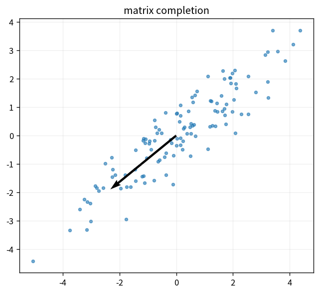

# matrix completion

Course 07｜データ解析の行列手法｜Topic 18/20

---
layout: center
---

## 今回の問い

## 到達目標

- 定義と代表式を、自分の言葉と記号で説明できる。
- 成立条件を確認し、手計算と結果を検算できる。

## 理解確認

- 定義・条件・計算結果を自分の言葉で説明できるか確認する。

matrix completionの代表式は、どの定義・仮定から、なぜその形になるのか。

---

## なぜ今これを学ぶのか

前Topic `mat-random-projections-jl` で得た概念を使い、ここでは matrix completion へ進む。

---

## 直感

低ランク近似はデータの主要な方向だけ残し、情報を圧縮する。

---

## 図解

行列画像を特異値1個、2個、…と増やして再構成する。 特異値を大きい順に並べると、各rank-1成分がデータをどれだけ強く説明するかが見える。小さい特異値の成分を落とすと低rank近似になる。

---

## 記号と代表式

- $\Omega$：observed index set
- $P_\Omega$：observed entriesだけ残すoperator
- $\|M\|_*$：nuclear norm

$$
\min_{\mathbf{M}}\|\mathbf{M}\|_*\quad\text{s.t. }P_{\Omega}(\mathbf{M})=P_{\Omega}(\mathbf{X})
$$

---

## 導出 1

$M=UV^T$ with small rならdegrees of freedomがmnより小さく、missing entriesへconstraintを共有できる。

---

## 導出 2

nuclear normはsingular valuesのL1 sumでrankのconvex surrogate。

---

## 例題

user-item rating matrixをlatent factorsで補完。ただしmissing-not-at-randomならbias。

---

## 条件を変えるとどうなるか

1列しか観測されない等、sampling patternが偏るとlow-rankでも一意recovery不能。

---

## よくある誤解

matrix completionでは、式へ数値を代入するだけでは不十分である。1列しか観測されない等、sampling patternが偏るとlow-rankでも一意recovery不能。 という失敗例が示すように、式を使える条件と結論の範囲を区別する必要がある。

---

## 実装・計算上の注意

alternating factorizationはscalableだがnonconvex。validationはobserved held-out entriesで。

---

## 一段先へ

graphにもmatrix spectrumがあり、Laplacian eigenvectorsでgeometryを捉える。

---

## 自分で説明できるか

- 「low-rank assumption」を式を見ずに説明できるか
- 「observation constraint」までの論理を一段ずつ再現できるか
- matrix completionの条件を1つ外した反例を説明できるか

---
layout: center
---

## 教科書と演習

- [教科書](../../textbook/mat-matrix-completion)
- [10問の演習](../../exercises/mat-matrix-completion)
