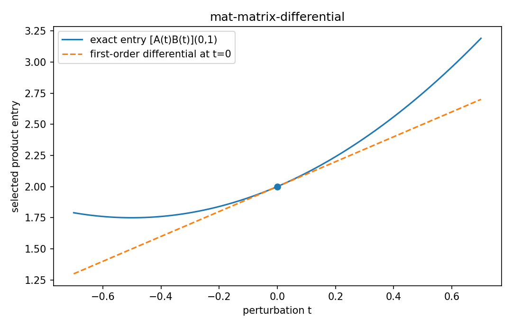

# Matrix differential

行列・ベクトル微分

---

## 問い

公式を暗記せず、積・逆行列・traceの微分をdifferentialから再導出するにはどうするか。

---

## 記号とshape

- `$\mathbf A,\mathbf B`: matrix-valued variables (compatible)
- `$d\mathbf A,d\mathbf B`: first-order perturbations (same shapes as originals)

---

## 中心式

$$
d(\mathbf A\mathbf B)=(d\mathbf A)\mathbf B+\mathbf A(d\mathbf B)
$$

---

## 導出

- $\mathbf A\to\mathbf A+d\mathbf A$、$\mathbf B\to\mathbf B+d\mathbf B$ を積へ代入する。
- $d\mathbf A\,d\mathbf B$ は二次微小量なので一次differentialでは捨てる。
- 残る一次項がproduct ruleであり、scalar微分と同じ構造だが順序を交換してはいけない。

---

## 図

---

## 小さな例

$A(t)=\begin{bmatrix}t&0\\0&1\end{bmatrix}$、$B(t)=\begin{bmatrix}1&t\\0&1\end{bmatrix}$ に対し、積を直接微分した結果とproduct ruleが一致する。

---

## 何がわかるか

matrix calculusのtrace trick、inverse derivative、log-det、Gaussian likelihoodの導出の共通基盤になる。

---

## 失敗条件

行列は一般に可換でない。scalar感覚で $(d\mathbf A)\mathbf B$ と $\mathbf B(d\mathbf A)$ を入れ替えると誤る。

---

## 実装検算

symbolicな公式だけでなく、微小乱数行列 `D` を加えた差分が一次予測と一致するか確認する。

---

## 式の読み方を固定する

Matrix differentialでは、局所線形化・内積・行列積のどこに微分対象が入るかを追う。$\mathbf A,\mathbf B$ は matrix-valued variables（compatible）、$d\mathbf A,d\mathbf B$ は first-order perturbations（same shapes as originals）。特に行列積は一般に可換でないため、中心式 `d(\mathbf A\mathbf B)=(d\mathbf A)\mathbf B+\mathbf A(d\mathbf B)` の積順序を保持したままdifferentialまたはJacobianへ落とすことが重要である。転置を1つ動かしただけでshapeが変わるので、式変形ごとに入力次元と出力次元を再確認する。

---

## 極限・反例で検算

- 手計算例: $A(t)=\begin{bmatrix}t&0\\0&1\end{bmatrix}$、$B(t)=\begin{bmatrix}1&t\\0&1\end{bmatrix}$ に対し、積を直接微分した結果とproduct ruleが一致する。
- 失敗条件: 行列は一般に可換でない。scalar感覚で $(d\mathbf A)\mathbf B$ と $\mathbf B(d\mathbf A)$ を入れ替えると誤る。
- 実装検算: symbolicな公式だけでなく、微小乱数行列 `D` を加えた差分が一次予測と一致するか確認する。

---

## 工学での位置づけ

matrix calculusのtrace trick、inverse derivative、log-det、Gaussian likelihoodの導出の共通基盤になる。

中心式 `d(\mathbf A\mathbf B)=(d\mathbf A)\mathbf B+\mathbf A(d\mathbf B)` のどの量が観測・未知parameter・weight・frequency成分に対応するかを区別する。

---

## 試験で書けるべきこと

- `Matrix differential` の記号とshapeを定義する
- `$\mathbf A\to\mathbf A+d\mathbf A$、$\mathbf B\to\mathbf B+d\mathbf B$ を積へ代入する。` から中心式を導く
- `$A(t)=\begin{bmatrix}t&0\\0&1\end{bmatrix}$、$B(t)=\begin{bmatrix}1&t\\0&1\end{bmatrix}$ に対し、積を直接微分した結果とproduct ruleが一致する。` を最後まで追う
- `行列は一般に可換でない。scalar感覚で $(d\mathbf A)\mathbf B$ と $\mathbf B(d\mathbf A)$ を入れ替えると誤る。` がなぜ問題か説明する

---

## 接続

Prerequisites: mat-scalar-by-matrix-derivative, mat-vector-by-matrix-derivative

[教科書](../../textbook/mat-matrix-differential)
[10問の演習](../../exercises/mat-matrix-differential)
