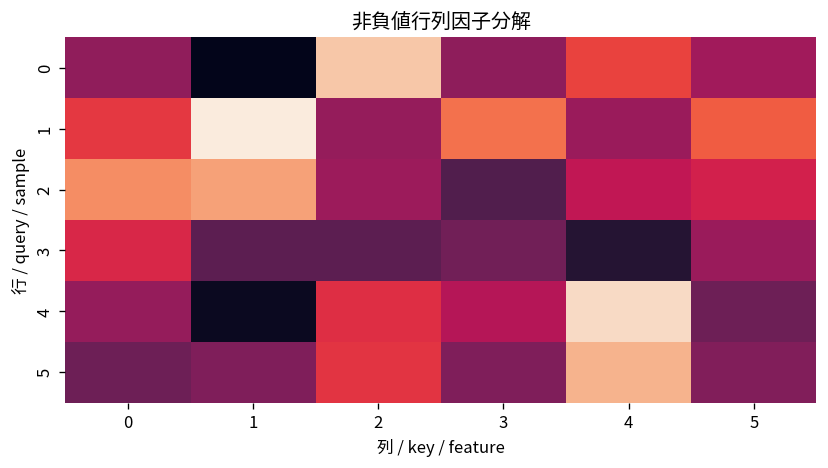

# 非負値行列因子分解

Course 07｜データ解析の行列手法｜Topic 14/20

---
layout: center
---

## 今回の問い

## 到達目標

- 定義と代表式を、自分の言葉と記号で説明できる。
- 成立条件を確認し、手計算と結果を検算できる。

## 理解確認

- 定義・条件・計算結果を自分の言葉で説明できるか確認する。

非負値行列因子分解の代表式は、どの定義・仮定から、なぜその形になるのか。

---

## なぜ今これを学ぶのか

前Topic `mat-filtering-regularization` で得た概念を使い、ここでは 非負値行列因子分解 へ進む。

---

## 直感

行列因子分解は観測行列を少数の潜在成分の積として説明する。

---

## 図解

元行列と2因子、再構成行列をheatmapで並べる。 データ行列を少数の基底と係数へ分ける。NMFなら両方を非負に制約するため、加法的なparts representationとして各成分を解釈しやすい。

---

## 記号と代表式

- $X\ge0$
- $W\in\mathbb R_+^{m\times r}$：basis
- $H\in\mathbb R_+^{r\times n}$：coefficients

$$
\min_{\mathbf{W},\mathbf{H}\ge0}\|\mathbf{X}-\mathbf{W}\mathbf{H}\|_F^2
$$

---

## 導出 1

$X\approx WH$ でcolumn x_j≈Σ_k h_{kj}w_k。nonnegativeなのでsubtractive cancellationなし。

---

## 導出 2

Frobenius lossならmin_{W,H≥0}||X-WH||²。W固定でH convex、H固定でW convexだがjointにはnonconvex。

---

## 例題

parts-based image decompositionでW columnsがnonnegative parts、Hが各imageのmixture weights。

---

## 条件を変えるとどうなるか

negative centered dataへstandard NMFは直接使えない。PCA後centered matrixとNMF inputを混同しない。

---

## よくある誤解

非負値行列因子分解では、式へ数値を代入するだけでは不十分である。negative centered dataへstandard NMFは直接使えない。PCA後centered matrixとNMF inputを混同しない。 という失敗例が示すように、式を使える条件と結論の範囲を区別する必要がある。

---

## 実装・計算上の注意

multiple initialization、objective convergence、zero locking、scale normalizationを記録。

---

## 一段先へ

NMFはnonnegative constraintでinterpretabilityを狙う。独立性をcriterionにするICAは別原理。

---

## 自分で説明できるか

- 「low-rank factor model」を式を見ずに説明できるか
- 「scale ambiguity」までの論理を一段ずつ再現できるか
- 非負値行列因子分解の条件を1つ外した反例を説明できるか

---
layout: center
---

## 教科書と演習

- [教科書](../../textbook/mat-nmf-nonnegative-factors)
- [10問の演習](../../exercises/mat-nmf-nonnegative-factors)
