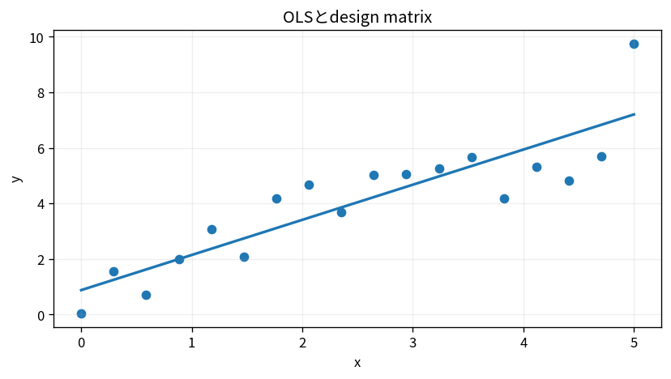

# OLSとdesign matrix

Course 07｜データ解析の行列手法｜Topic 06/20

---
layout: center
---

## 今回の問い

## 到達目標

- 定義と代表式を、自分の言葉と記号で説明できる。
- 成立条件を確認し、手計算と結果を検算できる。

## 理解確認

- 定義・条件・計算結果を自分の言葉で説明できるか確認する。

OLSとdesign matrixの代表式は、どの定義・仮定から、なぜその形になるのか。

---

## なぜ今これを学ぶのか

前Topic `mat-whitening-mahalanobis` で得た概念を使い、ここでは OLSとdesign matrix へ進む。

---

## 直感

回帰は入力から平均的な出力を説明・予測する関係をモデル化する。

---

## 図解

散布点、回帰線、残差を同時に描く。 点が観測値、線がモデル予測、点から線までの縦の差が残差である。二乗残差を合計する最小二乗では、大きな残差ほど強く目的関数へ効く。

---

## 記号と代表式

- $X\in\mathbb R^{n\times p}$：design matrix
- $y\in\mathbb R^n$
- $\beta\in\mathbb R^p$
- $r=y-X\beta$

$$
\hat{\boldsymbol{\beta}}=\arg\min_{\boldsymbol{\beta}}\|\mathbf{X}\boldsymbol{\beta}-\mathbf{y}\|_2^2
$$

---

## 導出 1

$J=\|y-Xβ\|²=(y-Xβ)^T(y-Xβ)$。gradient $-2X^T(y-Xβ)$。

---

## 導出 2

$X^Tr=0$。residualは全design columnに直交。

---

## 例題

切片column1とx columnでstraight line fit。normal equationsはresidual sum=0とresidual-x inner product=0。

---

## 条件を変えるとどうなるか

X^TX inverse formulaをrank checkなしに使うと失敗。

---

## よくある誤解

OLSとdesign matrixでは、式へ数値を代入するだけでは不十分である。X^TX inverse formulaをrank checkなしに使うと失敗。 という失敗例が示すように、式を使える条件と結論の範囲を区別する必要がある。

---

## 実装・計算上の注意

QR/SVD `lstsq`。intercept duplication、categorical dummy trap、feature scalingを確認。

---

## 一段先へ

観測noise varianceが異なるとEuclidean residual normが自然でなく、inverse-variance WLSへ。

---

## 自分で説明できるか

- 「objective gradient」を式を見ずに説明できるか
- 「solve」までの論理を一段ずつ再現できるか
- OLSとdesign matrixの条件を1つ外した反例を説明できるか

---
layout: center
---

## 教科書と演習

- [教科書](../../textbook/mat-ols-design-matrices)
- [10問の演習](../../exercises/mat-ols-design-matrices)
