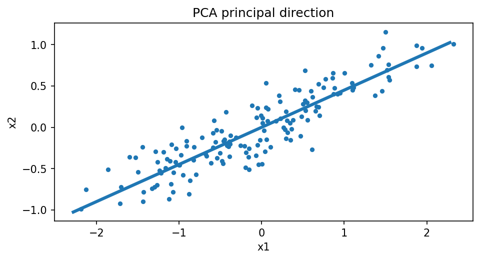

# PCAの幾何学

Course 07｜データ解析の行列手法｜Topic 03/20

---
layout: center
---

## 今回の問い

## 到達目標

- 定義と代表式を、自分の言葉と記号で説明できる。
- 成立条件を確認し、手計算と結果を検算できる。

## 理解確認

- 定義・条件・計算結果を自分の言葉で説明できるか確認する。

PCAの幾何学の代表式は、どの定義・仮定から、なぜその形になるのか。

---

## なぜ今これを学ぶのか

前Topic `mat-covariance-scatter-matrices` で得た概念を使い、ここでは PCAの幾何学 へ進む。

---

## 直感

PCAはデータの分散が大きい直交方向を順に選び、低次元へ射影する。

---

## 図解

細長い点群と主成分軸、射影点を描く。 点群の最も長い方向が第一主成分である。各点をその軸へ直交射影した座標の分散が最大になる方向を探す問題が固有値/SVDへつながる。

---

## 記号と代表式

- $v\in\mathbb R^p,\|v\|=1$：projection direction
- $z=X_cv$：scores
- $S$：covariance

$$
\max_{\|\mathbf{v}\|_2=1}\mathbf{v}^{\mathsf T}\mathbf{S}\mathbf{v}
$$

---

## 導出 1

$Var(z)=(n-1)^{-1}\|X_cv\|²=v^TSv$。

---

## 導出 2

scaleを自由にするとvを大きくしてvarianceを無限増加できるので $v^Tv=1$。

---

## 例題

ellipse cloudの長軸がPC1、短軸PC2。eigenvalueは各axisのvariance。

---

## 条件を変えるとどうなるか

PCAはlabelを使わないのでclass separation最大化とは限らない。大variance nuisanceがPC1になることも。

---

## よくある誤解

PCAの幾何学では、式へ数値を代入するだけでは不十分である。PCAはlabelを使わないのでclass separation最大化とは限らない。大variance nuisanceがPC1になることも。 という失敗例が示すように、式を使える条件と結論の範囲を区別する必要がある。

---

## 実装・計算上の注意

covarianceを形成せずcentered XのSVDを使うと安定/効率的。explained variance ratioだけでrを自動決定しない。

---

## 一段先へ

PCA eigenvectorsとXのright singular vectorsが一致する関係を次Topicで導く。

---

## 自分で説明できるか

- 「project variance」を式を見ずに説明できるか
- 「Lagrange condition」までの論理を一段ずつ再現できるか
- PCAの幾何学の条件を1つ外した反例を説明できるか

---
layout: center
---

## 教科書と演習

- [教科書](../../textbook/mat-pca-geometry)
- [10問の演習](../../exercises/mat-pca-geometry)
